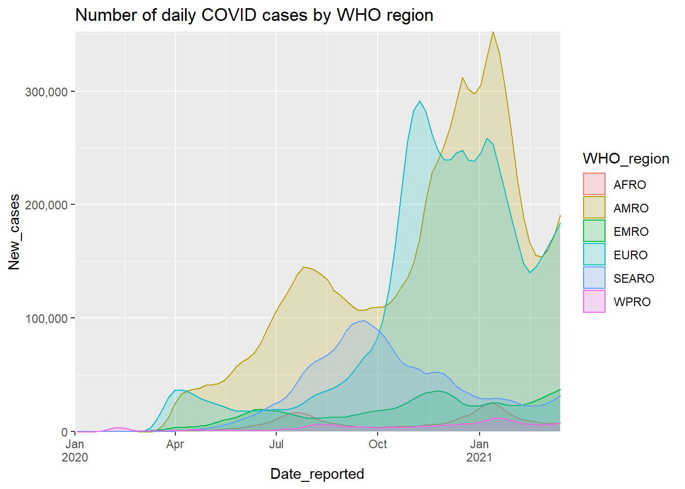
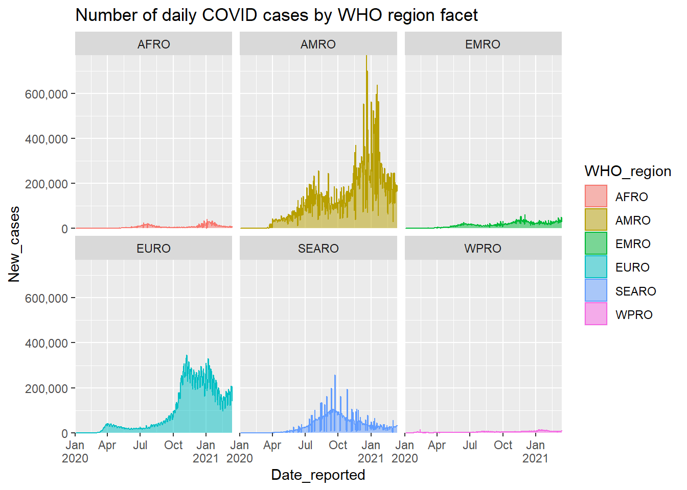
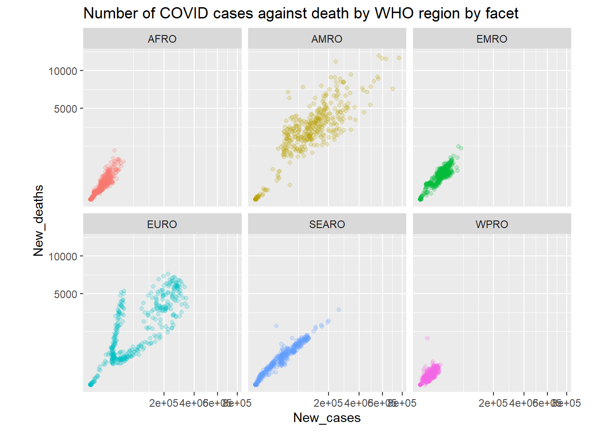

# Data


```
##      WHO_region Date_reported New_cases New_deaths
## 1          AFRO    2020-01-03         0          0
## 2          AMRO    2020-01-03         0          0
## 3          EMRO    2020-01-03         0          0
## 4          EURO    2020-01-03         0          0
## 5         SEARO    2020-01-03         0          0
## 6          WPRO    2020-01-03         0          0
## 7          AFRO    2020-01-04         0          0
## 8          AMRO    2020-01-04         0          0
## 9          EMRO    2020-01-04         0          0
## 10         EURO    2020-01-04         0          0
## 11        SEARO    2020-01-04         0          0
## 12         WPRO    2020-01-04         1          0
## 13         AFRO    2020-01-05         0          0
## 14         AMRO    2020-01-05         0          0
## 15         EMRO    2020-01-05         0          0
## 16         EURO    2020-01-05         0          0
## 17        SEARO    2020-01-05         0          0
## 18         WPRO    2020-01-05         0          0
## 19         AFRO    2020-01-06         0          0
## 20         AMRO    2020-01-06         0          0
## 21         EMRO    2020-01-06         0          0
## 22         EURO    2020-01-06         0          0
## 23        SEARO    2020-01-06         0          0
## 24         WPRO    2020-01-06         3          0
## 25         AFRO    2020-01-07         0          0
## 26         AMRO    2020-01-07         0          0
## 27         EMRO    2020-01-07         0          0
## 28         EURO    2020-01-07         0          0
## 29        SEARO    2020-01-07         0          0
## 30         WPRO    2020-01-07         0          0
## 31         AFRO    2020-01-08         0          0
## 32         AMRO    2020-01-08         0          0
## 33         EMRO    2020-01-08         0          0
## 34         EURO    2020-01-08         0          0
## 35        SEARO    2020-01-08         0          0
## 36         WPRO    2020-01-08         0          0
## 37         AFRO    2020-01-09         0          0
## 38         AMRO    2020-01-09         0          0
## 39         EMRO    2020-01-09         0          0
## 40         EURO    2020-01-09         0          0
## 41        SEARO    2020-01-09         0          0
## 42         WPRO    2020-01-09         0          0
## 43         AFRO    2020-01-10         0          0
## 44         AMRO    2020-01-10         0          0
## 45         EMRO    2020-01-10         0          0
## 46         EURO    2020-01-10         0          0
## 47        SEARO    2020-01-10         0          0
## 48         WPRO    2020-01-10         0          0
## 49         AFRO    2020-01-11         0          0
## 50         AMRO    2020-01-11         0          0
## 51         EMRO    2020-01-11         0          0
## 52         EURO    2020-01-11         0          0
## 53        SEARO    2020-01-11         0          0
## 54         WPRO    2020-01-11         0          0
## 55         AFRO    2020-01-12         0          0
## 56         AMRO    2020-01-12         0          0
## 57         EMRO    2020-01-12         0          0
## 58         EURO    2020-01-12         0          0
## 59        SEARO    2020-01-12         0          0
## 60         WPRO    2020-01-12        41          1
## 61         AFRO    2020-01-13         0          0
## 62         AMRO    2020-01-13         0          0
## 63         EMRO    2020-01-13         0          0
## 64         EURO    2020-01-13         0          0
## 65        SEARO    2020-01-13         5          0
## 66         WPRO    2020-01-13         0          0
## 67         AFRO    2020-01-14         0          0
## 68         AMRO    2020-01-14         0          0
## 69         EMRO    2020-01-14         0          0
## 70         EURO    2020-01-14         0          0
## 71        SEARO    2020-01-14         0          0
## 72         WPRO    2020-01-14         1          0
## 73         AFRO    2020-01-15         0          0
## 74         AMRO    2020-01-15         0          0
## 75         EMRO    2020-01-15         0          0
## 76         EURO    2020-01-15         0          0
## 77        SEARO    2020-01-15         0          0
## 78         WPRO    2020-01-15         0          0
## 79         AFRO    2020-01-16         0          0
## 80         AMRO    2020-01-16         0          0
## 81         EMRO    2020-01-16         0          0
## 82         EURO    2020-01-16         0          0
## 83        SEARO    2020-01-16         0          0
## 84         WPRO    2020-01-16         0          0
## 85         AFRO    2020-01-17         0          0
## 86         AMRO    2020-01-17         0          0
## 87         EMRO    2020-01-17         0          0
## 88         EURO    2020-01-17         0          0
## 89        SEARO    2020-01-17         1          0
## 90         WPRO    2020-01-17         4          1
## 91         AFRO    2020-01-18         0          0
## 92         AMRO    2020-01-18         0          0
## 93         EMRO    2020-01-18         0          0
## 94         EURO    2020-01-18         0          0
## 95        SEARO    2020-01-18         0          0
## 96         WPRO    2020-01-18         0          0
## 97         AFRO    2020-01-19         0          0
## 98         AMRO    2020-01-19         0          0
## 99         EMRO    2020-01-19         0          0
## 100        EURO    2020-01-19         0          0
## 101       SEARO    2020-01-19         0          0
## 102        WPRO    2020-01-19        81          1
## 103        AFRO    2020-01-20         0          0
## 104        AMRO    2020-01-20         5          0
## 105        EMRO    2020-01-20         0          0
## 106        EURO    2020-01-20         0          0
## 107       SEARO    2020-01-20         0          0
## 108        WPRO    2020-01-20        77          1
## 109        AFRO    2020-01-21         0          0
## 110        AMRO    2020-01-21         0          0
## 111        EMRO    2020-01-21         0          0
## 112        EURO    2020-01-21         0          0
## 113       SEARO    2020-01-21         0          0
## 114        WPRO    2020-01-21        93          2
## 115        AFRO    2020-01-22         0          0
## 116        AMRO    2020-01-22         0          0
## 117        EMRO    2020-01-22         0          0
## 118        EURO    2020-01-22         0          0
## 119       SEARO    2020-01-22         2          0
## 120        WPRO    2020-01-22       147         11
## 121        AFRO    2020-01-23         0          0
## 122        AMRO    2020-01-23         0          0
## 123        EMRO    2020-01-23         0          0
## 124        EURO    2020-01-23         0          0
## 125       SEARO    2020-01-23         5          0
## 126        WPRO    2020-01-23       132          1
## 127        AFRO    2020-01-24         0          0
## 128        AMRO    2020-01-24         1          0
## 129        EMRO    2020-01-24         0          0
## 130        EURO    2020-01-24         3          0
## 131       SEARO    2020-01-24         0          0
## 132        WPRO    2020-01-24       269          8
## 133        AFRO    2020-01-25         0          0
## 134        AMRO    2020-01-25         0          0
## 135        EMRO    2020-01-25         0          0
## 136        EURO    2020-01-25         0          0
## 137       SEARO    2020-01-25         0          0
## 138        WPRO    2020-01-25       469         16
## 139        AFRO    2020-01-26         0          0
## 140        AMRO    2020-01-26         3          0
## 141        EMRO    2020-01-26         0          0
## 142        EURO    2020-01-26         0          0
## 143       SEARO    2020-01-26         1          0
## 144        WPRO    2020-01-26       691         14
## 145        AFRO    2020-01-27         0          0
## 146        AMRO    2020-01-27         6          0
## 147        EMRO    2020-01-27         0          0
## 148        EURO    2020-01-27         0          0
## 149       SEARO    2020-01-27         8          0
## 150        WPRO    2020-01-27       782         26
## 151        AFRO    2020-01-28         0          0
## 152        AMRO    2020-01-28         1          0
## 153        EMRO    2020-01-28         0          0
## 154        EURO    2020-01-28         1          0
## 155       SEARO    2020-01-28         6          0
## 156        WPRO    2020-01-28      1771         49
## 157        AFRO    2020-01-29         0          0
## 158        AMRO    2020-01-29         0          0
## 159        EMRO    2020-01-29         8          0
## 160        EURO    2020-01-29         7          0
## 161       SEARO    2020-01-29         0          0
## 162        WPRO    2020-01-29      1469          2
## 163        AFRO    2020-01-30         0          0
## 164        AMRO    2020-01-30         1          0
## 165        EMRO    2020-01-30         0          0
## 166        EURO    2020-01-30         1          0
## 167       SEARO    2020-01-30         5          0
## 168        WPRO    2020-01-30      1750         38
## 169        AFRO    2020-01-31         0          0
## 170        AMRO    2020-01-31         2          0
## 171        EMRO    2020-01-31         0          0
## 172        EURO    2020-01-31         6          0
## 173       SEARO    2020-01-31         5          0
## 174        WPRO    2020-01-31      2000         42
## 175        AFRO    2020-02-01         0          0
## 176        AMRO    2020-02-01         1          0
## 177        EMRO    2020-02-01         1          0
## 178        EURO    2020-02-01         4          0
## 179       SEARO    2020-02-01         0          0
## 180        WPRO    2020-02-01      2109         46
## 181        AFRO    2020-02-02         0          0
## 182        AMRO    2020-02-02         0          0
## 183        EMRO    2020-02-02         0          0
## 184        EURO    2020-02-02         5          0
## 185       SEARO    2020-02-02         1          0
## 186        WPRO    2020-02-02      2601        103
## 187        AFRO    2020-02-03         0          0
## 188        AMRO    2020-02-03         3          0
## 189        EMRO    2020-02-03         0          0
## 190        EURO    2020-02-03         1          0
## 191       SEARO    2020-02-03         1          0
## 192        WPRO    2020-02-03      2834         64
## 193        AFRO    2020-02-04         0          0
## 194        AMRO    2020-02-04         0          0
## 195        EMRO    2020-02-04         0          0
## 196        EURO    2020-02-04         3          0
## 197       SEARO    2020-02-04         6          0
## 198        WPRO    2020-02-04      3235         66
## 199        AFRO    2020-02-05         0          0
## 200        AMRO    2020-02-05         1          0
## 201        EMRO    2020-02-05         0          0
## 202        EURO    2020-02-05         1          0
## 203       SEARO    2020-02-05         0          0
## 204        WPRO    2020-02-05      3908         72
## 205        AFRO    2020-02-06         0          0
## 206        AMRO    2020-02-06         1          0
## 207        EMRO    2020-02-06         0          0
## 208        EURO    2020-02-06         0          0
## 209       SEARO    2020-02-06         0          0
## 210        WPRO    2020-02-06      3712         70
## 211        AFRO    2020-02-07         0          0
## 212        AMRO    2020-02-07         2          0
## 213        EMRO    2020-02-07         0          0
## 214        EURO    2020-02-07         2          0
## 215       SEARO    2020-02-07         0          0
## 216        WPRO    2020-02-07      3159         85
## 217        AFRO    2020-02-08         0          0
## 218        AMRO    2020-02-08         0          0
## 219        EMRO    2020-02-08         2          0
## 220        EURO    2020-02-08         6          0
## 221       SEARO    2020-02-08         0          0
## 222        WPRO    2020-02-08      3392         87
## 223        AFRO    2020-02-09         0          0
## 224        AMRO    2020-02-09         0          0
## 225        EMRO    2020-02-09         0          0
## 226        EURO    2020-02-09         0          0
## 227       SEARO    2020-02-09         0          0
## 228        WPRO    2020-02-09      2664        100
## 229        AFRO    2020-02-10         0          0
## 230        AMRO    2020-02-10         0          0
## 231        EMRO    2020-02-10         1          0
## 232        EURO    2020-02-10         4          0
## 233       SEARO    2020-02-10         0          0
## 234        WPRO    2020-02-10      2989        107
## 235        AFRO    2020-02-11         0          0
## 236        AMRO    2020-02-11         1          0
## 237        EMRO    2020-02-11         0          0
## 238        EURO    2020-02-11         2          0
## 239       SEARO    2020-02-11         8          0
## 240        WPRO    2020-02-11      2478        100
## 241        AFRO    2020-02-12         0          0
## 242        AMRO    2020-02-12         0          0
## 243        EMRO    2020-02-12         0          0
## 244        EURO    2020-02-12         2          0
## 245       SEARO    2020-02-12         0          0
## 246        WPRO    2020-02-12      2027          5
## 247        AFRO    2020-02-13         0          0
## 248        AMRO    2020-02-13         2          0
## 249        EMRO    2020-02-13         0          0
## 250        EURO    2020-02-13         1          1
## 251       SEARO    2020-02-13         0          0
## 252        WPRO    2020-02-13     15155        253
## 253        AFRO    2020-02-14         0          0
## 254        AMRO    2020-02-14         0          0
## 255        EMRO    2020-02-14         5          0
## 256        EURO    2020-02-14         3          0
## 257       SEARO    2020-02-14         0          0
## 258        WPRO    2020-02-14      4065        152
## 259        AFRO    2020-02-15         0          0
## 260        AMRO    2020-02-15         0          0
## 261        EMRO    2020-02-15         0          0
## 262        EURO    2020-02-15         0          1
## 263       SEARO    2020-02-15         1          0
## 264        WPRO    2020-02-15      2660        142
## 265        AFRO    2020-02-16         0          0
## 266        AMRO    2020-02-16         0          0
## 267        EMRO    2020-02-16         1          0
## 268        EURO    2020-02-16         0          0
## 269       SEARO    2020-02-16         0          0
## 270        WPRO    2020-02-16      2029        104
## 271        AFRO    2020-02-17         0          0
## 272        AMRO    2020-02-17         1          0
## 273        EMRO    2020-02-17         0          0
## 274        EURO    2020-02-17         1          0
## 275       SEARO    2020-02-17         1          0
## 276        WPRO    2020-02-17      2060         98
## 277        AFRO    2020-02-18         0          0
## 278        AMRO    2020-02-18         0          0
## 279        EMRO    2020-02-18         0          0
## 280        EURO    2020-02-18         0          0
## 281       SEARO    2020-02-18         0          0
## 282        WPRO    2020-02-18      1904        139
## 283        AFRO    2020-02-19         0          0
## 284        AMRO    2020-02-19         0          0
## 285        EMRO    2020-02-19         0          0
## 286        EURO    2020-02-19         0          0
## 287       SEARO    2020-02-19         0          0
## 288        WPRO    2020-02-19      1782        113
## 289        AFRO    2020-02-20         0          0
## 290        AMRO    2020-02-20         0          0
## 291        EMRO    2020-02-20         9          2
## 292        EURO    2020-02-20         0          0
## 293       SEARO    2020-02-20         0          0
## 294        WPRO    2020-02-20       432        123
## 295        AFRO    2020-02-21         0          0
## 296        AMRO    2020-02-21        19          0
## 297        EMRO    2020-02-21        20          2
## 298        EURO    2020-02-21         1          0
## 299       SEARO    2020-02-21         0          0
## 300        WPRO    2020-02-21      1035          0
## 301        AFRO    2020-02-22         0          0
## 302        AMRO    2020-02-22         2          0
## 303        EMRO    2020-02-22        12          1
## 304        EURO    2020-02-22        14          0
## 305       SEARO    2020-02-22         0          0
## 306        WPRO    2020-02-22      1073        206
## 307        AFRO    2020-02-23         0          0
## 308        AMRO    2020-02-23         0          0
## 309        EMRO    2020-02-23        15          3
## 310        EURO    2020-02-23        65          2
## 311       SEARO    2020-02-23         0          0
## 312        WPRO    2020-02-23       849          2
## 313        AFRO    2020-02-24         0          0
## 314        AMRO    2020-02-24        19          0
## 315        EMRO    2020-02-24        44          0
## 316        EURO    2020-02-24        55          0
## 317       SEARO    2020-02-24         0          0
## 318        WPRO    2020-02-24       463        155
## 319        AFRO    2020-02-25         5          0
## 320        AMRO    2020-02-25         0          0
## 321        EMRO    2020-02-25        64          7
## 322        EURO    2020-02-25        99          4
## 323       SEARO    2020-02-25         2          0
## 324        WPRO    2020-02-25       674         72
## 325        AFRO    2020-02-26         0          0
## 326        AMRO    2020-02-26        12          0
## 327        EMRO    2020-02-26        66          4
## 328        EURO    2020-02-26       110          5
## 329       SEARO    2020-02-26         0          0
## 330        WPRO    2020-02-26       705         56
## 331        AFRO    2020-02-27         0          0
## 332        AMRO    2020-02-27         0          0
## 333        EMRO    2020-02-27       150          7
## 334        EURO    2020-02-27       105          2
## 335       SEARO    2020-02-27         3          0
## 336        WPRO    2020-02-27       969         32
## 337        AFRO    2020-02-28         5          0
## 338        AMRO    2020-02-28         9          0
## 339        EMRO    2020-02-28       153          8
## 340        EURO    2020-02-28       331          5
## 341       SEARO    2020-02-28         1          0
## 342        WPRO    2020-02-28       359         44
## 343        AFRO    2020-02-29         0          0
## 344        AMRO    2020-02-29         8          0
## 345        EMRO    2020-02-29       222          9
## 346        EURO    2020-02-29       327          5
## 347       SEARO    2020-02-29         1          0
## 348        WPRO    2020-02-29      1839         52
## 349        AFRO    2020-03-01         0          0
## 350        AMRO    2020-03-01         6          0
## 351        EMRO    2020-03-01        13          0
## 352        EURO    2020-03-01       419          8
## 353       SEARO    2020-03-01         0          1
## 354        WPRO    2020-03-01      1178         38
## 355        AFRO    2020-03-02         7          0
## 356        AMRO    2020-03-02        25          0
## 357        EMRO    2020-03-02       420         23
## 358        EURO    2020-03-02       685          6
## 359       SEARO    2020-03-02         9          0
## 360        WPRO    2020-03-02       705         46
## 361        AFRO    2020-03-03         2          0
## 362        AMRO    2020-03-03        14          0
## 363        EMRO    2020-03-03      1393         11
## 364        EURO    2020-03-03       567         18
## 365       SEARO    2020-03-03         0          0
## 366        WPRO    2020-03-03       748         39
## 367        AFRO    2020-03-04         0          0
## 368        AMRO    2020-03-04        71          5
## 369        EMRO    2020-03-04       600         17
## 370        EURO    2020-03-04       767         29
## 371       SEARO    2020-03-04        22          0
## 372        WPRO    2020-03-04       666         41
## 373        AFRO    2020-03-05        15          0
## 374        AMRO    2020-03-05        29          4
## 375        EMRO    2020-03-05        22          0
## 376        EURO    2020-03-05      1073         30
## 377       SEARO    2020-03-05         6          0
## 378        WPRO    2020-03-05       641         35
## 379        AFRO    2020-03-06        11          0
## 380        AMRO    2020-03-06         5          0
## 381        EMRO    2020-03-06      1869         34
## 382        EURO    2020-03-06      1516         46
## 383       SEARO    2020-03-06         6          0
## 384        WPRO    2020-03-06       720         36
## 385        AFRO    2020-03-07         6          0
## 386        AMRO    2020-03-07       126          3
## 387        EMRO    2020-03-07      1138         21
## 388        EURO    2020-03-07      1870         54
## 389       SEARO    2020-03-07         8          0
## 390        WPRO    2020-03-07       697         30
## 391        AFRO    2020-03-08         1          0
## 392        AMRO    2020-03-08        38          0
## 393        EMRO    2020-03-08       793         52
## 394        EURO    2020-03-08      2203         41
## 395       SEARO    2020-03-08        19          0
## 396        WPRO    2020-03-08       489         35
## 397        AFRO    2020-03-09         0          0
## 398        AMRO    2020-03-09       284          8
## 399        EMRO    2020-03-09        40          0
## 400        EURO    2020-03-09      2612        147
## 401       SEARO    2020-03-09         0          0
## 402        WPRO    2020-03-09       366         28
## 403        AFRO    2020-03-10         8          0
## 404        AMRO    2020-03-10       248          6
## 405        EMRO    2020-03-10      1565         98
## 406        EURO    2020-03-10      3361        129
## 407       SEARO    2020-03-10        27          0
## 408        WPRO    2020-03-10       233         19
## 409        AFRO    2020-03-11        11          0
## 410        AMRO    2020-03-11        60          2
## 411        EMRO    2020-03-11      1082         64
## 412        EURO    2020-03-11      3255        193
## 413       SEARO    2020-03-11        25          1
## 414        WPRO    2020-03-11       121         27
## 415        AFRO    2020-03-12        26          1
## 416        AMRO    2020-03-12       319          4
## 417        EMRO    2020-03-12      1124         76
## 418        EURO    2020-03-12      5956        259
## 419       SEARO    2020-03-12        37          0
## 420        WPRO    2020-03-12       635         25
## 421        AFRO    2020-03-13         7          0
## 422        AMRO    2020-03-13       475          8
## 423        EMRO    2020-03-13      1318         87
## 424        EURO    2020-03-13      7545        252
## 425       SEARO    2020-03-13        47          4
## 426        WPRO    2020-03-13       128         15
## 427        AFRO    2020-03-14        54          0
## 428        AMRO    2020-03-14       585          6
## 429        EMRO    2020-03-14      1851         97
## 430        EURO    2020-03-14      8064        342
## 431       SEARO    2020-03-14         7          1
## 432        WPRO    2020-03-14       317         24
## 433        AFRO    2020-03-15        63          0
## 434        AMRO    2020-03-15       234          1
## 435        EMRO    2020-03-15      1383        117
## 436        EURO    2020-03-15      9666        306
## 437       SEARO    2020-03-15       119          0
## 438        WPRO    2020-03-15       330         16
## 439        AFRO    2020-03-16        55          3
## 440        AMRO    2020-03-16       215          3
## 441        EMRO    2020-03-16      1192        130
## 442        EURO    2020-03-16      9137        556
## 443       SEARO    2020-03-16       103          1
## 444        WPRO    2020-03-16       438         20
## 445        AFRO    2020-03-17        37          0
## 446        AMRO    2020-03-17      2250         18
## 447        EMRO    2020-03-17      1376        138
## 448        EURO    2020-03-17     11936        556
## 449       SEARO    2020-03-17        42          0
## 450        WPRO    2020-03-17       339         25
## 451        AFRO    2020-03-18       108          3
## 452        AMRO    2020-03-18      4217         50
## 453        EMRO    2020-03-18      1622        153
## 454        EURO    2020-03-18     12971        625
## 455       SEARO    2020-03-18        90          1
## 456        WPRO    2020-03-18       479         22
## 457        AFRO    2020-03-19        80          1
## 458        AMRO    2020-03-19      3928         60
## 459        EMRO    2020-03-19      1220        151
## 460        EURO    2020-03-19     15752        822
## 461       SEARO    2020-03-19       255         21
## 462        WPRO    2020-03-19       738         16
## 463        AFRO    2020-03-20        43          4
## 464        AMRO    2020-03-20      5634         56
## 465        EMRO    2020-03-20      1569        154
## 466        EURO    2020-03-20     23123        968
## 467       SEARO    2020-03-20       102          8
## 468        WPRO    2020-03-20       426         12
## 469        AFRO    2020-03-21       231          7
## 470        AMRO    2020-03-21       827         18
## 471        EMRO    2020-03-21      1281        130
## 472        EURO    2020-03-21     23969       1182
## 473       SEARO    2020-03-21       278          7
## 474        WPRO    2020-03-21       805         22
## 475        AFRO    2020-03-22        60          1
## 476        AMRO    2020-03-22        27          0
## 477        EMRO    2020-03-22      1515        137
## 478        EURO    2020-03-22     24123       1553
## 479       SEARO    2020-03-22       310         11
## 480        WPRO    2020-03-22       649         23
## 481        AFRO    2020-03-23       170          3
## 482        AMRO    2020-03-23     17319        213
## 483        EMRO    2020-03-23      1782        138
## 484        EURO    2020-03-23     22351       1482
## 485       SEARO    2020-03-23       305          5
## 486        WPRO    2020-03-23       853         17
## 487        AFRO    2020-03-24       302          3
## 488        AMRO    2020-03-24      2827         56
## 489        EMRO    2020-03-24      2091        128
## 490        EURO    2020-03-24     26758       1643
## 491       SEARO    2020-03-24       120          5
## 492        WPRO    2020-03-24       989         30
## 493        AFRO    2020-03-25       297          3
## 494        AMRO    2020-03-25     20717        273
## 495        EMRO    2020-03-25      3143        157
## 496        EURO    2020-03-25     28027       2067
## 497       SEARO    2020-03-25       324          9
## 498        WPRO    2020-03-25      1135         16
## 499        AFRO    2020-03-26       564          2
## 500        AMRO    2020-03-26     18733        351
## 501        EMRO    2020-03-26      2871        166
## 502        EURO    2020-03-26     33294       2182
## 503       SEARO    2020-03-26       222          5
## 504        WPRO    2020-03-26       816         14
## 505        AFRO    2020-03-27       221          8
## 506        AMRO    2020-03-27      1824         10
## 507        EMRO    2020-03-27      3238        163
## 508        EURO    2020-03-27     38572       2418
## 509       SEARO    2020-03-27       543         34
## 510        WPRO    2020-03-27      1435         35
## 511        AFRO    2020-03-28       436          9
## 512        AMRO    2020-03-28     19172        301
## 513        EMRO    2020-03-28      4081        164
## 514        EURO    2020-03-28     40428       2918
## 515       SEARO    2020-03-28         0          0
## 516        WPRO    2020-03-28      1161         23
## 517        AFRO    2020-03-29       178          3
## 518        AMRO    2020-03-29     20163        476
## 519        EMRO    2020-03-29      3527        148
## 520        EURO    2020-03-29     37869       3045
## 521       SEARO    2020-03-29       504         36
## 522        WPRO    2020-03-29      1445         34
## 523        AFRO    2020-03-30       487         17
## 524        AMRO    2020-03-30     21425        480
## 525        EMRO    2020-03-30      3790        134
## 526        EURO    2020-03-30     31263       2661
## 527       SEARO    2020-03-30       621         16
## 528        WPRO    2020-03-30      1278         25
## 529        AFRO    2020-03-31       319          9
## 530        AMRO    2020-03-31      2267         73
## 531        EMRO    2020-03-31       941         27
## 532        EURO    2020-03-31     31351       3045
## 533       SEARO    2020-03-31       314          5
## 534        WPRO    2020-03-31       967         32
## 535        AFRO    2020-04-01       285         16
## 536        AMRO    2020-04-01     44052        816
## 537        EMRO    2020-04-01      3861        164
## 538        EURO    2020-04-01     41788       3467
## 539       SEARO    2020-04-01       796         45
## 540        WPRO    2020-04-01      1557         20
## 541        AFRO    2020-04-02       576         31
## 542        AMRO    2020-04-02     28619       1188
## 543        EMRO    2020-04-02      6934        294
## 544        EURO    2020-04-02     39127       3609
## 545       SEARO    2020-04-02       551         28
## 546        WPRO    2020-04-02      1372         25
## 547        AFRO    2020-04-03       575         38
## 548        AMRO    2020-04-03     30631       1109
## 549        EMRO    2020-04-03      3799        164
## 550        EURO    2020-04-03     37675       3652
## 551       SEARO    2020-04-03       317         17
## 552        WPRO    2020-04-03      1046         27
## 553        AFRO    2020-04-04       744         36
## 554        AMRO    2020-04-04     31873       1190
## 555        EMRO    2020-04-04      3550        174
## 556        EURO    2020-04-04     41265       5312
## 557       SEARO    2020-04-04       212         14
## 558        WPRO    2020-04-04      1533         56
## 559        AFRO    2020-04-05       429         37
## 560        AMRO    2020-04-05     36369       1399
## 561        EMRO    2020-04-05      4310        201
## 562        EURO    2020-04-05     38599       4295
## 563       SEARO    2020-04-05      1721         37
## 564        WPRO    2020-04-05      1019         29
## 565        AFRO    2020-04-06       288          8
## 566        AMRO    2020-04-06     35739       1463
## 567        EMRO    2020-04-06      1905         27
## 568        EURO    2020-04-06     29693       3216
## 569       SEARO    2020-04-06       972         46
## 570        WPRO    2020-04-06      -799         21
## 571        AFRO    2020-04-07       458         51
## 572        AMRO    2020-04-07     31930       1390
## 573        EMRO    2020-04-07      5732        284
## 574        EURO    2020-04-07     30721       3691
## 575       SEARO    2020-04-07       644         19
## 576        WPRO    2020-04-07      1073         27
## 577        AFRO    2020-04-08       474         31
## 578        AMRO    2020-04-08     30822       1374
## 579        EMRO    2020-04-08      3683        148
## 580        EURO    2020-04-08     35163       5143
## 581       SEARO    2020-04-08      1318         71
## 582        WPRO    2020-04-08      2999         36
## 583        AFRO    2020-04-09       647         23
## 584        AMRO    2020-04-09     40492       2358
## 585        EMRO    2020-04-09      3451        169
## 586        EURO    2020-04-09     39358       4064
## 587       SEARO    2020-04-09      1097         64
## 588        WPRO    2020-04-09      1182         22
## 589        AFRO    2020-04-10       401         34
## 590        AMRO    2020-04-10     37659       2232
## 591        EMRO    2020-04-10      1487         30
## 592        EURO    2020-04-10     40994       5019
## 593       SEARO    2020-04-10       822         57
## 594        WPRO    2020-04-10      1397         35
## 595        AFRO    2020-04-11       356         12
## 596        AMRO    2020-04-11     44242       2289
## 597        EMRO    2020-04-11      4227        178
## 598        EURO    2020-04-11     39624       4374
## 599       SEARO    2020-04-11      1564         72
## 600        WPRO    2020-04-11      1301         38
## 601        AFRO    2020-04-12       448          8
## 602        AMRO    2020-04-12     37044       2230
## 603        EMRO    2020-04-12      4963        275
## 604        EURO    2020-04-12     35273       3825
## 605       SEARO    2020-04-12      1499         87
## 606        WPRO    2020-04-12      1569         41
## 607        AFRO    2020-04-13       767         62
## 608        AMRO    2020-04-13     36593       2194
## 609        EMRO    2020-04-13      2500         56
## 610        EURO    2020-04-13     29294       3224
## 611       SEARO    2020-04-13       548         34
## 612        WPRO    2020-04-13      1283         64
## 613        AFRO    2020-04-14       408         34
## 614        AMRO    2020-04-14     34701       1834
## 615        EMRO    2020-04-14      5329        242
## 616        EURO    2020-04-14     27761       3373
## 617       SEARO    2020-04-14      2356        134
## 618        WPRO    2020-04-14      1404         39
## 619        AFRO    2020-04-15       616         23
## 620        AMRO    2020-04-15     28430       1785
## 621        EMRO    2020-04-15      3036        130
## 622        EURO    2020-04-15     34074       4210
## 623       SEARO    2020-04-15      1859         54
## 624        WPRO    2020-04-15      1399         40
## 625        AFRO    2020-04-16       503         28
## 626        AMRO    2020-04-16     30348       2779
## 627        EMRO    2020-04-16      5511        140
## 628        EURO    2020-04-16     33292       4794
## 629       SEARO    2020-04-16      1709         77
## 630        WPRO    2020-04-16      1367         38
## 631        AFRO    2020-04-17       443         23
## 632        AMRO    2020-04-17     39527       6948
## 633        EMRO    2020-04-17      4172        117
## 634        EURO    2020-04-17     36913       4142
## 635       SEARO    2020-04-17       718         40
## 636        WPRO    2020-04-17      1699         29
## 637        AFRO    2020-04-18       843         42
## 638        AMRO    2020-04-18     38775       2507
## 639        EMRO    2020-04-18      4778        114
## 640        EURO    2020-04-18     33881       3874
## 641       SEARO    2020-04-18      2697         91
## 642        WPRO    2020-04-18      1987       1330
## 643        AFRO    2020-04-19       546         10
## 644        AMRO    2020-04-19     39516       2962
## 645        EMRO    2020-04-19      4050        143
## 646        EURO    2020-04-19     34914       3772
## 647       SEARO    2020-04-19      2047         81
## 648        WPRO    2020-04-19      1855         23
## 649        AFRO    2020-04-20      1099         35
## 650        AMRO    2020-04-20     31868       2011
## 651        EMRO    2020-04-20      4134        139
## 652        EURO    2020-04-20     27405       2563
## 653       SEARO    2020-04-20      2290         44
## 654        WPRO    2020-04-20      1326         27
## 655        AFRO    2020-04-21       715         36
## 656        AMRO    2020-04-21     39707       2556
## 657        EMRO    2020-04-21      6634        142
## 658        EURO    2020-04-21     28692       2960
## 659       SEARO    2020-04-21      2230         93
## 660        WPRO    2020-04-21      2069         37
## 661        AFRO    2020-04-22       684         25
## 662        AMRO    2020-04-22     32005       2511
## 663        EMRO    2020-04-22      4398        147
## 664        EURO    2020-04-22     31839       3885
## 665       SEARO    2020-04-22      1702         70
## 666        WPRO    2020-04-22      1761        108
## 667        AFRO    2020-04-23       674         24
## 668        AMRO    2020-04-23     32242       3153
## 669        EMRO    2020-04-23      5255        132
## 670        EURO    2020-04-23     30271       3270
## 671       SEARO    2020-04-23      2265         59
## 672        WPRO    2020-04-23      1635         25
## 673        AFRO    2020-04-24      1430         44
## 674        AMRO    2020-04-24     38019       2939
## 675        EMRO    2020-04-24      4355        150
## 676        EURO    2020-04-24     32091       3048
## 677       SEARO    2020-04-24      3049         95
## 678        WPRO    2020-04-24      1879         51
## 679        AFRO    2020-04-25      1236         19
## 680        AMRO    2020-04-25     40579       2502
## 681        EMRO    2020-04-25      5306        110
## 682        EURO    2020-04-25     31279       3140
## 683       SEARO    2020-04-25      1892         67
## 684        WPRO    2020-04-25      1688         37
## 685        AFRO    2020-04-26       858         29
## 686        AMRO    2020-04-26     57286       2801
## 687        EMRO    2020-04-26      5921        146
## 688        EURO    2020-04-26     28800       3042
## 689       SEARO    2020-04-26       779         54
## 690        WPRO    2020-04-26      1169         37
## 691        AFRO    2020-04-27      1120         29
## 692        AMRO    2020-04-27     47283       2793
## 693        EMRO    2020-04-27      4525         21
## 694        EURO    2020-04-27     23202       1884
## 695       SEARO    2020-04-27      4607        131
## 696        WPRO    2020-04-27      1482         15
## 697        AFRO    2020-04-28       804         16
## 698        AMRO    2020-04-28     36881       1613
## 699        EMRO    2020-04-28      7379        275
## 700        EURO    2020-04-28     23239       2147
## 701       SEARO    2020-04-28      2588         76
## 702        WPRO    2020-04-28      1264         40
## 703        AFRO    2020-04-29       839         18
## 704        AMRO    2020-04-29     35690       2221
## 705        EMRO    2020-04-29      5109        154
## 706        EURO    2020-04-29     23579       2850
## 707       SEARO    2020-04-29       992         19
## 708        WPRO    2020-04-29      1064         39
## 709        AFRO    2020-04-30      1598         39
## 710        AMRO    2020-04-30     31658       2753
## 711        EMRO    2020-04-30      5799        107
## 712        EURO    2020-04-30     28345       2689
## 713       SEARO    2020-04-30      4356        154
## 714        WPRO    2020-04-30      1290         56
## 715        AFRO    2020-05-01      1455         21
## 716        AMRO    2020-05-01     47118       3995
## 717        EMRO    2020-05-01      7226        185
## 718        EURO    2020-05-01     28300       2311
## 719       SEARO    2020-05-01      3425         84
## 720        WPRO    2020-05-01      1099         34
## 721        AFRO    2020-05-02      1299         41
## 722        AMRO    2020-05-02     48384       3034
## 723        EMRO    2020-05-02      3731        115
## 724        EURO    2020-05-02     27180       2086
## 725       SEARO    2020-05-02      3207        107
## 726        WPRO    2020-05-02      1565         43
## 727        AFRO    2020-05-03      1948         62
## 728        AMRO    2020-05-03     43704       6205
## 729        EMRO    2020-05-03      8320        125
## 730        EURO    2020-05-03     26073       1987
## 731       SEARO    2020-05-03      3714         99
## 732        WPRO    2020-05-03      1041         59
## 733        AFRO    2020-05-04      1085         22
## 734        AMRO    2020-05-04     48455       1201
## 735        EMRO    2020-05-04      5476        127
## 736        EURO    2020-05-04     23918       1400
## 737       SEARO    2020-05-04      2976         96
## 738        WPRO    2020-05-04      1328         29
## 739        AFRO    2020-05-05      2082         27
## 740        AMRO    2020-05-05     44795        127
## 741        EMRO    2020-05-05      5256         81
## 742        EURO    2020-05-05     21237       1599
## 743       SEARO    2020-05-05      5960        205
## 744        WPRO    2020-05-05      1096         29
## 745        AFRO    2020-05-06      1336         90
## 746        AMRO    2020-05-06     29641       1488
## 747        EMRO    2020-05-06      7180        238
## 748        EURO    2020-05-06     26169       2211
## 749       SEARO    2020-05-06      4210        155
## 750        WPRO    2020-05-06      1016         40
## 751        AFRO    2020-05-07       922         15
## 752        AMRO    2020-05-07     35926       3728
## 753        EMRO    2020-05-07     11493        182
## 754        EURO    2020-05-07     29972       2105
## 755       SEARO    2020-05-07      4635        124
## 756        WPRO    2020-05-07      1296         33
## 757        AFRO    2020-05-08      2834         49
## 758        AMRO    2020-05-08     43166       3139
## 759        EMRO    2020-05-08      7985        107
## 760        EURO    2020-05-08     26464       1773
## 761       SEARO    2020-05-08      1124         34
## 762        WPRO    2020-05-08      1267         34
## 763        AFRO    2020-05-09      1989         57
## 764        AMRO    2020-05-09     50389       4051
## 765        EMRO    2020-05-09      6829         84
## 766        EURO    2020-05-09     26413       1895
## 767       SEARO    2020-05-09      7467        207
## 768        WPRO    2020-05-09      1076         55
## 769        AFRO    2020-05-10      2962         46
## 770        AMRO    2020-05-10     44300       2915
## 771        EMRO    2020-05-10     11227        194
## 772        EURO    2020-05-10     24651       1204
## 773       SEARO    2020-05-10      5133        172
## 774        WPRO    2020-05-10      1139         21
## 775        AFRO    2020-05-11      1913         47
## 776        AMRO    2020-05-11     37724       2611
## 777        EMRO    2020-05-11      9660        114
## 778        EURO    2020-05-11     21311       1042
## 779       SEARO    2020-05-11      1133         11
## 780        WPRO    2020-05-11      1248         23
## 781        AFRO    2020-05-12      2331         34
## 782        AMRO    2020-05-12     25371       1670
## 783        EMRO    2020-05-12      6615         91
## 784        EURO    2020-05-12     20075       1291
## 785       SEARO    2020-05-12      9645        213
## 786        WPRO    2020-05-12       927         34
## 787        AFRO    2020-05-13      2071         51
## 788        AMRO    2020-05-13     55891       3016
## 789        EMRO    2020-05-13     11824        162
## 790        EURO    2020-05-13     24552       1843
## 791       SEARO    2020-05-13      1934         56
## 792        WPRO    2020-05-13      1364         51
## 793        AFRO    2020-05-14      2711         67
## 794        AMRO    2020-05-14     19640       1546
## 795        EMRO    2020-05-14     12807        168
## 796        EURO    2020-05-14     21995       1398
## 797       SEARO    2020-05-14      8955        286
## 798        WPRO    2020-05-14      1081         44
## 799        AFRO    2020-05-15      2365         51
## 800        AMRO    2020-05-15     63449       4209
## 801        EMRO    2020-05-15      9991        127
## 802        EURO    2020-05-15     24178       1589
## 803       SEARO    2020-05-15      5703        148
## 804        WPRO    2020-05-15      1268         42
## 805        AFRO    2020-05-16      2266         47
## 806        AMRO    2020-05-16     53855       3778
## 807        EMRO    2020-05-16      7370         62
## 808        EURO    2020-05-16     21509       1303
## 809       SEARO    2020-05-16      5549        133
## 810        WPRO    2020-05-16      1171         33
## 811        AFRO    2020-05-17      2419         44
## 812        AMRO    2020-05-17     50698       2731
## 813        EMRO    2020-05-17     12670        196
## 814        EURO    2020-05-17     21368       1145
## 815       SEARO    2020-05-17      5538        180
## 816        WPRO    2020-05-17       823         33
## 817        AFRO    2020-05-18      2472         35
## 818        AMRO    2020-05-18     62528       3174
## 819        EMRO    2020-05-18     11926        151
## 820        EURO    2020-05-18     17744        712
## 821       SEARO    2020-05-18      8701        235
## 822        WPRO    2020-05-18       971         13
## 823        AFRO    2020-05-19      2213         51
## 824        AMRO    2020-05-19     32518       1654
## 825        EMRO    2020-05-19     14782        178
## 826        EURO    2020-05-19     18397        909
## 827       SEARO    2020-05-19      1855         51
## 828        WPRO    2020-05-19       663         22
## 829        AFRO    2020-05-20      1872         42
## 830        AMRO    2020-05-20     46598       2066
## 831        EMRO    2020-05-20      9953        123
## 832        EURO    2020-05-20     19669       1347
## 833       SEARO    2020-05-20     13000        311
## 834        WPRO    2020-05-20       777         15
## 835        AFRO    2020-05-21      2294         43
## 836        AMRO    2020-05-21     60401       3250
## 837        EMRO    2020-05-21     12237        182
## 838        EURO    2020-05-21     21826       1098
## 839       SEARO    2020-05-21      8436        191
## 840        WPRO    2020-05-21       955         13
## 841        AFRO    2020-05-22      3987         93
## 842        AMRO    2020-05-22     52859       3007
## 843        EMRO    2020-05-22      7410        121
## 844        EURO    2020-05-22     19875        991
## 845       SEARO    2020-05-22      8434        220
## 846        WPRO    2020-05-22       838         24
## 847        AFRO    2020-05-23      2725         65
## 848        AMRO    2020-05-23     42291       2104
## 849        EMRO    2020-05-23     14316        165
## 850        EURO    2020-05-23     19704        967
## 851       SEARO    2020-05-23      7821        162
## 852        WPRO    2020-05-23       919         27
## 853        AFRO    2020-05-24      3056         34
## 854        AMRO    2020-05-24     35359       2594
## 855        EMRO    2020-05-24     12886        182
## 856        EURO    2020-05-24     18523        872
## 857       SEARO    2020-05-24     10792        216
## 858        WPRO    2020-05-24       925         19
## 859        AFRO    2020-05-25      2645         47
## 860        AMRO    2020-05-25     75222       3787
## 861        EMRO    2020-05-25     10494        173
## 862        EURO    2020-05-25     17158        828
## 863       SEARO    2020-05-25      9579        196
## 864        WPRO    2020-05-25       911         15
## 865        AFRO    2020-05-26      2470         87
## 866        AMRO    2020-05-26     69331       2846
## 867        EMRO    2020-05-26     12402        128
## 868        EURO    2020-05-26     16901        754
## 869       SEARO    2020-05-26      8392        195
## 870        WPRO    2020-05-26       894         24
## 871        AFRO    2020-05-27      2987         94
## 872        AMRO    2020-05-27     29383       1278
## 873        EMRO    2020-05-27      8886        102
## 874        EURO    2020-05-27     16854        809
## 875       SEARO    2020-05-27      8946        248
## 876        WPRO    2020-05-27      1007         25
## 877        AFRO    2020-05-28      4040         66
## 878        AMRO    2020-05-28     78967       3592
## 879        EMRO    2020-05-28      9860        100
## 880        EURO    2020-05-28     18168       1088
## 881       SEARO    2020-05-28      2806         39
## 882        WPRO    2020-05-28      1056         29
## 883        AFRO    2020-05-29      3206         58
## 884        AMRO    2020-05-29     59986       3446
## 885        EMRO    2020-05-29     17973        339
## 886        EURO    2020-05-29     22170       1048
## 887       SEARO    2020-05-29       729         24
## 888        WPRO    2020-05-29      1042         24
## 889        AFRO    2020-05-30      3650         51
## 890        AMRO    2020-05-30     65402       3231
## 891        EMRO    2020-05-30     14502        248
## 892        EURO    2020-05-30     19686        882
## 893       SEARO    2020-05-30     27578        739
## 894        WPRO    2020-05-30      1944         33
## 895        AFRO    2020-05-31      4191         71
## 896        AMRO    2020-05-31     58517       2848
## 897        EMRO    2020-05-31     15065        275
## 898        EURO    2020-05-31     19995        717
## 899       SEARO    2020-05-31      9364        235
## 900        WPRO    2020-05-31      1192         13
## 901        AFRO    2020-06-01      3495         88
## 902        AMRO    2020-06-01     80835       2354
## 903        EMRO    2020-06-01     14518        271
## 904        EURO    2020-06-01     16334        534
## 905       SEARO    2020-06-01     10945        270
## 906        WPRO    2020-06-01      1560         10
## 907        AFRO    2020-06-02      3539         58
## 908        AMRO    2020-06-02     67173       2176
## 909        EMRO    2020-06-02     16640        275
## 910        EURO    2020-06-02     15369        610
## 911       SEARO    2020-06-02     11430        257
## 912        WPRO    2020-06-02      1107          7
## 913        AFRO    2020-06-03      3983         97
## 914        AMRO    2020-06-03     43942       2036
## 915        EMRO    2020-06-03     15766        274
## 916        EURO    2020-06-03     15631        842
## 917       SEARO    2020-06-03     12779        277
## 918        WPRO    2020-06-03      1052         13
## 919        AFRO    2020-06-04      3529         62
## 920        AMRO    2020-06-04     72602       3171
## 921        EMRO    2020-06-04     16790        268
## 922        EURO    2020-06-04     18304        842
## 923       SEARO    2020-06-04     12977        333
## 924        WPRO    2020-06-04      1496         11
## 925        AFRO    2020-06-05      2443         48
## 926        AMRO    2020-06-05     62264       3796
## 927        EMRO    2020-06-05     12727        200
## 928        EURO    2020-06-05     19066        632
## 929       SEARO    2020-06-05     10841        297
## 930        WPRO    2020-06-05      1540         14
## 931        AFRO    2020-06-06      9025        160
## 932        AMRO    2020-06-06     70695       3812
## 933        EMRO    2020-06-06     20980        352
## 934        EURO    2020-06-06     19133        864
## 935       SEARO    2020-06-06     16139        409
## 936        WPRO    2020-06-06       637         11
## 937        AFRO    2020-06-07      4501         77
## 938        AMRO    2020-06-07     50314       2158
## 939        EMRO    2020-06-07     19526        331
## 940        EURO    2020-06-07     17953        583
## 941       SEARO    2020-06-07     13965        356
## 942        WPRO    2020-06-07      1206         11
## 943        AFRO    2020-06-08      2116         54
## 944        AMRO    2020-06-08     47716       1672
## 945        EMRO    2020-06-08     18751        268
## 946        EURO    2020-06-08     18334        419
## 947       SEARO    2020-06-08     13652        298
## 948        WPRO    2020-06-08      1038          9
## 949        AFRO    2020-06-09      6980        156
## 950        AMRO    2020-06-09     95904       3584
## 951        EMRO    2020-06-09     13623        225
## 952        EURO    2020-06-09     16175        563
## 953       SEARO    2020-06-09     13924        406
## 954        WPRO    2020-06-09      1057          9
## 955        AFRO    2020-06-10      4880        122
## 956        AMRO    2020-06-10     11496        552
## 957        EMRO    2020-06-10     23014        429
## 958        EURO    2020-06-10     17109        812
## 959       SEARO    2020-06-10     11385        320
## 960        WPRO    2020-06-10       846         11
## 961        AFRO    2020-06-11      4822        120
## 962        AMRO    2020-06-11    125687       5526
## 963        EMRO    2020-06-11     17948        320
## 964        EURO    2020-06-11     18339        652
## 965       SEARO    2020-06-11     17899        475
## 966        WPRO    2020-06-11      1292         12
## 967        AFRO    2020-06-12      5686        109
## 968        AMRO    2020-06-12     75265       3400
## 969        EMRO    2020-06-12     19954        362
## 970        EURO    2020-06-12     19566        549
## 971       SEARO    2020-06-12      1280         41
## 972        WPRO    2020-06-12      1017         12
## 973        AFRO    2020-06-13      5673        169
## 974        AMRO    2020-06-13     56153       2546
## 975        EMRO    2020-06-13     13853        236
## 976        EURO    2020-06-13     19000        533
## 977       SEARO    2020-06-13     30218        913
## 978        WPRO    2020-06-13      1228         19
## 979        AFRO    2020-06-14      6236        128
## 980        AMRO    2020-06-14     71976       2991
## 981        EMRO    2020-06-14     28664        454
## 982        EURO    2020-06-14     19660        495
## 983       SEARO    2020-06-14     16539        401
## 984        WPRO    2020-06-14      1149         25
## 985        AFRO    2020-06-15      7779        114
## 986        AMRO    2020-06-15     90895       3320
## 987        EMRO    2020-06-15     20393        455
## 988        EURO    2020-06-15     17623        401
## 989       SEARO    2020-06-15      4451         76
## 990        WPRO    2020-06-15      1132         15
## 991        AFRO    2020-06-16      6156        123
## 992        AMRO    2020-06-16     56439       1511
## 993        EMRO    2020-06-16     17947        482
## 994        EURO    2020-06-16     16931        460
## 995       SEARO    2020-06-16     26783        807
## 996        WPRO    2020-06-16       927         13
## 997        AFRO    2020-06-17      5626        112
## 998        AMRO    2020-06-17     36953       1592
## 999        EMRO    2020-06-17     21315        503
## 1000       EURO    2020-06-17     17826        696
## 1001      SEARO    2020-06-17     16351       2089
## 1002       WPRO    2020-06-17       664         11
## 1003       AFRO    2020-06-18      7452        137
## 1004       AMRO    2020-06-18    105404       2462
## 1005       EMRO    2020-06-18     17586        388
## 1006       EURO    2020-06-18     19591        573
## 1007      SEARO    2020-06-18     18558        423
## 1008       WPRO    2020-06-18       876         10
## 1009       AFRO    2020-06-19      6226        100
## 1010       AMRO    2020-06-19    104519       3648
## 1011       EMRO    2020-06-19     21022        589
## 1012       EURO    2020-06-19     19607        588
## 1013      SEARO    2020-06-19     19436        439
## 1014       WPRO    2020-06-19       978          8
## 1015       AFRO    2020-06-20      7627        166
## 1016       AMRO    2020-06-20     57500       4145
## 1017       EMRO    2020-06-20     22370        525
## 1018       EURO    2020-06-20     19270        486
## 1019      SEARO    2020-06-20      1507         34
## 1020       WPRO    2020-06-20      1050         31
## 1021       AFRO    2020-06-21      8750        128
## 1022       AMRO    2020-06-21    135936       3787
## 1023       EMRO    2020-06-21     17619        509
## 1024       EURO    2020-06-21     19774        424
## 1025      SEARO    2020-06-21     37677        819
## 1026       WPRO    2020-06-21      1370         22
## 1027       AFRO    2020-06-22      3117         69
## 1028       AMRO    2020-06-22     92607       2813
## 1029       EMRO    2020-06-22     18544        472
## 1030       EURO    2020-06-22     17333        323
## 1031      SEARO    2020-06-22     16455        482
## 1032       WPRO    2020-06-22      1051         19
## 1033       AFRO    2020-06-23     11888        167
## 1034       AMRO    2020-06-23     67820       2457
## 1035       EMRO    2020-06-23     15120        391
## 1036       EURO    2020-06-23     16979        407
## 1037      SEARO    2020-06-23     23457        424
## 1038       WPRO    2020-06-23      1037         11
## 1039       AFRO    2020-06-24      7083        175
## 1040       AMRO    2020-06-24     67768       2216
## 1041       EMRO    2020-06-24     19686        420
## 1042       EURO    2020-06-24     18608        518
## 1043      SEARO    2020-06-24     21034        544
## 1044       WPRO    2020-06-24      1423         18
## 1045       AFRO    2020-06-25      8323        142
## 1046       AMRO    2020-06-25     58715       2334
## 1047       EMRO    2020-06-25     16584        574
## 1048       EURO    2020-06-25     20175        362
## 1049      SEARO    2020-06-25     22160        493
## 1050       WPRO    2020-06-25       844         25
## 1051       AFRO    2020-06-26     10960        136
## 1052       AMRO    2020-06-26    142516       4743
## 1053       EMRO    2020-06-26     18350        402
## 1054       EURO    2020-06-26     20107        529
## 1055      SEARO    2020-06-26     22884        495
## 1056       WPRO    2020-06-26      1100         11
## 1057       AFRO    2020-06-27      9713        110
## 1058       AMRO    2020-06-27    109610       5195
## 1059       EMRO    2020-06-27     21725        636
## 1060       EURO    2020-06-27     20465        523
## 1061      SEARO    2020-06-27     24257        488
## 1062       WPRO    2020-06-27      1459         14
## 1063       AFRO    2020-06-28      8946        100
## 1064       AMRO    2020-06-28    117434       3206
## 1065       EMRO    2020-06-28     18203        489
## 1066       EURO    2020-06-28     18683        315
## 1067      SEARO    2020-06-28     24848        481
## 1068       WPRO    2020-06-28      1196         12
## 1069       AFRO    2020-06-29     10348         97
## 1070       AMRO    2020-06-29    100875       2116
## 1071       EMRO    2020-06-29     16668        440
## 1072       EURO    2020-06-29     16472        304
## 1073      SEARO    2020-06-29     25494        458
## 1074       WPRO    2020-06-29      1136          9
## 1075       AFRO    2020-06-30      9742        135
## 1076       AMRO    2020-06-30    102684       3096
## 1077       EMRO    2020-06-30     16025        539
## 1078       EURO    2020-06-30     26970        396
## 1079      SEARO    2020-06-30     22582        463
## 1080       WPRO    2020-06-30      1459         13
## 1081       AFRO    2020-07-01      9673        186
## 1082       AMRO    2020-07-01     79826       2084
## 1083       EMRO    2020-07-01     19596        514
## 1084       EURO    2020-07-01     18527        520
## 1085      SEARO    2020-07-01     25533        694
## 1086       WPRO    2020-07-01      1530         11
## 1087       AFRO    2020-07-02     11573        148
## 1088       AMRO    2020-07-02     98838       3024
## 1089       EMRO    2020-07-02     19646        571
## 1090       EURO    2020-07-02     19285        455
## 1091      SEARO    2020-07-02     24829        534
## 1092       WPRO    2020-07-02      1609          5
## 1093       AFRO    2020-07-03     11205        133
## 1094       AMRO    2020-07-03    130028       3428
## 1095       EMRO    2020-07-03     16960        427
## 1096       EURO    2020-07-03     19964        488
## 1097      SEARO    2020-07-03     27050        471
## 1098       WPRO    2020-07-03       837          5
## 1099       AFRO    2020-07-04     12532        154
## 1100       AMRO    2020-07-04     75519       1504
## 1101       EMRO    2020-07-04     21544        578
## 1102       EURO    2020-07-04     19604        450
## 1103      SEARO    2020-07-04     27942        534
## 1104       WPRO    2020-07-04      2251          8
## 1105       AFRO    2020-07-05     14305        114
## 1106       AMRO    2020-07-05    118939       4362
## 1107       EMRO    2020-07-05     17962        548
## 1108       EURO    2020-07-05     18725        367
## 1109      SEARO    2020-07-05     29839        697
## 1110       WPRO    2020-07-05      2121         10
## 1111       AFRO    2020-07-06     12050        217
## 1112       AMRO    2020-07-06    181374       3501
## 1113       EMRO    2020-07-06     13641        273
## 1114       EURO    2020-07-06     16365        341
## 1115      SEARO    2020-07-06     28953        565
## 1116       WPRO    2020-07-06      2969          8
## 1117       AFRO    2020-07-07     13627        174
## 1118       AMRO    2020-07-07     91113       1652
## 1119       EMRO    2020-07-07     21364        761
## 1120       EURO    2020-07-07     17038        400
## 1121      SEARO    2020-07-07     26867        583
## 1122       WPRO    2020-07-07      2708         10
## 1123       AFRO    2020-07-08     15826        282
## 1124       AMRO    2020-07-08     91606       2097
## 1125       EMRO    2020-07-08     17017        560
## 1126       EURO    2020-07-08     18881        536
## 1127      SEARO    2020-07-08     27266        605
## 1128       WPRO    2020-07-08      2096          8
## 1129       AFRO    2020-07-09      3688         43
## 1130       AMRO    2020-07-09    111772       3458
## 1131       EMRO    2020-07-09     16965        462
## 1132       EURO    2020-07-09     19842        492
## 1133      SEARO    2020-07-09     30515        584
## 1134       WPRO    2020-07-09      3129          8
## 1135       AFRO    2020-07-10     25636        264
## 1136       AMRO    2020-07-10    145744       3958
## 1137       EMRO    2020-07-10     15553        571
## 1138       EURO    2020-07-10     20611        442
## 1139      SEARO    2020-07-10     32926        574
## 1140       WPRO    2020-07-10      2143          6
## 1141       AFRO    2020-07-11     14463        168
## 1142       AMRO    2020-07-11    132499       3626
## 1143       EMRO    2020-07-11     15510        402
## 1144       EURO    2020-07-11     21054        466
## 1145      SEARO    2020-07-11     31962        608
## 1146       WPRO    2020-07-11      2153         42
## 1147       AFRO    2020-07-12     18675        195
## 1148       AMRO    2020-07-12     68822       2495
## 1149       EMRO    2020-07-12     18618        554
## 1150       EURO    2020-07-12     20377        349
## 1151      SEARO    2020-07-12      4555         99
## 1152       WPRO    2020-07-12      2154         15
## 1153       AFRO    2020-07-13     16878        167
## 1154       AMRO    2020-07-13    198501       3633
## 1155       EMRO    2020-07-13     14017        490
## 1156       EURO    2020-07-13     17729        275
## 1157      SEARO    2020-07-13     61946       1169
## 1158       WPRO    2020-07-13      2954        163
## 1159       AFRO    2020-07-14     15213        175
## 1160       AMRO    2020-07-14    114676       2243
## 1161       EMRO    2020-07-14     16642        575
## 1162       EURO    2020-07-14     18691        373
## 1163      SEARO    2020-07-14     33057        642
## 1164       WPRO    2020-07-14      1709         66
## 1165       AFRO    2020-07-15     13161        216
## 1166       AMRO    2020-07-15    107474       2421
## 1167       EMRO    2020-07-15     13686        563
## 1168       EURO    2020-07-15     19492        415
## 1169      SEARO    2020-07-15     34401        670
## 1170       WPRO    2020-07-15      1563          7
## 1171       AFRO    2020-07-16     17658        175
## 1172       AMRO    2020-07-16     68432       2737
## 1173       EMRO    2020-07-16     16034        494
## 1174       EURO    2020-07-16     21252        470
## 1175      SEARO    2020-07-16     37909        727
## 1176       WPRO    2020-07-16      2295         19
## 1177       AFRO    2020-07-17     19446        313
## 1178       AMRO    2020-07-17    196384       3914
## 1179       EMRO    2020-07-17     14739        498
## 1180       EURO    2020-07-17     21971        423
## 1181      SEARO    2020-07-17     39518        803
## 1182       WPRO    2020-07-17      3709         33
## 1183       AFRO    2020-07-18     17692        210
## 1184       AMRO    2020-07-18    152675       5024
## 1185       EMRO    2020-07-18     12630        455
## 1186       EURO    2020-07-18     33422        651
## 1187      SEARO    2020-07-18      4618        136
## 1188       WPRO    2020-07-18      3293         22
## 1189       AFRO    2020-07-19     17170        188
## 1190       AMRO    2020-07-19    108581       2375
## 1191       EMRO    2020-07-19     13430        449
## 1192       EURO    2020-07-19     21703        554
## 1193      SEARO    2020-07-19     78348       1307
## 1194       WPRO    2020-07-19      3373        117
## 1195       AFRO    2020-07-20     19413        160
## 1196       AMRO    2020-07-20    175554       4651
## 1197       EMRO    2020-07-20     12510        302
## 1198       EURO    2020-07-20     18695        282
## 1199      SEARO    2020-07-20      4273        164
## 1200       WPRO    2020-07-20      3404         64
## 1201       AFRO    2020-07-21      2913         43
## 1202       AMRO    2020-07-21     53544       1755
## 1203       EMRO    2020-07-21     11605        571
## 1204       EURO    2020-07-21     20678        389
## 1205      SEARO    2020-07-21     79533       1364
## 1206       WPRO    2020-07-21      2625          8
## 1207       AFRO    2020-07-22     23915        427
## 1208       AMRO    2020-07-22    168050       2514
## 1209       EMRO    2020-07-22     17817        579
## 1210       EURO    2020-07-22     21739        447
## 1211      SEARO    2020-07-22     45415        820
## 1212       WPRO    2020-07-22      3404          9
## 1213       AFRO    2020-07-23     18514        632
## 1214       AMRO    2020-07-23    101116       3013
## 1215       EMRO    2020-07-23     13852        445
## 1216       EURO    2020-07-23     24037        424
## 1217      SEARO    2020-07-23     50667       1312
## 1218       WPRO    2020-07-23      3235          9
## 1219       AFRO    2020-07-24     16675        211
## 1220       AMRO    2020-07-24    212543       8980
## 1221       EMRO    2020-07-24     13662        526
## 1222       EURO    2020-07-24     24520        413
## 1223      SEARO    2020-07-24     51266        857
## 1224       WPRO    2020-07-24      4016         37
## 1225       AFRO    2020-07-25     20776        336
## 1226       AMRO    2020-07-25    100184       3016
## 1227       EMRO    2020-07-25     14347        438
## 1228       EURO    2020-07-25     23660        409
## 1229      SEARO    2020-07-25     56433        933
## 1230       WPRO    2020-07-25      3750         16
## 1231       AFRO    2020-07-26     16264        361
## 1232       AMRO    2020-07-26    234454       4942
## 1233       EMRO    2020-07-26      8709        321
## 1234       EURO    2020-07-26     23166        282
## 1235      SEARO    2020-07-26     50725        755
## 1236       WPRO    2020-07-26      3726         29
## 1237       AFRO    2020-07-27     15902        184
## 1238       AMRO    2020-07-27    155544       3911
## 1239       EMRO    2020-07-27     16817        572
## 1240       EURO    2020-07-27     18918        263
## 1241      SEARO    2020-07-27      6495        159
## 1242       WPRO    2020-07-27      3830         47
## 1243       AFRO    2020-07-28     13439        367
## 1244       AMRO    2020-07-28    114540       2168
## 1245       EMRO    2020-07-28      8940        217
## 1246       EURO    2020-07-28     21611        586
## 1247      SEARO    2020-07-28    102166       1459
## 1248       WPRO    2020-07-28      3842         26
## 1249       AFRO    2020-07-29     12425        267
## 1250       AMRO    2020-07-29    107178       2772
## 1251       EMRO    2020-07-29     14440        596
## 1252       EURO    2020-07-29     29001        413
## 1253      SEARO    2020-07-29     53676        867
## 1254       WPRO    2020-07-29      3620         12
## 1255       AFRO    2020-07-30     15896        305
## 1256       AMRO    2020-07-30    126915       3536
## 1257       EMRO    2020-07-30     15682        466
## 1258       EURO    2020-07-30     32591        400
## 1259      SEARO    2020-07-30     55407        810
## 1260       WPRO    2020-07-30      3847         29
## 1261       AFRO    2020-07-31     16100        407
## 1262       AMRO    2020-07-31    189227       5064
## 1263       EMRO    2020-07-31     12902        431
## 1264       EURO    2020-07-31     32762        414
## 1265      SEARO    2020-07-31     62500        988
## 1266       WPRO    2020-07-31      6592         39
## 1267       AFRO    2020-08-01     13667        236
## 1268       AMRO    2020-08-01    169925       4212
## 1269       EMRO    2020-08-01     11007        346
## 1270       EURO    2020-08-01     37325        381
## 1271      SEARO    2020-08-01     62231        869
## 1272       WPRO    2020-08-01      6719         58
## 1273       AFRO    2020-08-02     18857        301
## 1274       AMRO    2020-08-02    158742       3987
## 1275       EMRO    2020-08-02      8703        369
## 1276       EURO    2020-08-02     30326        586
## 1277      SEARO    2020-08-02     58815        936
## 1278       WPRO    2020-08-02      6691         27
## 1279       AFRO    2020-08-03     12880        272
## 1280       AMRO    2020-08-03    151976       3951
## 1281       EMRO    2020-08-03     11313        426
## 1282       EURO    2020-08-03     27156        292
## 1283      SEARO    2020-08-03     56006        839
## 1284       WPRO    2020-08-03      8155         35
## 1285       AFRO    2020-08-04      9901         98
## 1286       AMRO    2020-08-04    111350       2168
## 1287       EMRO    2020-08-04     10312        450
## 1288       EURO    2020-08-04     31150        374
## 1289      SEARO    2020-08-04     55639        899
## 1290       WPRO    2020-08-04      5103         63
## 1291       AFRO    2020-08-05      8210        609
## 1292       AMRO    2020-08-05    100596       2603
## 1293       EMRO    2020-08-05     10587        426
## 1294       EURO    2020-08-05     32226        415
## 1295      SEARO    2020-08-05     56779        995
## 1296       WPRO    2020-08-05      8445         36
## 1297       AFRO    2020-08-06     14712        509
## 1298       AMRO    2020-08-06     38917       1840
## 1299       EMRO    2020-08-06     12521        393
## 1300       EURO    2020-08-06     35446        392
## 1301      SEARO    2020-08-06     61288       1003
## 1302       WPRO    2020-08-06      6428         28
## 1303       AFRO    2020-08-07     11887        391
## 1304       AMRO    2020-08-07    152838       4461
## 1305       EMRO    2020-08-07     11987        355
## 1306       EURO    2020-08-07     35353        395
## 1307      SEARO    2020-08-07     67848        999
## 1308       WPRO    2020-08-07      5971         49
## 1309       AFRO    2020-08-08     11884        379
## 1310       AMRO    2020-08-08    257079       6666
## 1311       EMRO    2020-08-08     12846        349
## 1312       EURO    2020-08-08     36760        399
## 1313      SEARO    2020-08-08     67432       1037
## 1314       WPRO    2020-08-08      5803         36
## 1315       AFRO    2020-08-09     13164        381
## 1316       AMRO    2020-08-09    149061       4019
## 1317       EMRO    2020-08-09     11628        338
## 1318       EURO    2020-08-09     32442        638
## 1319      SEARO    2020-08-09     69799        961
## 1320       WPRO    2020-08-09      6238         56
## 1321       AFRO    2020-08-10     10446        304
## 1322       AMRO    2020-08-10    151787       3682
## 1323       EMRO    2020-08-10     10983        365
## 1324       EURO    2020-08-10     27137        295
## 1325      SEARO    2020-08-10     66973       1108
## 1326       WPRO    2020-08-10      5016         93
## 1327       AFRO    2020-08-11      7775        276
## 1328       AMRO    2020-08-11     58373       1705
## 1329       EMRO    2020-08-11     10616        395
## 1330       EURO    2020-08-11     33761        380
## 1331      SEARO    2020-08-11     58679        956
## 1332       WPRO    2020-08-11      8351         51
## 1333       AFRO    2020-08-12      6153        207
## 1334       AMRO    2020-08-12    149364       3430
## 1335       EMRO    2020-08-12     12646        397
## 1336       EURO    2020-08-12     33314        406
## 1337      SEARO    2020-08-12      5407         97
## 1338       WPRO    2020-08-12      4713         49
## 1339       AFRO    2020-08-13      6568        351
## 1340       AMRO    2020-08-13    150513       4487
## 1341       EMRO    2020-08-13     11434        351
## 1342       EURO    2020-08-13     37938        391
## 1343      SEARO    2020-08-13    133545       1906
## 1344       WPRO    2020-08-13      5939        123
## 1345       AFRO    2020-08-14      9377        363
## 1346       AMRO    2020-08-14    159464       4517
## 1347       EMRO    2020-08-14     16750        407
## 1348       EURO    2020-08-14     39055        412
## 1349      SEARO    2020-08-14     64703       1007
## 1350       WPRO    2020-08-14      5474         47
## 1351       AFRO    2020-08-15      8713        356
## 1352       AMRO    2020-08-15    160918       7747
## 1353       EMRO    2020-08-15     12421        341
## 1354       EURO    2020-08-15     39727        401
## 1355      SEARO    2020-08-15      9876        197
## 1356       WPRO    2020-08-15      8301         44
## 1357       AFRO    2020-08-16      5774         84
## 1358       AMRO    2020-08-16    138693       3459
## 1359       EMRO    2020-08-16     13014        330
## 1360       EURO    2020-08-16     38361        672
## 1361      SEARO    2020-08-16    135185       2035
## 1362       WPRO    2020-08-16      5911        168
## 1363       AFRO    2020-08-17     12940        358
## 1364       AMRO    2020-08-17    153934       3786
## 1365       EMRO    2020-08-17     10589        297
## 1366       EURO    2020-08-17     31348        268
## 1367      SEARO    2020-08-17     60826       1022
## 1368       WPRO    2020-08-17      5296         94
## 1369       AFRO    2020-08-18      4319         66
## 1370       AMRO    2020-08-18     80596       1634
## 1371       EMRO    2020-08-18     10165        316
## 1372       EURO    2020-08-18     29295        383
## 1373      SEARO    2020-08-18     62232       1006
## 1374       WPRO    2020-08-18      5059         59
## 1375       AFRO    2020-08-19      7851        469
## 1376       AMRO    2020-08-19    115879       2978
## 1377       EMRO    2020-08-19     19720        522
## 1378       EURO    2020-08-19     35260        376
## 1379      SEARO    2020-08-19     70592       1216
## 1380       WPRO    2020-08-19      6321         38
## 1381       AFRO    2020-08-20     10599        320
## 1382       AMRO    2020-08-20    127041       4106
## 1383       EMRO    2020-08-20     14152        380
## 1384       EURO    2020-08-20     41836        412
## 1385      SEARO    2020-08-20     75169       1093
## 1386       WPRO    2020-08-20      6227        138
## 1387       AFRO    2020-08-21      6811        256
## 1388       AMRO    2020-08-21    143711       4536
## 1389       EMRO    2020-08-21     12525        355
## 1390       EURO    2020-08-21     43248        371
## 1391      SEARO    2020-08-21     74916       1102
## 1392       WPRO    2020-08-21      6300        119
## 1393       AFRO    2020-08-22      5487         53
## 1394       AMRO    2020-08-22    135885       3777
## 1395       EMRO    2020-08-22     14114        323
## 1396       EURO    2020-08-22     43851        414
## 1397      SEARO    2020-08-22     75536       1078
## 1398       WPRO    2020-08-22      6151         81
## 1399       AFRO    2020-08-23     11415        425
## 1400       AMRO    2020-08-23    115796       3718
## 1401       EMRO    2020-08-23     10224        196
## 1402       EURO    2020-08-23     41112        484
## 1403      SEARO    2020-08-23      5129        151
## 1404       WPRO    2020-08-23      6647         48
## 1405       AFRO    2020-08-24      7798        146
## 1406       AMRO    2020-08-24    142597       3702
## 1407       EMRO    2020-08-24     11025        397
## 1408       EURO    2020-08-24     35264        284
## 1409      SEARO    2020-08-24     76088       1114
## 1410       WPRO    2020-08-24      3561         56
## 1411       AFRO    2020-08-25      6128        142
## 1412       AMRO    2020-08-25     96985       2212
## 1413       EMRO    2020-08-25      5189        151
## 1414       EURO    2020-08-25     32716        411
## 1415      SEARO    2020-08-25    125769       1735
## 1416       WPRO    2020-08-25      6119         43
## 1417       AFRO    2020-08-26      5139        213
## 1418       AMRO    2020-08-26     62147       1454
## 1419       EMRO    2020-08-26     23413        655
## 1420       EURO    2020-08-26     37573        455
## 1421      SEARO    2020-08-26     72295       1204
## 1422       WPRO    2020-08-26      4279         53
## 1423       AFRO    2020-08-27      7353        295
## 1424       AMRO    2020-08-27    149144       4867
## 1425       EMRO    2020-08-27     11442        275
## 1426       EURO    2020-08-27     45762        442
## 1427      SEARO    2020-08-27     82647       1181
## 1428       WPRO    2020-08-27      6902        146
## 1429       AFRO    2020-08-28      3915         62
## 1430       AMRO    2020-08-28    138107       4123
## 1431       EMRO    2020-08-28     10953        289
## 1432       EURO    2020-08-28     46238        433
## 1433      SEARO    2020-08-28     83692       1230
## 1434       WPRO    2020-08-28      4889        139
## 1435       AFRO    2020-08-29      6933        277
## 1436       AMRO    2020-08-29    134028       3551
## 1437       EMRO    2020-08-29     15738        353
## 1438       EURO    2020-08-29     48940        416
## 1439      SEARO    2020-08-29     82796       1185
## 1440       WPRO    2020-08-29      5522        128
## 1441       AFRO    2020-08-30      7863        295
## 1442       AMRO    2020-08-30     88084       2278
## 1443       EMRO    2020-08-30     11807        267
## 1444       EURO    2020-08-30     45428        466
## 1445      SEARO    2020-08-30      6423        136
## 1446       WPRO    2020-08-30      4988        127
## 1447       AFRO    2020-08-31      6084         95
## 1448       AMRO    2020-08-31    166653       4416
## 1449       EMRO    2020-08-31     10919        294
## 1450       EURO    2020-08-31     38275        318
## 1451      SEARO    2020-08-31    163520       2057
## 1452       WPRO    2020-08-31      5395        130
## 1453       AFRO    2020-09-01      5434        180
## 1454       AMRO    2020-09-01     77726       1390
## 1455       EMRO    2020-09-01     12107        313
## 1456       EURO    2020-09-01     34578        456
## 1457      SEARO    2020-09-01     72350        852
## 1458       WPRO    2020-09-01      4439        100
## 1459       AFRO    2020-09-02      5149        167
## 1460       AMRO    2020-09-02     99909       2421
## 1461       EMRO    2020-09-02     11946        326
## 1462       EURO    2020-09-02     41017        505
## 1463      SEARO    2020-09-02     88125       1261
## 1464       WPRO    2020-09-02      4554         62
## 1465       AFRO    2020-09-03      5696        189
## 1466       AMRO    2020-09-03     42510       1869
## 1467       EMRO    2020-09-03     14830        362
## 1468       EURO    2020-09-03     49185        491
## 1469      SEARO    2020-09-03     88353       1166
## 1470       WPRO    2020-09-03      3002         47
## 1471       AFRO    2020-09-04      5778         67
## 1472       AMRO    2020-09-04    246254       6463
## 1473       EMRO    2020-09-04     14132        317
## 1474       EURO    2020-09-04     51756        484
## 1475      SEARO    2020-09-04     93156       1304
## 1476       WPRO    2020-09-04      3367         98
## 1477       AFRO    2020-09-05      4808        321
## 1478       AMRO    2020-09-05    132375       3495
## 1479       EMRO    2020-09-05     14544        328
## 1480       EURO    2020-09-05     54225        459
## 1481      SEARO    2020-09-05     93170       1214
## 1482       WPRO    2020-09-05      4719        132
## 1483       AFRO    2020-09-06      5866        169
## 1484       AMRO    2020-09-06    136184       3172
## 1485       EMRO    2020-09-06     13743        294
## 1486       EURO    2020-09-06     53118        487
## 1487      SEARO    2020-09-06     95035       1183
## 1488       WPRO    2020-09-06      3430         75
## 1489       AFRO    2020-09-07      4735        161
## 1490       AMRO    2020-09-07    114753       2659
## 1491       EMRO    2020-09-07     13616        265
## 1492       EURO    2020-09-07     44624        342
## 1493      SEARO    2020-09-07     98042       1168
## 1494       WPRO    2020-09-07      3535        100
## 1495       AFRO    2020-09-08      4192        159
## 1496       AMRO    2020-09-08     84633       7598
## 1497       EMRO    2020-09-08     12027        390
## 1498       EURO    2020-09-08     42466        488
## 1499      SEARO    2020-09-08     83083       1295
## 1500       WPRO    2020-09-08      2068         47
## 1501       AFRO    2020-09-09      4599        139
## 1502       AMRO    2020-09-09     63398       1557
## 1503       EMRO    2020-09-09     19080        414
## 1504       EURO    2020-09-09     47895        555
## 1505      SEARO    2020-09-09     95836       1261
## 1506       WPRO    2020-09-09      4222         55
## 1507       AFRO    2020-09-10      4822        147
## 1508       AMRO    2020-09-10     67972       2292
## 1509       EMRO    2020-09-10     12657        185
## 1510       EURO    2020-09-10     58381        527
## 1511      SEARO    2020-09-10    102057       1327
## 1512       WPRO    2020-09-10      4101         98
## 1513       AFRO    2020-09-11      4369        140
## 1514       AMRO    2020-09-11    101791       3402
## 1515       EMRO    2020-09-11     18727        484
## 1516       EURO    2020-09-11     62210        504
## 1517      SEARO    2020-09-11      7542        168
## 1518       WPRO    2020-09-11      5010        100
## 1519       AFRO    2020-09-12      5609        164
## 1520       AMRO    2020-09-12    140904       4026
## 1521       EMRO    2020-09-12     15329        303
## 1522       EURO    2020-09-12     64499        581
## 1523      SEARO    2020-09-12    199604       2503
## 1524       WPRO    2020-09-12      5181         68
## 1525       AFRO    2020-09-13      4644         95
## 1526       AMRO    2020-09-13    131611       3305
## 1527       EMRO    2020-09-13     10358        237
## 1528       EURO    2020-09-13     63093        493
## 1529      SEARO    2020-09-13     99105       1198
## 1530       WPRO    2020-09-13      5958        212
## 1531       AFRO    2020-09-14      3337         58
## 1532       AMRO    2020-09-14    106120       2427
## 1533       EMRO    2020-09-14     18230        374
## 1534       EURO    2020-09-14     48997        400
## 1535      SEARO    2020-09-14    102401       1364
## 1536       WPRO    2020-09-14      4112         96
## 1537       AFRO    2020-09-15      3711        100
## 1538       AMRO    2020-09-15     87114       1876
## 1539       EMRO    2020-09-15      8946        130
## 1540       EURO    2020-09-15     49676        591
## 1541      SEARO    2020-09-15     90320       1222
## 1542       WPRO    2020-09-15      5306        279
## 1543       AFRO    2020-09-16      3719        221
## 1544       AMRO    2020-09-16     94052       2056
## 1545       EMRO    2020-09-16     24999        635
## 1546       EURO    2020-09-16     58723        681
## 1547      SEARO    2020-09-16     97254       1476
## 1548       WPRO    2020-09-16      4317         48
## 1549       AFRO    2020-09-17      4278        105
## 1550       AMRO    2020-09-17    109255       3385
## 1551       EMRO    2020-09-17     14466        230
## 1552       EURO    2020-09-17     70496        652
## 1553      SEARO    2020-09-17    105368       1303
## 1554       WPRO    2020-09-17      4350         90
## 1555       AFRO    2020-09-18      4973        116
## 1556       AMRO    2020-09-18     82460       2426
## 1557       EMRO    2020-09-18     20317        565
## 1558       EURO    2020-09-18     72237        648
## 1559      SEARO    2020-09-18    103388       1351
## 1560       WPRO    2020-09-18      4306         81
## 1561       AFRO    2020-09-19      4579        121
## 1562       AMRO    2020-09-19     99573       2545
## 1563       EMRO    2020-09-19     13285        314
## 1564       EURO    2020-09-19     75767        770
## 1565      SEARO    2020-09-19    101199       1405
## 1566       WPRO    2020-09-19      4177         68
## 1567       AFRO    2020-09-20      4658        120
## 1568       AMRO    2020-09-20    187570       4399
## 1569       EMRO    2020-09-20     15391        258
## 1570       EURO    2020-09-20     75825        588
## 1571      SEARO    2020-09-20      7671        161
## 1572       WPRO    2020-09-20      4785        119
## 1573       AFRO    2020-09-21      4106         52
## 1574       AMRO    2020-09-21    109854       2473
## 1575       EMRO    2020-09-21     20396        589
## 1576       EURO    2020-09-21     59271        480
## 1577      SEARO    2020-09-21      7406        154
## 1578       WPRO    2020-09-21      3992         62
## 1579       AFRO    2020-09-22      3138         73
## 1580       AMRO    2020-09-22     87963       1153
## 1581       EMRO    2020-09-22     10935        293
## 1582       EURO    2020-09-22     53574        651
## 1583      SEARO    2020-09-22    258312       3379
## 1584       WPRO    2020-09-22      4002         29
## 1585       AFRO    2020-09-23      3909        169
## 1586       AMRO    2020-09-23     89047       2240
## 1587       EMRO    2020-09-23     10292        151
## 1588       EURO    2020-09-23     63998        742
## 1589      SEARO    2020-09-23     94572       1399
## 1590       WPRO    2020-09-23      2239         62
## 1591       AFRO    2020-09-24      3857        131
## 1592       AMRO    2020-09-24    114666       2558
## 1593       EMRO    2020-09-24     31307        685
## 1594       EURO    2020-09-24     80049        753
## 1595      SEARO    2020-09-24     90771       1203
## 1596       WPRO    2020-09-24      3528         65
## 1597       AFRO    2020-09-25      4880        127
## 1598       AMRO    2020-09-25     88084       3661
## 1599       EMRO    2020-09-25     12199        300
## 1600       EURO    2020-09-25     85357        706
## 1601      SEARO    2020-09-25     98955       1479
## 1602       WPRO    2020-09-25      2876         53
## 1603       AFRO    2020-09-26      1813         30
## 1604       AMRO    2020-09-26    101822       2941
## 1605       EMRO    2020-09-26     25249        486
## 1606       EURO    2020-09-26     88688        879
## 1607      SEARO    2020-09-26     92243       1242
## 1608       WPRO    2020-09-26      3518         93
## 1609       AFRO    2020-09-27      4605        138
## 1610       AMRO    2020-09-27    177300       4022
## 1611       EMRO    2020-09-27     17482        378
## 1612       EURO    2020-09-27     82301        738
## 1613      SEARO    2020-09-27     93160       1198
## 1614       WPRO    2020-09-27      2831         98
## 1615       AFRO    2020-09-28      3916         47
## 1616       AMRO    2020-09-28    117674       2929
## 1617       EMRO    2020-09-28     17576        412
## 1618       EURO    2020-09-28     67812        535
## 1619      SEARO    2020-09-28     94218       1277
## 1620       WPRO    2020-09-28      3685         71
## 1621       AFRO    2020-09-29      3476        229
## 1622       AMRO    2020-09-29     84067       1511
## 1623       EMRO    2020-09-29     15796        420
## 1624       EURO    2020-09-29     57475        723
## 1625      SEARO    2020-09-29     77837        929
## 1626       WPRO    2020-09-29      3663         54
## 1627       AFRO    2020-09-30      3601        129
## 1628       AMRO    2020-09-30     68059       1105
## 1629       EMRO    2020-09-30      8454        131
## 1630       EURO    2020-09-30     67381        893
## 1631      SEARO    2020-09-30     88323       1371
## 1632       WPRO    2020-09-30      3034         88
## 1633       AFRO    2020-10-01      3969         89
## 1634       AMRO    2020-10-01    117114       3450
## 1635       EMRO    2020-10-01     31317        706
## 1636       EURO    2020-10-01     83697        844
## 1637      SEARO    2020-10-01     93598       1378
## 1638       WPRO    2020-10-01      3348         73
## 1639       AFRO    2020-10-02      4417        173
## 1640       AMRO    2020-10-02    110667       3293
## 1641       EMRO    2020-10-02     18636        390
## 1642       EURO    2020-10-02     96268        890
## 1643      SEARO    2020-10-02     91654       1261
## 1644       WPRO    2020-10-02      3426         67
## 1645       AFRO    2020-10-03      3955         68
## 1646       AMRO    2020-10-03    132319       6177
## 1647       EMRO    2020-10-03     16245        377
## 1648       EURO    2020-10-03     92817        946
## 1649      SEARO    2020-10-03     89175       1261
## 1650       WPRO    2020-10-03      3866         75
## 1651       AFRO    2020-10-04      4218         61
## 1652       AMRO    2020-10-04    126079       3018
## 1653       EMRO    2020-10-04     16772        375
## 1654       EURO    2020-10-04    101312        756
## 1655      SEARO    2020-10-04     81958       1031
## 1656       WPRO    2020-10-04      3727         75
## 1657       AFRO    2020-10-05      4683         63
## 1658       AMRO    2020-10-05    111970       2394
## 1659       EMRO    2020-10-05     21041        469
## 1660       EURO    2020-10-05     87265        555
## 1661      SEARO    2020-10-05     81506       1012
## 1662       WPRO    2020-10-05      3989        103
## 1663       AFRO    2020-10-06      2684         79
## 1664       AMRO    2020-10-06     76898       1655
## 1665       EMRO    2020-10-06     16889        241
## 1666       EURO    2020-10-06     86968        925
## 1667      SEARO    2020-10-06     74060       1160
## 1668       WPRO    2020-10-06      3449         71
## 1669       AFRO    2020-10-07      2724        120
## 1670       AMRO    2020-10-07     43125       1351
## 1671       EMRO    2020-10-07     22599        659
## 1672       EURO    2020-10-07     99372       1044
## 1673      SEARO    2020-10-07      8947        187
## 1674       WPRO    2020-10-07      3494         36
## 1675       AFRO    2020-10-08      2990         55
## 1676       AMRO    2020-10-08    164365       3152
## 1677       EMRO    2020-10-08     21906        478
## 1678       EURO    2020-10-08    119094       1090
## 1679      SEARO    2020-10-08    161719       2144
## 1680       WPRO    2020-10-08      4066         75
## 1681       AFRO    2020-10-09      6054        327
## 1682       AMRO    2020-10-09     95710       2554
## 1683       EMRO    2020-10-09     17701        455
## 1684       EURO    2020-10-09    128934       1007
## 1685      SEARO    2020-10-09     82288       1129
## 1686       WPRO    2020-10-09      3430        154
## 1687       AFRO    2020-10-10      4586        179
## 1688       AMRO    2020-10-10    181717       6397
## 1689       EMRO    2020-10-10     20851        465
## 1690       EURO    2020-10-10    135941       1067
## 1691      SEARO    2020-10-10     82238       1081
## 1692       WPRO    2020-10-10      4378         99
## 1693       AFRO    2020-10-11      4656        161
## 1694       AMRO    2020-10-11    129857       2973
## 1695       EMRO    2020-10-11     17537        367
## 1696       EURO    2020-10-11    135383       1044
## 1697      SEARO    2020-10-11     87188       1075
## 1698       WPRO    2020-10-11      3388         95
## 1699       AFRO    2020-10-12      3790        141
## 1700       AMRO    2020-10-12    120038       2122
## 1701       EMRO    2020-10-12     16639        274
## 1702       EURO    2020-10-12    105568        837
## 1703      SEARO    2020-10-12     74711        942
## 1704       WPRO    2020-10-12      3596         90
## 1705       AFRO    2020-10-13      5458        143
## 1706       AMRO    2020-10-13     81500       1353
## 1707       EMRO    2020-10-13     22013        753
## 1708       EURO    2020-10-13    109824       1091
## 1709      SEARO    2020-10-13     67522        903
## 1710       WPRO    2020-10-13      5018         20
## 1711       AFRO    2020-10-14      3621        195
## 1712       AMRO    2020-10-14     46674       1284
## 1713       EMRO    2020-10-14     17438        423
## 1714       EURO    2020-10-14    131778       1313
## 1715      SEARO    2020-10-14     73888        891
## 1716       WPRO    2020-10-14      3365         55
## 1717       AFRO    2020-10-15      4683        169
## 1718       AMRO    2020-10-15    144903       2729
## 1719       EMRO    2020-10-15     23703        538
## 1720       EURO    2020-10-15    158809       1401
## 1721      SEARO    2020-10-15     77260        876
## 1722       WPRO    2020-10-15      3624         97
## 1723       AFRO    2020-10-16      4483        206
## 1724       AMRO    2020-10-16     65801       1973
## 1725       EMRO    2020-10-16     23203        507
## 1726       EURO    2020-10-16    178602       1397
## 1727      SEARO    2020-10-16     74237       1074
## 1728       WPRO    2020-10-16      3675         59
## 1729       AFRO    2020-10-17      4944        104
## 1730       AMRO    2020-10-17    187352       3638
## 1731       EMRO    2020-10-17     24226        581
## 1732       EURO    2020-10-17    178219       1536
## 1733      SEARO    2020-10-17     73781        986
## 1734       WPRO    2020-10-17      4766         54
## 1735       AFRO    2020-10-18      4587        100
## 1736       AMRO    2020-10-18    152500       3172
## 1737       EMRO    2020-10-18     18338        474
## 1738       EURO    2020-10-18    176960       1297
## 1739      SEARO    2020-10-18     72087       1192
## 1740       WPRO    2020-10-18      4279         89
## 1741       AFRO    2020-10-19      4173         96
## 1742       AMRO    2020-10-19    111530       2117
## 1743       EMRO    2020-10-19     18988        506
## 1744       EURO    2020-10-19    154751       1119
## 1745      SEARO    2020-10-19     65236        728
## 1746       WPRO    2020-10-19      3800         60
## 1747       AFRO    2020-10-20      3373         46
## 1748       AMRO    2020-10-20     94114       1462
## 1749       EMRO    2020-10-20     23005        648
## 1750       EURO    2020-10-20    152505       1483
## 1751      SEARO    2020-10-20     55779        732
## 1752       WPRO    2020-10-20      4779         34
## 1753       AFRO    2020-10-21      3725         42
## 1754       AMRO    2020-10-21    114481       1803
## 1755       EMRO    2020-10-21     21136        563
## 1756       EURO    2020-10-21    188253       1985
## 1757      SEARO    2020-10-21     64831        925
## 1758       WPRO    2020-10-21      3225         25
## 1759       AFRO    2020-10-22      5347        304
## 1760       AMRO    2020-10-22     97180       2135
## 1761       EMRO    2020-10-22     19979        547
## 1762       EURO    2020-10-22    223924       1880
## 1763      SEARO    2020-10-22     67221        878
## 1764       WPRO    2020-10-22      3479         74
## 1765       AFRO    2020-10-23      5652        151
## 1766       AMRO    2020-10-23    160082       3766
## 1767       EMRO    2020-10-23     24524        572
## 1768       EURO    2020-10-23    244902       1943
## 1769      SEARO    2020-10-23     67396        895
## 1770       WPRO    2020-10-23      3550         55
## 1771       AFRO    2020-10-24      5123         93
## 1772       AMRO    2020-10-24    141502       2793
## 1773       EMRO    2020-10-24     26540        632
## 1774       EURO    2020-10-24    255580       2170
## 1775      SEARO    2020-10-24     12714        182
## 1776       WPRO    2020-10-24      4249        157
## 1777       AFRO    2020-10-25      4535         94
## 1778       AMRO    2020-10-25    165592       2893
## 1779       EMRO    2020-10-25     24515        636
## 1780       EURO    2020-10-25    247141       1962
## 1781      SEARO    2020-10-25      5149         60
## 1782       WPRO    2020-10-25      4115         33
## 1783       AFRO    2020-10-26      4059         49
## 1784       AMRO    2020-10-26    153430       2476
## 1785       EMRO    2020-10-26     21855        527
## 1786       EURO    2020-10-26    220827       1677
## 1787      SEARO    2020-10-26     13045        279
## 1788       WPRO    2020-10-26      3803         58
## 1789       AFRO    2020-10-27      2870         71
## 1790       AMRO    2020-10-27     47296       1091
## 1791       EMRO    2020-10-27     24754        801
## 1792       EURO    2020-10-27    212045       2070
## 1793      SEARO    2020-10-27    193865       2367
## 1794       WPRO    2020-10-27      4142         89
## 1795       AFRO    2020-10-28      4881        119
## 1796       AMRO    2020-10-28    167035       1781
## 1797       EMRO    2020-10-28     28378        612
## 1798       EURO    2020-10-28    258897       2986
## 1799      SEARO    2020-10-28     51292        671
## 1800       WPRO    2020-10-28      3226         22
## 1801       AFRO    2020-10-29      4351        103
## 1802       AMRO    2020-10-29    119488       2168
## 1803       EMRO    2020-10-29     22233        595
## 1804       EURO    2020-10-29    273932       2769
## 1805      SEARO    2020-10-29     59127        676
## 1806       WPRO    2020-10-29      4594         80
## 1807       AFRO    2020-10-30      5493         97
## 1808       AMRO    2020-10-30    188030       4093
## 1809       EMRO    2020-10-30     32049        698
## 1810       EURO    2020-10-30    297035       2845
## 1811      SEARO    2020-10-30     58212        721
## 1812       WPRO    2020-10-30      3418         46
## 1813       AFRO    2020-10-31      6091        113
## 1814       AMRO    2020-10-31    158484       2789
## 1815       EMRO    2020-10-31     28484        730
## 1816       EURO    2020-10-31    309075       3187
## 1817      SEARO    2020-10-31     58041        687
## 1818       WPRO    2020-10-31      3841         54
## 1819       AFRO    2020-11-01      5225         93
## 1820       AMRO    2020-11-01    160143       2336
## 1821       EMRO    2020-11-01     25893        691
## 1822       EURO    2020-11-01    270649       2855
## 1823      SEARO    2020-11-01     55409        612
## 1824       WPRO    2020-11-01      3449         49
## 1825       AFRO    2020-11-02      3517        166
## 1826       AMRO    2020-11-02    142215       2812
## 1827       EMRO    2020-11-02     26706        745
## 1828       EURO    2020-11-02    246727       2361
## 1829      SEARO    2020-11-02     51897        615
## 1830       WPRO    2020-11-02      4163         27
## 1831       AFRO    2020-11-03      3836        107
## 1832       AMRO    2020-11-03    121316       1327
## 1833       EMRO    2020-11-03     28989        809
## 1834       EURO    2020-11-03    252212       2944
## 1835      SEARO    2020-11-03     48690        682
## 1836       WPRO    2020-11-03      5146         52
## 1837       AFRO    2020-11-04      3952        116
## 1838       AMRO    2020-11-04    128982       1782
## 1839       EMRO    2020-11-04     24060        666
## 1840       EURO    2020-11-04    266897       4257
## 1841      SEARO    2020-11-04     55614        680
## 1842       WPRO    2020-11-04      4025         70
## 1843       AFRO    2020-11-05      5462         82
## 1844       AMRO    2020-11-05    136297       2611
## 1845       EMRO    2020-11-05     34136       1057
## 1846       EURO    2020-11-05    307745       3904
## 1847      SEARO    2020-11-05     60062        892
## 1848       WPRO    2020-11-05      3550         71
## 1849       AFRO    2020-11-06      4432         50
## 1850       AMRO    2020-11-06    169682       3376
## 1851       EMRO    2020-11-06     35727        896
## 1852       EURO    2020-11-06    332626       4002
## 1853      SEARO    2020-11-06     61440        910
## 1854       WPRO    2020-11-06      4324         66
## 1855       AFRO    2020-11-07      7259        230
## 1856       AMRO    2020-11-07    174863       2484
## 1857       EMRO    2020-11-07     20472        306
## 1858       EURO    2020-11-07    338418       4524
## 1859      SEARO    2020-11-07      6562         65
## 1860       WPRO    2020-11-07      5437         59
## 1861       AFRO    2020-11-08      5191         81
## 1862       AMRO    2020-11-08    146087       3109
## 1863       EMRO    2020-11-08     41016       1141
## 1864       EURO    2020-11-08    346573       3681
## 1865      SEARO    2020-11-08    105892       1288
## 1866       WPRO    2020-11-08      4724         32
## 1867       AFRO    2020-11-09      3151         20
## 1868       AMRO    2020-11-09    200514       2299
## 1869       EMRO    2020-11-09     34467        832
## 1870       EURO    2020-11-09    253522       2885
## 1871      SEARO    2020-11-09     55637        629
## 1872       WPRO    2020-11-09      4598         67
## 1873       AFRO    2020-11-10      7905        154
## 1874       AMRO    2020-11-10    141878       1785
## 1875       EMRO    2020-11-10     30949        805
## 1876       EURO    2020-11-10    228862       3767
## 1877      SEARO    2020-11-10      8096        135
## 1878       WPRO    2020-11-10      4996        142
## 1879       AFRO    2020-11-11      5348        160
## 1880       AMRO    2020-11-11    173137       1978
## 1881       EMRO    2020-11-11     35101        873
## 1882       EURO    2020-11-11    260421       5474
## 1883      SEARO    2020-11-11     92288       1101
## 1884       WPRO    2020-11-11      4020         39
## 1885       AFRO    2020-11-12      4357        106
## 1886       AMRO    2020-11-12    173959       3267
## 1887       EMRO    2020-11-12     36153        863
## 1888       EURO    2020-11-12    293448       4792
## 1889      SEARO    2020-11-12     55490        670
## 1890       WPRO    2020-11-12      4735         61
## 1891       AFRO    2020-11-13      7265        142
## 1892       AMRO    2020-11-13    246729       3381
## 1893       EMRO    2020-11-13     36077        824
## 1894       EURO    2020-11-13    316608       4566
## 1895      SEARO    2020-11-13     55192        696
## 1896       WPRO    2020-11-13      4447         29
## 1897       AFRO    2020-11-14      8038        162
## 1898       AMRO    2020-11-14    280224       3585
## 1899       EMRO    2020-11-14     34339        803
## 1900       EURO    2020-11-14    302850       4990
## 1901      SEARO    2020-11-14     55577        686
## 1902       WPRO    2020-11-14      5238         48
## 1903       AFRO    2020-11-15      5127         89
## 1904       AMRO    2020-11-15    248718       3028
## 1905       EMRO    2020-11-15     31094        791
## 1906       EURO    2020-11-15    285254       4250
## 1907      SEARO    2020-11-15     49555        604
## 1908       WPRO    2020-11-15      4937         49
## 1909       AFRO    2020-11-16      6032        105
## 1910       AMRO    2020-11-16     79637       2330
## 1911       EMRO    2020-11-16     30853        792
## 1912       EURO    2020-11-16    239330       3466
## 1913      SEARO    2020-11-16     39911        568
## 1914       WPRO    2020-11-16      4618         48
## 1915       AFRO    2020-11-17      4724        133
## 1916       AMRO    2020-11-17    338636       2903
## 1917       EMRO    2020-11-17     38067        979
## 1918       EURO    2020-11-17    222267       4180
## 1919      SEARO    2020-11-17     37204        521
## 1920       WPRO    2020-11-17      4792         36
## 1921       AFRO    2020-11-18      5669        159
## 1922       AMRO    2020-11-18     38089       1175
## 1923       EMRO    2020-11-18     23906        674
## 1924       EURO    2020-11-18    272121       5917
## 1925      SEARO    2020-11-18     12416        272
## 1926       WPRO    2020-11-18      4477         47
## 1927       AFRO    2020-11-19      7136        200
## 1928       AMRO    2020-11-19    371548       3793
## 1929       EMRO    2020-11-19     52200       1058
## 1930       EURO    2020-11-19    282447       5383
## 1931      SEARO    2020-11-19     94008       1231
## 1932       WPRO    2020-11-19      4941        111
## 1933       AFRO    2020-11-20      9284        186
## 1934       AMRO    2020-11-20    251688       4175
## 1935       EMRO    2020-11-20     21588        333
## 1936       EURO    2020-11-20    290031       5141
## 1937      SEARO    2020-11-20     56779        754
## 1938       WPRO    2020-11-20      5665         70
## 1939       AFRO    2020-11-21      7299        159
## 1940       AMRO    2020-11-21    258075       3915
## 1941       EMRO    2020-11-21     54019       1704
## 1942       EURO    2020-11-21    286706       5906
## 1943      SEARO    2020-11-21      6734         63
## 1944       WPRO    2020-11-21      5679         55
## 1945       AFRO    2020-11-22      6911        146
## 1946       AMRO    2020-11-22    271506       3830
## 1947       EMRO    2020-11-22     33509        730
## 1948       EURO    2020-11-22    261021       4397
## 1949      SEARO    2020-11-22    106721       1310
## 1950       WPRO    2020-11-22      5814         72
## 1951       AFRO    2020-11-23      6361        122
## 1952       AMRO    2020-11-23    218930       2694
## 1953       EMRO    2020-11-23     34460        928
## 1954       EURO    2020-11-23    211403       3491
## 1955      SEARO    2020-11-23     53986        697
## 1956       WPRO    2020-11-23      5745         59
## 1957       AFRO    2020-11-24      5139        121
## 1958       AMRO    2020-11-24    232243       2146
## 1959       EMRO    2020-11-24     29087        769
## 1960       EURO    2020-11-24    195671       4791
## 1961      SEARO    2020-11-24     43635        550
## 1962       WPRO    2020-11-24      6118         66
## 1963       AFRO    2020-11-25      5413        144
## 1964       AMRO    2020-11-25    190907       1829
## 1965       EMRO    2020-11-25     37176        934
## 1966       EURO    2020-11-25    235945       6337
## 1967      SEARO    2020-11-25     11870        266
## 1968       WPRO    2020-11-25      5613         34
## 1969       AFRO    2020-11-26      5553         73
## 1970       AMRO    2020-11-26    251088       4530
## 1971       EMRO    2020-11-26     30329        719
## 1972       EURO    2020-11-26    256265       5634
## 1973      SEARO    2020-11-26    102586       1231
## 1974       WPRO    2020-11-26      5093         59
## 1975       AFRO    2020-11-27     10391        254
## 1976       AMRO    2020-11-27    270832       4546
## 1977       EMRO    2020-11-27     38788        920
## 1978       EURO    2020-11-27    280830       5556
## 1979      SEARO    2020-11-27     52518        682
## 1980       WPRO    2020-11-27      5381         64
## 1981       AFRO    2020-11-28      8041        147
## 1982       AMRO    2020-11-28    227319       3443
## 1983       EMRO    2020-11-28     40716        798
## 1984       EURO    2020-11-28    273774       6262
## 1985      SEARO    2020-11-28     56054        786
## 1986       WPRO    2020-11-28      6202         46
## 1987       AFRO    2020-11-29      7228        112
## 1988       AMRO    2020-11-29    227012       2779
## 1989       EMRO    2020-11-29     26564        423
## 1990       EURO    2020-11-29    248697       4773
## 1991      SEARO    2020-11-29     50531        676
## 1992       WPRO    2020-11-29      6398        117
## 1993       AFRO    2020-11-30      4813         54
## 1994       AMRO    2020-11-30    174220       2170
## 1995       EMRO    2020-11-30     18727        281
## 1996       EURO    2020-11-30    202289       3705
## 1997      SEARO    2020-11-30     49484        688
## 1998       WPRO    2020-11-30      6157         59
## 1999       AFRO    2020-12-01      4871         71
## 2000       AMRO    2020-12-01    291326       2883
## 2001       EMRO    2020-12-01     62206       1580
## 2002       EURO    2020-12-01    193160       4687
## 2003      SEARO    2020-12-01     11160        234
## 2004       WPRO    2020-12-01      5371         45
## 2005       AFRO    2020-12-02      8414        224
## 2006       AMRO    2020-12-02    227625       2908
## 2007       EMRO    2020-12-02     30456        699
## 2008       EURO    2020-12-02    222157       6178
## 2009      SEARO    2020-12-02     70267       1027
## 2010       WPRO    2020-12-02      5773         63
## 2011       AFRO    2020-12-03      7997        113
## 2012       AMRO    2020-12-03    266401       4632
## 2013       EMRO    2020-12-03     37159        800
## 2014       EURO    2020-12-03    259875       5699
## 2015      SEARO    2020-12-03     55638        898
## 2016       WPRO    2020-12-03      5630         66
## 2017       AFRO    2020-12-04      9027        148
## 2018       AMRO    2020-12-04    286234       4827
## 2019       EMRO    2020-12-04     38641        750
## 2020       EURO    2020-12-04    268064       5763
## 2021      SEARO    2020-12-04     50086        770
## 2022       WPRO    2020-12-04      5517         57
## 2023       AFRO    2020-12-05      9042        204
## 2024       AMRO    2020-12-05    321358       5017
## 2025       EMRO    2020-12-05     29996        627
## 2026       EURO    2020-12-05    268360       5933
## 2027      SEARO    2020-12-05     48062        711
## 2028       WPRO    2020-12-05      5505        113
## 2029       AFRO    2020-12-06      9071        162
## 2030       AMRO    2020-12-06    288745       3874
## 2031       EMRO    2020-12-06     36911        723
## 2032       EURO    2020-12-06    249497       4660
## 2033      SEARO    2020-12-06     47691        676
## 2034       WPRO    2020-12-06      6078         58
## 2035       AFRO    2020-12-07      7958        159
## 2036       AMRO    2020-12-07    301756       4696
## 2037       EMRO    2020-12-07     28157        567
## 2038       EURO    2020-12-07    208183       3686
## 2039      SEARO    2020-12-07     43412        612
## 2040       WPRO    2020-12-07      5870         54
## 2041       AFRO    2020-12-08      3149         27
## 2042       AMRO    2020-12-08    250041       2478
## 2043       EMRO    2020-12-08     31922        670
## 2044       EURO    2020-12-08    193780       4390
## 2045      SEARO    2020-12-08     36217        571
## 2046       WPRO    2020-12-08      5214         67
## 2047       AFRO    2020-12-09     13220        304
## 2048       AMRO    2020-12-09    241915       2898
## 2049       EMRO    2020-12-09     29386        744
## 2050       EURO    2020-12-09    232178       6038
## 2051      SEARO    2020-12-09     43635        621
## 2052       WPRO    2020-12-09      5964        154
## 2053       AFRO    2020-12-10     13345        226
## 2054       AMRO    2020-12-10     73517       1367
## 2055       EMRO    2020-12-10     29445        630
## 2056       EURO    2020-12-10    256132       5204
## 2057      SEARO    2020-12-10     43429        662
## 2058       WPRO    2020-12-10      5983         71
## 2059       AFRO    2020-12-11      4925         77
## 2060       AMRO    2020-12-11    555105       9038
## 2061       EMRO    2020-12-11     30096        642
## 2062       EURO    2020-12-11    278328       5815
## 2063      SEARO    2020-12-11     41224        655
## 2064       WPRO    2020-12-11      7565         75
## 2065       AFRO    2020-12-12     19986        405
## 2066       AMRO    2020-12-12    309832       5108
## 2067       EMRO    2020-12-12     27390        517
## 2068       EURO    2020-12-12    276917       5804
## 2069      SEARO    2020-12-12     40596        675
## 2070       WPRO    2020-12-12      7295         53
## 2071       AFRO    2020-12-13     11764        188
## 2072       AMRO    2020-12-13    281492       4242
## 2073       EMRO    2020-12-13     24399        572
## 2074       EURO    2020-12-13    253733       4953
## 2075      SEARO    2020-12-13     35403        462
## 2076       WPRO    2020-12-13      7391         63
## 2077       AFRO    2020-12-14     16120        287
## 2078       AMRO    2020-12-14    366425       5077
## 2079       EMRO    2020-12-14     26620        594
## 2080       EURO    2020-12-14    210381       3526
## 2081      SEARO    2020-12-14     37701        547
## 2082       WPRO    2020-12-14      5535         40
## 2083       AFRO    2020-12-15      7990        224
## 2084       AMRO    2020-12-15    239525       2531
## 2085       EMRO    2020-12-15     22882        582
## 2086       EURO    2020-12-15    201236       4841
## 2087      SEARO    2020-12-15     37396        719
## 2088       WPRO    2020-12-15      6069        108
## 2089       AFRO    2020-12-16     12210        260
## 2090       AMRO    2020-12-16    261726       3007
## 2091       EMRO    2020-12-16     25864        553
## 2092       EURO    2020-12-16    248737       6888
## 2093      SEARO    2020-12-16     11581        251
## 2094       WPRO    2020-12-16      6413        119
## 2095       AFRO    2020-12-17     12359        194
## 2096       AMRO    2020-12-17     89002       2692
## 2097       EMRO    2020-12-17     14001        327
## 2098       EURO    2020-12-17    279794       5882
## 2099      SEARO    2020-12-17     59033        919
## 2100       WPRO    2020-12-17      6761        102
## 2101       AFRO    2020-12-18      6782         65
## 2102       AMRO    2020-12-18    126317       2477
## 2103       EMRO    2020-12-18     32001        731
## 2104       EURO    2020-12-18    296716       5745
## 2105      SEARO    2020-12-18     35557        576
## 2106       WPRO    2020-12-18      6074         69
## 2107       AFRO    2020-12-19     23746        526
## 2108       AMRO    2020-12-19    769644      12011
## 2109       EMRO    2020-12-19     31299        620
## 2110       EURO    2020-12-19    279308       6058
## 2111      SEARO    2020-12-19     35916        549
## 2112       WPRO    2020-12-19      9015        101
## 2113       AFRO    2020-12-20     15511        307
## 2114       AMRO    2020-12-20    129968       2700
## 2115       EMRO    2020-12-20     20608        434
## 2116       EURO    2020-12-20    247648       4540
## 2117      SEARO    2020-12-20     38220        549
## 2118       WPRO    2020-12-20      6793         97
## 2119       AFRO    2020-12-21      3180         49
## 2120       AMRO    2020-12-21    702031       7315
## 2121       EMRO    2020-12-21     27287        598
## 2122       EURO    2020-12-21    210670       3572
## 2123      SEARO    2020-12-21     11543        307
## 2124       WPRO    2020-12-21      6834         92
## 2125       AFRO    2020-12-22     23030        427
## 2126       AMRO    2020-12-22     69878       1408
## 2127       EMRO    2020-12-22     20142        520
## 2128       EURO    2020-12-22    209892       4914
## 2129      SEARO    2020-12-22     10409        263
## 2130       WPRO    2020-12-22      7075         85
## 2131       AFRO    2020-12-23     13950        584
## 2132       AMRO    2020-12-23    440454       4555
## 2133       EMRO    2020-12-23     16917        427
## 2134       EURO    2020-12-23    251089       6490
## 2135      SEARO    2020-12-23     78377       1188
## 2136       WPRO    2020-12-23      7168        134
## 2137       AFRO    2020-12-24     17911        458
## 2138       AMRO    2020-12-24    295504       5326
## 2139       EMRO    2020-12-24     31021        634
## 2140       EURO    2020-12-24    284987       5876
## 2141      SEARO    2020-12-24     35987        518
## 2142       WPRO    2020-12-24      6796        107
## 2143       AFRO    2020-12-25      5169         62
## 2144       AMRO    2020-12-25    312463       5079
## 2145       EMRO    2020-12-25     20988        504
## 2146       EURO    2020-12-25    269393       4649
## 2147      SEARO    2020-12-25     32152        541
## 2148       WPRO    2020-12-25      8631         84
## 2149       AFRO    2020-12-26     35241        675
## 2150       AMRO    2020-12-26    332348       6818
## 2151       EMRO    2020-12-26     27032        532
## 2152       EURO    2020-12-26    220829       3893
## 2153      SEARO    2020-12-26     34451        588
## 2154       WPRO    2020-12-26      6800         61
## 2155       AFRO    2020-12-27     15066        295
## 2156       AMRO    2020-12-27    213560       3354
## 2157       EMRO    2020-12-27     16514        338
## 2158       EURO    2020-12-27    168134       3353
## 2159      SEARO    2020-12-27     29062        506
## 2160       WPRO    2020-12-27      9759        100
## 2161       AFRO    2020-12-28     13532        263
## 2162       AMRO    2020-12-28    230308       2339
## 2163       EMRO    2020-12-28     23532        542
## 2164       EURO    2020-12-28    162919       3528
## 2165      SEARO    2020-12-28     28483        554
## 2166       WPRO    2020-12-28      5963         94
## 2167       AFRO    2020-12-29     13624        506
## 2168       AMRO    2020-12-29    201781       2821
## 2169       EMRO    2020-12-29     18988        424
## 2170       EURO    2020-12-29    193490       5056
## 2171      SEARO    2020-12-29     20584        331
## 2172       WPRO    2020-12-29      6598        122
## 2173       AFRO    2020-12-30     13299        539
## 2174       AMRO    2020-12-30    234844       3492
## 2175       EMRO    2020-12-30     23847        475
## 2176       EURO    2020-12-30    263195       6937
## 2177      SEARO    2020-12-30     36671        790
## 2178       WPRO    2020-12-30      6537         85
## 2179       AFRO    2020-12-31     24856        555
## 2180       AMRO    2020-12-31    261503       5294
## 2181       EMRO    2020-12-31     23536        404
## 2182       EURO    2020-12-31    309990       6154
## 2183      SEARO    2020-12-31     32016        591
## 2184       WPRO    2020-12-31      8851        185
## 2185       AFRO    2021-01-01     24454        542
## 2186       AMRO    2021-01-01    181305       4251
## 2187       EMRO    2021-01-01     23665        445
## 2188       EURO    2021-01-01    300670       5335
## 2189      SEARO    2021-01-01     13083        283
## 2190       WPRO    2021-01-01      9448         87
## 2191       AFRO    2021-01-02       194          7
## 2192       AMRO    2021-01-02    563204       8799
## 2193       EMRO    2021-01-02     22964        504
## 2194       EURO    2021-01-02    239233       3878
## 2195      SEARO    2021-01-02     49648        711
## 2196       WPRO    2021-01-02      7581         62
## 2197       AFRO    2021-01-03     40456        865
## 2198       AMRO    2021-01-03    254710       4659
## 2199       EMRO    2021-01-03     22778        411
## 2200       EURO    2021-01-03    188838       3589
## 2201      SEARO    2021-01-03     20389        263
## 2202       WPRO    2021-01-03      8000         95
## 2203       AFRO    2021-01-04      3931         55
## 2204       AMRO    2021-01-04    334870       3988
## 2205       EMRO    2021-01-04     20465        406
## 2206       EURO    2021-01-04    195948       3334
## 2207      SEARO    2021-01-04     34586        681
## 2208       WPRO    2021-01-04      6713         85
## 2209       AFRO    2021-01-05     31464        914
## 2210       AMRO    2021-01-05    272921       2691
## 2211       EMRO    2021-01-05     20862        397
## 2212       EURO    2021-01-05    221768       5110
## 2213      SEARO    2021-01-05     19317        250
## 2214       WPRO    2021-01-05      7762        105
## 2215       AFRO    2021-01-06     18733        598
## 2216       AMRO    2021-01-06     77723       2143
## 2217       EMRO    2021-01-06     21465        363
## 2218       EURO    2021-01-06    293307       6575
## 2219      SEARO    2021-01-06     33699        650
## 2220       WPRO    2021-01-06      8403        151
## 2221       AFRO    2021-01-07     30859        966
## 2222       AMRO    2021-01-07    524001       8390
## 2223       EMRO    2021-01-07     26572        423
## 2224       EURO    2021-01-07    331442       5766
## 2225      SEARO    2021-01-07     13360        274
## 2226       WPRO    2021-01-07     10834        122
## 2227       AFRO    2021-01-08     30695        538
## 2228       AMRO    2021-01-08    434688       7184
## 2229       EMRO    2021-01-08     30422        445
## 2230       EURO    2021-01-08    282004       5687
## 2231      SEARO    2021-01-08     50568        729
## 2232       WPRO    2021-01-08     12177        119
## 2233       AFRO    2021-01-09     30774        723
## 2234       AMRO    2021-01-09    423111       7459
## 2235       EMRO    2021-01-09     23657        333
## 2236       EURO    2021-01-09    301732       6443
## 2237      SEARO    2021-01-09     13269        273
## 2238       WPRO    2021-01-09     13144        120
## 2239       AFRO    2021-01-10     28496        527
## 2240       AMRO    2021-01-10    463571       6940
## 2241       EMRO    2021-01-10     17253        315
## 2242       EURO    2021-01-10    274603       4602
## 2243      SEARO    2021-01-10     12360        237
## 2244       WPRO    2021-01-10     12897        130
## 2245       AFRO    2021-01-11     27263        488
## 2246       AMRO    2021-01-11    321643       5575
## 2247       EMRO    2021-01-11     35791        536
## 2248       EURO    2021-01-11    224623       3548
## 2249      SEARO    2021-01-11     65901        828
## 2250       WPRO    2021-01-11     10978         80
## 2251       AFRO    2021-01-12     25803        554
## 2252       AMRO    2021-01-12    151892       2961
## 2253       EMRO    2021-01-12     24303        389
## 2254       EURO    2021-01-12    193967       5434
## 2255      SEARO    2021-01-12     22695        403
## 2256       WPRO    2021-01-12     10550         93
## 2257       AFRO    2021-01-13     20612        884
## 2258       AMRO    2021-01-13    491573       5419
## 2259       EMRO    2021-01-13     20955        390
## 2260       EURO    2021-01-13    254543       6544
## 2261      SEARO    2021-01-13     29942        579
## 2262       WPRO    2021-01-13     10816        214
## 2263       AFRO    2021-01-14     27532        974
## 2264       AMRO    2021-01-14    123688       3761
## 2265       EMRO    2021-01-14     27927        463
## 2266       EURO    2021-01-14    285103       6607
## 2267      SEARO    2021-01-14     14160        354
## 2268       WPRO    2021-01-14     10101        239
## 2269       AFRO    2021-01-15     28745        866
## 2270       AMRO    2021-01-15    596534      11926
## 2271       EMRO    2021-01-15     31804        440
## 2272       EURO    2021-01-15    275769       6128
## 2273      SEARO    2021-01-15     35266        425
## 2274       WPRO    2021-01-15     13269        171
## 2275       AFRO    2021-01-16     22142        715
## 2276       AMRO    2021-01-16    132045       2302
## 2277       EMRO    2021-01-16     29508        375
## 2278       EURO    2021-01-16    271527       6341
## 2279      SEARO    2021-01-16     29239        507
## 2280       WPRO    2021-01-16     12824        230
## 2281       AFRO    2021-01-17     11749        157
## 2282       AMRO    2021-01-17    151211       3169
## 2283       EMRO    2021-01-17     23384        412
## 2284       EURO    2021-01-17    241795       4986
## 2285      SEARO    2021-01-17     44680        746
## 2286       WPRO    2021-01-17     13237         97
## 2287       AFRO    2021-01-18     33987        807
## 2288       AMRO    2021-01-18    637207      11863
## 2289       EMRO    2021-01-18     27887        470
## 2290       EURO    2021-01-18    182273       3557
## 2291      SEARO    2021-01-18     26959        391
## 2292       WPRO    2021-01-18     11844         89
## 2293       AFRO    2021-01-19     19469        522
## 2294       AMRO    2021-01-19    494922       7620
## 2295       EMRO    2021-01-19     20094        375
## 2296       EURO    2021-01-19    167382       5194
## 2297      SEARO    2021-01-19     22075        501
## 2298       WPRO    2021-01-19     12220         87
## 2299       AFRO    2021-01-20     19239       1023
## 2300       AMRO    2021-01-20    224568       3847
## 2301       EMRO    2021-01-20     24644        425
## 2302       EURO    2021-01-20    224561       7396
## 2303      SEARO    2021-01-20     26539        511
## 2304       WPRO    2021-01-20     11088        201
## 2305       AFRO    2021-01-21     21220        726
## 2306       AMRO    2021-01-21     57760       2383
## 2307       EMRO    2021-01-21     21732        439
## 2308       EURO    2021-01-21    258407       6993
## 2309      SEARO    2021-01-21     30237        444
## 2310       WPRO    2021-01-21     12142        189
## 2311       AFRO    2021-01-22     22913        858
## 2312       AMRO    2021-01-22    565201      12407
## 2313       EMRO    2021-01-22     29193        513
## 2314       EURO    2021-01-22    247003       6137
## 2315      SEARO    2021-01-22     28863        548
## 2316       WPRO    2021-01-22     11024        174
## 2317       AFRO    2021-01-23     20728        781
## 2318       AMRO    2021-01-23    302015       6455
## 2319       EMRO    2021-01-23     20112        372
## 2320       EURO    2021-01-23    242966       6458
## 2321      SEARO    2021-01-23     30295        445
## 2322       WPRO    2021-01-23     11892        165
## 2323       AFRO    2021-01-24     11931        132
## 2324       AMRO    2021-01-24    341017       9355
## 2325       EMRO    2021-01-24     28755        429
## 2326       EURO    2021-01-24    223490       5165
## 2327      SEARO    2021-01-24     17004        202
## 2328       WPRO    2021-01-24     11257        158
## 2329       AFRO    2021-01-25     27962        962
## 2330       AMRO    2021-01-25    312412       7464
## 2331       EMRO    2021-01-25     20743        396
## 2332       EURO    2021-01-25    164474       3537
## 2333      SEARO    2021-01-25     26340        432
## 2334       WPRO    2021-01-25     10156        140
## 2335       AFRO    2021-01-26     14158        471
## 2336       AMRO    2021-01-26    222292       4032
## 2337       EMRO    2021-01-26     16321        290
## 2338       EURO    2021-01-26    136793       5128
## 2339      SEARO    2021-01-26     25326        283
## 2340       WPRO    2021-01-26      8053        140
## 2341       AFRO    2021-01-27     15613        845
## 2342       AMRO    2021-01-27    195708       3889
## 2343       EMRO    2021-01-27     21375        426
## 2344       EURO    2021-01-27    197946       7086
## 2345      SEARO    2021-01-27     38835        809
## 2346       WPRO    2021-01-27      9440        221
## 2347       AFRO    2021-01-28      9899        172
## 2348       AMRO    2021-01-28    289339       8329
## 2349       EMRO    2021-01-28     34725        620
## 2350       EURO    2021-01-28    234633       6642
## 2351      SEARO    2021-01-28     26530        539
## 2352       WPRO    2021-01-28     10551        221
## 2353       AFRO    2021-01-29     21512       1454
## 2354       AMRO    2021-01-29    291444       8236
## 2355       EMRO    2021-01-29     24787        465
## 2356       EURO    2021-01-29    226166       5898
## 2357      SEARO    2021-01-29     35424        675
## 2358       WPRO    2021-01-29      9948        187
## 2359       AFRO    2021-01-30     15996        672
## 2360       AMRO    2021-01-30    288813       8210
## 2361       EMRO    2021-01-30     23581        400
## 2362       EURO    2021-01-30    212303       6225
## 2363      SEARO    2021-01-30     29766        357
## 2364       WPRO    2021-01-30     11867        174
## 2365       AFRO    2021-01-31     13175        526
## 2366       AMRO    2021-01-31    272916       5715
## 2367       EMRO    2021-01-31     18729        616
## 2368       EURO    2021-01-31    193447       4846
## 2369      SEARO    2021-01-31     29343        366
## 2370       WPRO    2021-01-31     12120        198
## 2371       AFRO    2021-02-01     14575        347
## 2372       AMRO    2021-02-01    271891       8251
## 2373       EMRO    2021-02-01     22710        468
## 2374       EURO    2021-02-01    146136       3380
## 2375      SEARO    2021-02-01     26838        424
## 2376       WPRO    2021-02-01     10705        169
## 2377       AFRO    2021-02-02     10441        410
## 2378       AMRO    2021-02-02    178335       3750
## 2379       EMRO    2021-02-02     20778        346
## 2380       EURO    2021-02-02    123811       4805
## 2381      SEARO    2021-02-02     22163        399
## 2382       WPRO    2021-02-02      8545        152
## 2383       AFRO    2021-02-03     10358        674
## 2384       AMRO    2021-02-03    205534       4450
## 2385       EMRO    2021-02-03     16141        341
## 2386       EURO    2021-02-03    172812       6693
## 2387      SEARO    2021-02-03     13056        332
## 2388       WPRO    2021-02-03      7873        215
## 2389       AFRO    2021-02-04     11996        507
## 2390       AMRO    2021-02-04    211036       5634
## 2391       EMRO    2021-02-04     18969        441
## 2392       EURO    2021-02-04    201659       5949
## 2393      SEARO    2021-02-04     38070        424
## 2394       WPRO    2021-02-04      8792        202
## 2395       AFRO    2021-02-05     14597        452
## 2396       AMRO    2021-02-05    243790       8329
## 2397       EMRO    2021-02-05     36894        492
## 2398       EURO    2021-02-05    190621       5432
## 2399      SEARO    2021-02-05     26539        390
## 2400       WPRO    2021-02-05      9309        200
## 2401       AFRO    2021-02-06     12883        418
## 2402       AMRO    2021-02-06    234943       8994
## 2403       EMRO    2021-02-06     21833        358
## 2404       EURO    2021-02-06    180877       5379
## 2405      SEARO    2021-02-06     12683        208
## 2406       WPRO    2021-02-06      8161        193
## 2407       AFRO    2021-02-07      9760        426
## 2408       AMRO    2021-02-07    180055       4905
## 2409       EMRO    2021-02-07     23895        396
## 2410       EURO    2021-02-07    163302       3855
## 2411      SEARO    2021-02-07     38574        391
## 2412       WPRO    2021-02-07      8380        166
## 2413       AFRO    2021-02-08     10774        241
## 2414       AMRO    2021-02-08    267410       8805
## 2415       EMRO    2021-02-08     21330        325
## 2416       EURO    2021-02-08    123813       2909
## 2417      SEARO    2021-02-08     23968        278
## 2418       WPRO    2021-02-08      7210        142
## 2419       AFRO    2021-02-09      8703        291
## 2420       AMRO    2021-02-09    160830       3384
## 2421       EMRO    2021-02-09     23371        384
## 2422       EURO    2021-02-09    104392       4017
## 2423      SEARO    2021-02-09     19315        319
## 2424       WPRO    2021-02-09      6782        159
## 2425       AFRO    2021-02-10     10695        553
## 2426       AMRO    2021-02-10    143213       3889
## 2427       EMRO    2021-02-10     15337        229
## 2428       EURO    2021-02-10    147353       5806
## 2429      SEARO    2021-02-10     21660        327
## 2430       WPRO    2021-02-10      6602        176
## 2431       AFRO    2021-02-11     11874        425
## 2432       AMRO    2021-02-11    186250       6775
## 2433       EMRO    2021-02-11     34545        500
## 2434       EURO    2021-02-11    171127       5028
## 2435      SEARO    2021-02-11     10414        207
## 2436       WPRO    2021-02-11      6635        241
## 2437       AFRO    2021-02-12      9199        361
## 2438       AMRO    2021-02-12    204986       7305
## 2439       EMRO    2021-02-12     15804        362
## 2440       EURO    2021-02-12    162369       4447
## 2441      SEARO    2021-02-12     24270        216
## 2442       WPRO    2021-02-12      6991        180
## 2443       AFRO    2021-02-13     11041        466
## 2444       AMRO    2021-02-13    175595       5429
## 2445       EMRO    2021-02-13     30333        353
## 2446       EURO    2021-02-13    158330       4644
## 2447      SEARO    2021-02-13     20045        505
## 2448       WPRO    2021-02-13      8120        147
## 2449       AFRO    2021-02-14      9485        250
## 2450       AMRO    2021-02-14    241026      11420
## 2451       EMRO    2021-02-14     29181        334
## 2452       EURO    2021-02-14    140693       3267
## 2453      SEARO    2021-02-14     34394        475
## 2454       WPRO    2021-02-14      6911         81
## 2455       AFRO    2021-02-15      7052        116
## 2456       AMRO    2021-02-15    173036       6453
## 2457       EMRO    2021-02-15     21436        323
## 2458       EURO    2021-02-15    105290       2437
## 2459      SEARO    2021-02-15     26495        559
## 2460       WPRO    2021-02-15      6507         68
## 2461       AFRO    2021-02-16     10753        413
## 2462       AMRO    2021-02-16     71897       2888
## 2463       EMRO    2021-02-16     28091        368
## 2464       EURO    2021-02-16     96732       3533
## 2465      SEARO    2021-02-16     10932        101
## 2466       WPRO    2021-02-16      6488         83
## 2467       AFRO    2021-02-17      6854        130
## 2468       AMRO    2021-02-17     65123       1550
## 2469       EMRO    2021-02-17     21911        275
## 2470       EURO    2021-02-17    142454       4571
## 2471      SEARO    2021-02-17     23222        350
## 2472       WPRO    2021-02-17      6073        109
## 2473       AFRO    2021-02-18     12328        504
## 2474       AMRO    2021-02-18    244961       6162
## 2475       EMRO    2021-02-18     32967        451
## 2476       EURO    2021-02-18    161182       4279
## 2477      SEARO    2021-02-18     23906        322
## 2478       WPRO    2021-02-18      6320        177
## 2479       AFRO    2021-02-19      8139        357
## 2480       AMRO    2021-02-19    169597       5755
## 2481       EMRO    2021-02-19     24210        305
## 2482       EURO    2021-02-19    161881       3743
## 2483      SEARO    2021-02-19     23755        305
## 2484       WPRO    2021-02-19      6703        205
## 2485       AFRO    2021-02-20     10397        243
## 2486       AMRO    2021-02-20    173765       6020
## 2487       EMRO    2021-02-20     23756        394
## 2488       EURO    2021-02-20    161191       4015
## 2489      SEARO    2021-02-20     25855        299
## 2490       WPRO    2021-02-20      6848        232
## 2491       AFRO    2021-02-21      9204        257
## 2492       AMRO    2021-02-21    110037       4000
## 2493       EMRO    2021-02-21     24766        310
## 2494       EURO    2021-02-21    144772       2715
## 2495      SEARO    2021-02-21     23470        266
## 2496       WPRO    2021-02-21      5984        331
## 2497       AFRO    2021-02-22      8686        211
## 2498       AMRO    2021-02-22    229390       6500
## 2499       EMRO    2021-02-22     29155        397
## 2500       EURO    2021-02-22    116264       1974
## 2501      SEARO    2021-02-22     15478        100
## 2502       WPRO    2021-02-22      7214         91
## 2503       AFRO    2021-02-23      6705        214
## 2504       AMRO    2021-02-23    113505       2555
## 2505       EMRO    2021-02-23     25890        332
## 2506       EURO    2021-02-23    109007       3167
## 2507      SEARO    2021-02-23     28963        458
## 2508       WPRO    2021-02-23      5867         79
## 2509       AFRO    2021-02-24      5075        115
## 2510       AMRO    2021-02-24    115940       3611
## 2511       EMRO    2021-02-24     33460        330
## 2512       EURO    2021-02-24    159033       3964
## 2513      SEARO    2021-02-24     25125        460
## 2514       WPRO    2021-02-24      5486         85
## 2515       AFRO    2021-02-25     10438        498
## 2516       AMRO    2021-02-25    115743       4316
## 2517       EMRO    2021-02-25     27107        380
## 2518       EURO    2021-02-25    185250       3504
## 2519      SEARO    2021-02-25     25023       1002
## 2520       WPRO    2021-02-25      6765        105
## 2521       AFRO    2021-02-26      7134        209
## 2522       AMRO    2021-02-26    247277       7092
## 2523       EMRO    2021-02-26     36033        485
## 2524       EURO    2021-02-26    181096       3342
## 2525      SEARO    2021-02-26     26248        391
## 2526       WPRO    2021-02-26      5735        164
## 2527       AFRO    2021-02-27      6892        187
## 2528       AMRO    2021-02-27    187705       6534
## 2529       EMRO    2021-02-27     29273        294
## 2530       EURO    2021-02-27    179883       3611
## 2531      SEARO    2021-02-27     26560        489
## 2532       WPRO    2021-02-27      6564        152
## 2533       AFRO    2021-02-28      6843        242
## 2534       AMRO    2021-02-28    174591       4821
## 2535       EMRO    2021-02-28     30859        380
## 2536       EURO    2021-02-28    157193       2610
## 2537      SEARO    2021-02-28     24099        316
## 2538       WPRO    2021-02-28      7006        115
## 2539       AFRO    2021-03-01     10049        187
## 2540       AMRO    2021-03-01    173411       4789
## 2541       EMRO    2021-03-01     31092        395
## 2542       EURO    2021-03-01    122414       1912
## 2543      SEARO    2021-03-01      6594        202
## 2544       WPRO    2021-03-01      6084         68
## 2545       AFRO    2021-03-02      7739        194
## 2546       AMRO    2021-03-02    109553       2374
## 2547       EMRO    2021-03-02     30751        420
## 2548       EURO    2021-03-02    123433       3126
## 2549      SEARO    2021-03-02      1294         18
## 2550       WPRO    2021-03-02      4808         57
## 2551       AFRO    2021-03-03      4873        257
## 2552       AMRO    2021-03-03     29906       1539
## 2553       EMRO    2021-03-03     32326        351
## 2554       EURO    2021-03-03    176334       3786
## 2555      SEARO    2021-03-03     56302        661
## 2556       WPRO    2021-03-03      5402        114
## 2557       AFRO    2021-03-04      7897        188
## 2558       AMRO    2021-03-04    246178       7709
## 2559       EMRO    2021-03-04     22487        294
## 2560       EURO    2021-03-04    195388       3624
## 2561      SEARO    2021-03-04     25160        532
## 2562       WPRO    2021-03-04      5372        102
## 2563       AFRO    2021-03-05      8239        197
## 2564       AMRO    2021-03-05    178746       5532
## 2565       EMRO    2021-03-05     48811        621
## 2566       EURO    2021-03-05    191061       3264
## 2567      SEARO    2021-03-05     25830        304
## 2568       WPRO    2021-03-05      6276         96
## 2569       AFRO    2021-03-06      6732        187
## 2570       AMRO    2021-03-06    114838       3317
## 2571       EMRO    2021-03-06     30637        380
## 2572       EURO    2021-03-06    169880       3000
## 2573      SEARO    2021-03-06     26591        247
## 2574       WPRO    2021-03-06      6981         91
## 2575       AFRO    2021-03-07      8642        177
## 2576       AMRO    2021-03-07    248791       7190
## 2577       EMRO    2021-03-07     25223        297
## 2578       EURO    2021-03-07    183020       2556
## 2579      SEARO    2021-03-07     25605        238
## 2580       WPRO    2021-03-07      6754        102
## 2581       AFRO    2021-03-08     10308        145
## 2582       AMRO    2021-03-08    112550       3021
## 2583       EMRO    2021-03-08     40083        443
## 2584       EURO    2021-03-08    128431       2003
## 2585      SEARO    2021-03-08     25658        229
## 2586       WPRO    2021-03-08      6622         88
## 2587       AFRO    2021-03-09      5191        202
## 2588       AMRO    2021-03-09    203694       4413
## 2589       EMRO    2021-03-09     34689        426
## 2590       EURO    2021-03-09    122855       2939
## 2591      SEARO    2021-03-09     23800        378
## 2592       WPRO    2021-03-09      6290         64
## 2593       AFRO    2021-03-10      6409        213
## 2594       AMRO    2021-03-10    198844       2956
## 2595       EMRO    2021-03-10     29611        403
## 2596       EURO    2021-03-10    182439       3712
## 2597      SEARO    2021-03-10     25727        361
## 2598       WPRO    2021-03-10      5279         78
## 2599       AFRO    2021-03-11      8140        203
## 2600       AMRO    2021-03-11    161978       4922
## 2601       EMRO    2021-03-11     36862        408
## 2602       EURO    2021-03-11    209185       3459
## 2603      SEARO    2021-03-11     29154        301
## 2604       WPRO    2021-03-11      6783         76
## 2605       AFRO    2021-03-12      8070        169
## 2606       AMRO    2021-03-12    183291       5095
## 2607       EMRO    2021-03-12     28752        379
## 2608       EURO    2021-03-12    205364       3295
## 2609      SEARO    2021-03-12     31162        257
## 2610       WPRO    2021-03-12      7481        133
## 2611       AFRO    2021-03-13      5867        135
## 2612       AMRO    2021-03-13    188008       5276
## 2613       EMRO    2021-03-13     51286        494
## 2614       EURO    2021-03-13    209157       3303
## 2615      SEARO    2021-03-13     32571        334
## 2616       WPRO    2021-03-13      8480        152
## 2617       AFRO    2021-03-14     10240        242
## 2618       AMRO    2021-03-14    193074       4913
## 2619       EMRO    2021-03-14     30092        402
## 2620       EURO    2021-03-14    179266       2266
## 2621      SEARO    2021-03-14     31852        281
## 2622       WPRO    2021-03-14      8618        129
## 2623       AFRO    2021-03-15      5320        115
## 2624       AMRO    2021-03-15    166223       4292
## 2625       EMRO    2021-03-15     37128        459
## 2626       EURO    2021-03-15    141755       1900
## 2627      SEARO    2021-03-15     32821        236
## 2628       WPRO    2021-03-15      7984        108
```

# New cases per day for each region


```
## `geom_smooth()` using formula 'y ~ x'
```



# New cases per day for each region facet



# Cases against Death



# Cases against Death facet


