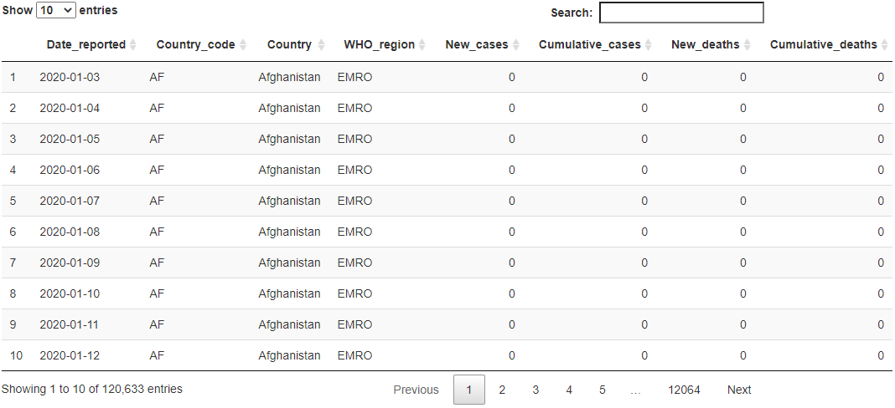

```{r libraries, include = FALSE, echo=FALSE, warning=FALSE,message=FALSE}
Sys.setenv(LANG = "en")
library(listdown)
library(ggplot2)
library(gtsummary)
library(flextable)
library(dplyr)
library(rmarkdown)
library(plotly)
library(gapminder)
library(trelliscopejs)
library(DT)
library(knitr)
```


# Abstract 

Statisticians and analysts have been using R (Ihaka, 1998) for a long time. R programming environment has it's formal document standards embedded such as R markdown. While R markdown generate documents itself programmatically, it requires the programmer to manually construct the structure of a file as a whole reproducible document. For the majority of coding work done as prose contents, namely computational components, the output are the main interest. The __listdown__ Package (Kane,Jiang and Urbanek, 2020) available on the __Comprehensive R Archive Network (CRAN)__ provides a programmatic solution to generate documents containing computational and narrative components efficiently, including computational components of data visualizations. However, as the demand for big data visualizations increase rapidly in the past decades, the capable tools for these tasks such as package __trelliscopejs__ (Hafen, Gosink, McDermott, Rodland, Kleese-Van Dam and Cleveland, 2013) is not natively supported in high efficient workflows of __listdown__. This paper demonstrates multiple methods implanting interactive plotting systems and graphical packages in R to a output document when users generate reproducible documents using the listdown Package. These methods are mainly supported by the __plotly__ (Sievert, 2020) and __trelliscopeJS__ packages available on CRAN. The concepts are illustrated using the gapminder data set from the __gapminder__ package (Bryan, 2017), and will be applied to a current analytical task on COVID-19 data sourced from the World Health Organization (https://www.who.int). 

_Keywords: reproducible documents, effective visualizations, big data visualizations_

# CH1 Introduction

## 1.1 Overview

R language has been a popular computing language since its first appearance back in the 90s (Ihaka & Gentleman, 1996). R has many features dedicated but not limited to statistical computing, data analysis and other revelant tasks across a greater number of industries and fields. In addition to the IDE (Intergrated Development Enviroment) software R studio, a large number of R packages are also available, intended for users to focus more on the "goal" instead of the "coding". The paper discusses how reproducibility and compatibility of multiple statistical tasks can be contained in one single document using high efficient workflows, followed by data visualizations in R. While big data visualization tasks has become much more achievable in R with the release of many famous visualization packages such as __trelliscopeJS__ (Hafen, Gosink, McDermott, Rodland, Kleese-Van Dam and Cleveland, 2013), listdown does not have native support for it so far. The goal is to embed the features of these packages into listdown, especially the idea of facetting. The result is a powerful big data visualization tool with high efficiency workflows. All of these can be achieved by creating __decorators__ for the __listdown__ package (Kane,Jiang and Urbanek, 2020). Finally, an application of the methods created will be demonstrated on the current COVID-19 pandemic data sets sourced from the World Health Organization (https://www.who.int). 

## 1.2 R markdown 

The R markdown (Baumer, Cetinkaya-Rundel, Bray, Loi, and Horton, 2014) demonstrates the possibility of constructing reproducible documents using R language. This format allows author to integrate R codes, written work, data tables, visualization plots and much more information into one directly structured document. Among scientific writings and analytical reports knitted using R markdown, the majority are made up of codes and narrative writings. The codes are usually but not limited to common computing languages, such as R, Python, SQL and others. Usually inserted between the codes, authors include contexts which explain the code chunk itself or the output from the code chunks. Sometimes descriptive writings are also placed between the codes using a hash, and is usually comments of the code lines. In this paper, the chunk of computing codes that produces outputs and the narrative writings that describes the outputs will be referred to computational components and narrative components respectively (Kane,Jiang and Urbanek, 2020). 

Statistical analysis tends to be more reachable and interpretable to public audience accompanied by the rapid rise of computing abilities. While the statistical computing threshold drops with the invention of R language, the needs to integrate computationally derived objects with narrative explanations arise. The usage of R markdown centralizes different data types with a specific format, further process with the technical work in a computationally organized way. Usually in most data analyzing tasks, the first thing is data cleaning and tidying. However, this processes usually requires other environments and configuration to manipulate. Such steps have different needs in computational purpose than report or presentations. It may not be fully shown using R code or other languages natively supported by R, but authors often use narrative texts to describe the associate processes. These narrative texts can be fully embedded in the R markdown file for readers to follow without opening other documents. Before a highly informative presentation, multiple explanatory analyses are often carried out. These explanatory analyses contain numerous amounts of table, plots and graphs, most of them have comments and notes. R markdown can save the robust components and generate documents without spending time on layouts and formats. 

The advantage of R markdown’s narrative feature can be shown in multiple prospects. Firstly, R markdown is as described in its name, a Markdown syntaxed mark-up language of R. By using combinations of codes and embedding symbols to control the formatting and layout of a R object file, users get the desired final output document. All of these are easy to achieve without extensive skills in coding and consume less time and effort to learn. Packages such as bookdown (Xie, 2016) demonstrates the easiness for users intending to edit long narrative components in contrast of using another commonly-used markup language – Latex. While latex may be more expressive in terms of proficiency for academical writing, the coding alike syntax required to produce documents takes a substantial amount of time and effort to learn and is relatively more complicated than R markdown’s syntax. On the other hand, statistical reports and presentations often contains numerous computational and narrative components. R markdown supports multiple file formats once a R object is completed and ready for publication. The function in R markdown for this objective is called “knit”. The process includes running all computational components, then formatting the outputs along with the narrative components. 

In R markdown, each computational component starts with three backwards apostrophes, with the language name and the code chunk options between the curly brackets shall be enclosed by three backwards apostrophes correspondingly. During the knitting process, computation components along with their results are laid out precedingly. Each narrative component, which is so called ordinary text with out code is combined within the computational components, resulting in a desired file. The final result is also customizable not only as in pdf or HTML format, but also includes editable formats such as Microsoft word documents. This conforms with the intention for a typical statistical report or presentation, that is, to make audience understand statistics with less to no statistical knowledge (Baumer, Cetinkaya-Rundel, Bray, Loi, and Horton, 2014).  R markdown fulfills this concept by offering modifiable documents for collaborators and other users to develop narrative components based on the statistical analysis results generated beforehand. 

While PDF and Word formats are commonly used by researchers in the fields for their formatting specification, they do not provide a pragmatical solution for interactive plots and graphics. Compared to static graphics, interactive graphics are extremely powerful for explanatory analysis, and complements the visualization prospect of statistical visualizations (Theus & Urbanek, 2008). Interactive graphics not only enhances the overall aesthetics of a visualization component, but could also reveal un-spotted insights. The findings may change conclusions and affect the narrative components, further changing the conclusion of a work (Healy,2018). Moreover, interactive visualization potentially provides a solution to readers with visual perception diseases such as color blindness (Wilke, 2019). HTML, another format producible by R markdown, is often underestimated in its ability for interactive visualization and animations. R has a variety of packages that supports interactive widgets which can by knitted and shown on HTML webpages. Despite the numerous packages and functions supported by R to create an interactive visualization, most of them requires an increase of workload in the computational components. A optimal solution of merging computational components that produce interactive graphics and the associated narrative components can be achieved by using the decorator function in listdown package (Kane,Jiang and Urbanek, 2020). The decorator pattern (Gamma, Helm, Johnson, Vlissides and Patterns, 1995) in the listdown function takes elements as arguments and returns the required object used for presentation in the specified output directory. When it comes to visualization components (ie. trelliscope), the plot is often fixed to a specific form pre-defined in the computation component. The goal is to make it live and interactive. This is possible by making use of the decorator function in listdown. 

## 1.3 Visualizations

The tools for presenting an interactive visualization was introduced previously. The remaining problem or perhaps one of the major limitations in creating an effective interactive plot may be the big data sets most statistical tasks come across with nowadays (Ali, Gupta, Nayak and Lenka, 2016). The explosive growth of data becomes a trend and is still expanding fast accompanied by multiple factors such as the popularization 5G and IoT (Internet of Things). Statistical presentations and reports requiring visualizations on big data sets becomes more challenging and creative. Interactive graphics provides an ultimate solution, increasing the display power compared to a static plot (Weissgerber, Garovic, Savic, Winham and Milic, 2016). Among the various techniques on big data visualization problems, the principle of subsetting a large data set into multiple smaller ones and presenting them in parallel are adapted by many solutions, including the famous __ggplot2__ package (Wickham, 2011) that most R markdown users are familiar with. The idea of Trelliscope displays (Becker, Cleveland & Shyu, 1996) provided a framework on multipanel graphics, and demonstrated its huge potential in big data visualizations. However, it was not until package __TrelliscopeJS__ (Hafen, Gosink, McDermott, Rodland, Kleese-Van Dam and Cleveland, 2013) made the interactivity of trelliscope display possible, and further enhanced the idea by implanting interactive functions to ggplot items, the interface is especially effective for data with multiple categorical responses. In this paper, multiple graphical computational components are created using the above mentioned packages, but we will start with simple examples such as the __plotly__ package (Sievert, 2020), which turns static ggplot objects into interactive plots. The strength and weakness of each method, along with solutions on improving the functions effectively for their usage in the listdown package are then followed with examples. 

The remainder of this paper will go through as follows. The next chapter explains the motivaion of the listdown package and workflow on how the listdown generates documents from scratch. This is a background literature review summoning the previous work done by the package's developers (Kane,Jiang and Urbanek, 2020) using real world COVID -19data. This chapter also introduced the background of the data as it is used later on. Chapter 3 discussed the implementation of decorators using the same data from chapter 2, along with an executive summary on the graphical outputs. Chapter 4 focused on solving more complicated visualizations by writing functions to the decorator of the listdown package. Chapter 5 applied the mechanisms to the COVID-19 data, and revealed the relationship of new cases and death number of each country by a specific time frame. The final chapter discussed the results of the output, concluded the limitations and further work. 


# CH2 Package Listdown

## 2.1 High Efficiency Workflows

Lets suppose the data analyzing part and all coding work has completed for an analysis. The results of the analysis containing summary tables, data tables and plots which we referred to computational components earlier, are collected into lists of objects and saved as a RDS or RDATA format file. They are in the order of which the author would like to present them separately in respect to the whole analysis, the next thing is to produce the components from the lists into a document like a html file. This is a typical order of a data analyzing work processes, but it is not definite. The computational components are not required to be turned into lists, but it is often the case for R users when dealing with multiple computational components. The objects in RDS and RDATA format files can be restored and reproduced in R environment easily, and has many advantages.

Sometimes, the computational components along with the results they produce are stored in multiple locations, or in many cases, on different machines. It is especially important to centralize them. They have multiple properties obtained naturally when turned into lists. Firstly, changing them into elements of a list generically provides a hierarchical structure for centralizing. Secondly, for most data, even on large scales, the actual presented contents are relatively small. Storing them into lists allows easier access and aligns with the concepts of centering. Lastly, if the elements in the list are not in the order of a presentation desired, or changes accordingly, manipulating the order is much more convenient than non-centralized components. Nonetheless, the data cleaning and other processes iteratively repeats each time generating documents for presentation whenever knitr is used in a R markdown file. A R markdown file generally lacks semantic structure. When all computational components and narrative components are stored in one single file manually paragraphed by the author, extracting and editing components partially in a R markdown file often leads to increase of workloads after the changes are committed. 

During a statistical analysis, the analytical process and results can be seen as two parts which can be stored separately. If the results contain graphs and plots, they could be further stored in single named lists. As everything is organized in named lists, listdown has several advantages compared to normal R markdown files containing all computational and narrative components. First, it allows multiple pathways working in parallel from the same data. When the experiment and objective is different based on the same data set, computational components are expected to be different. This will affect the narrative components such as contexts and discussions, but the data set along with other processes such as cleaning and tidying remains constant. Since the different “pathways” can be stored into different lists, listdown package allows users to selectively pick the reproducible lists along with the narrative components. R markdown files shows the experiment in a serial way if different analyses from the same data are stored in the same file, or users will have to open two R markdown files with the same computational component for processing in both R markdown files. 

In addition, R markdown does not hold any data dedicated for the file itself. In order for a computational component in R markdown that reads in the data to work, the data set has to be stored or set to a pathway specifying the location of the data, depending on either it is saved locally or on a server. 

To overcome the above mentioned aspects, package listdown (Kane,Jiang and Urbanek, 2020) was introduced providing functions to programmatically create R markdown files from named lists. By using functions from the package, the components can be turned into a single named list, organized in a hierarchical structure. The contents of each list denoted, including the name and type of R object can be viewed in dendrograms. On top of the lists, decorators and other customizable functions can be added to assist the problem of visualizing. This is particular useful when large datasets are added to its corresponding computational component list and the author intends to present them. Large data sets requires a substantial amount of space to be fully shown.

Another advantage for using the listdown package is its capability to avoid repetitive work when data analysis updates. This is partially useful when data analysis process is updated frequently while the data source remains in the same format and standard. Once the computational components for data cleaning and process are constructed and stored into the list, the analysis may change the output such as results and plots. It may further change the narrative components. However, updating analysis methods does not mean deprecating the previous methods, listdown package allows different workflows and pathways to be stored and reproduced at anytime with  knitr, this vastly improves efficiency and drops tedious repetitive works while maintaining the objectives desired. Some useful areas of statistical analysis benefiting from the listdown package are mainly but not limited to its usage in clinical trial and medical data (Kane,Jiang and Urbanek, 2020). The final case study verifies this statement. 


## 2.2 Listdown Working Steps
The workflow for users using the listdown package are described as the follows:

1. The computational components in R are turned into list of objects, Each computational components are named, and is part of the named list. 

2. The named list containing all computational components are saved to the current directory on the disk as _RDS_ or _RDATA_ formatted files.

3. By using function __listdown()__, the RDS is then read into R as a listdown class object. At this step, multiple components are added. First, the required package for the current listdown object to run are specified. Second, the decorator arguments are described. Third, initial expressions that runs before the listdown object knits are stated . Lastly, the document wide R chunk options are added in.

4. The header is then added, including the title of the output document, the author and the date. This is an optional step, and is not necessary in the workflow steps, however, it would be sensible to add the title in for readers to understand better. 

5. The listdown object with the header are now sufficient to create a document, functions __writeLines__ from package knitr (Xie, 2013) turns the listdown object to a R markdown file ready for rendering. 

6. The last step is to render the R markdown file to a output document. For the purpose of this paper, HTML format is ideal for all interactive plots and graphics. The R markdown is turned into markdown from knitr, the functions added in the listdown object at step 3 such as decorators and initial expressions injects through the kntting process, and produces the final HTML output. 
For the next part, the above steps will be explained in detail using a real world example data set. 

### 2.3 Case Study: COVID-19 Dataset Example

The data set regions from the __COVID-regions-2021.csv__ file ( World Health Organization, 2021) is used in this first example. In this data set, 4 key information are contained. Firstly, all the WHO membership countries around the globe are grouped spatially and culturally according to the World Health Organization into regions. The six big WHO regions are: 

- African Region

- Region of the Americas

- South-East Asia Region

- European Region

- Eastern Mediterranean Region

- Western Pacific Region

These regions are shown in each of their corresponding abbreviations under the variable _"WHO_region"_. Secondly, the date information under the _Date_reported_ variable is inclusive of 2020 and the first quarter of 2021. To be more exact, from 3rd of January 2020 to the 15th of March 2021. Thirdly, The number of new cases and the number of new deaths for each day of the regions has been included and named _New_cases_ and _New_deaths_. Four visualization objects produced using __ggplot2__ (Wickham, 2011) were saved in RDS formatted file as a list named _"computational_components_covid"_. The objects are named "New cases per day for each region", "New cases per day for each region facet", "Cases against Death" and "Cases against Death facet", each containing their corresponding graphics. The first two plots used __geom_area()__ to show the number of new cases recorded each day for all the regions in the given time frame. While the third and fourth plot shows the relationship of new cases against death recorded by day, and is plotted with __geom_point()__. The main difference within the first and second plot, the third and the fourth plot, is the additional function call __facet_wrap()__ in the ggplot function. In the facet_wrap arguments, a variable must be defined, such that the original data is separately plotted in respect to the defined variable of the argument. This function allows each panel in the plot to show a subset or a proportion of the data, and has advantage in comparing patterns and trends. The function works well especially in the situation where there are severely overlapping data points, or when there are too much (but not over numbered) levels in the defined variable. Later in this paper, we will discuss advanced solutions to big data sets with multiple levels that needs to be visualized effectively.  

Once data has been read into R, the computational component is reproduced and stored along with the data into a named list, in this case, it is called _"comp_covid"_. It is then saved to the current directory as a R object. 

#### 2.3.1 Making a list of computational Components

```
# Creating the computational components
computational_components_covid <- list( 
  `New cases per day for each region` = ggplot(regions) + 
    geom_area(aes(Date_reported, New_cases, colour=WHO_region, fill=WHO_region), 
              stat="smooth", 
              alpha=.2, position="identity",
              method="loess", span=.1)+ labs(title = "Number of daily COVID cases by WHO region") +
    scale_y_continuous(expand = rep(0,4),labels = label_comma()) +
    scale_x_date(limits = as.Date(c("2020-01-01", "2021-03-15")),
                 expand = expansion(0),
                 label = label_date_short()),

`New cases per day for each region facet` = ggplot(regions, 
                                                   aes(x = Date_reported, y = New_cases, col = WHO_region, fill = WHO_region,
                                                                stat = "smooth",  method="loess", span=.1)) + geom_area( alpha=.5) + 
  facet_wrap(.~WHO_region) + labs(title = "Number of daily COVID cases by WHO region facet") + scale_y_continuous(expand = rep(0,4),labels = label_comma()) +
     scale_x_date(limits = as.Date(c("2020-01-01", "2021-03-15")),
                 expand = expansion(0),
                 label = label_date_short()),


`Cases against Death` = ggplot(data = regions,
       aes(x=New_cases, y=New_deaths, color = WHO_region)) + geom_point(alpha = .2) + 
    scale_x_sqrt() +
    scale_y_sqrt() +
  labs(title = "Number of COVID cases against death by WHO region"),
     

`Cases against Death facet` = ggplot(filter(regions, New_cases >= 0),
       aes(New_cases, New_deaths, colour=WHO_region)) + 
    geom_point(alpha=.2) +
    scale_x_sqrt() +
    scale_y_sqrt() +
    facet_wrap(vars(WHO_region)) +
    theme(aspect.ratio=1, legend.position="none") +
    labs(title = "Number of COVID cases against death by WHO region by facet")

)

#Save file to the disk
 saveRDS(computational_components_covid, "comp-comp_covid.rds")
 
comp_covid <- readRDS("comp-comp_covid.rds")

ld_cc_dendro(comp_covid)
```

```{r covid-example-step1, echo=FALSE, message=FALSE, warning=FALSE}
library(listdown)
library(ggplot2)
library(tidyverse)
library(scales)
library(dplyr)
# Read in the regions data set.
regions = read.csv("COVID-regions-2021.csv", 
                    colClasses=c("character", "Date", rep("numeric", 2)))

# Creating the computational components
computational_components_covid <- list( 
  `New cases per day for each region` = ggplot(regions) + 
    geom_area(aes(Date_reported, New_cases, colour=WHO_region, fill=WHO_region), 
              stat="smooth", 
              alpha=.2, position="identity",
              method="loess", span=.1)+ labs(title = "Number of daily COVID cases by WHO region") +
    scale_y_continuous(expand = rep(0,4),labels = label_comma()) +
    scale_x_date(limits = as.Date(c("2020-01-01", "2021-03-15")),
                 expand = expansion(0),
                 label = label_date_short()),

`New cases per day for each region facet` = ggplot(regions, 
                                                   aes(x = Date_reported, y = New_cases, col = WHO_region, fill = WHO_region,
                                                                stat = "smooth",  method="loess", span=.1)) + geom_area( alpha=.5) + 
  facet_wrap(.~WHO_region) + labs(title = "Number of daily COVID cases by WHO region facet") + scale_y_continuous(expand = rep(0,4),labels = label_comma()) +
     scale_x_date(limits = as.Date(c("2020-01-01", "2021-03-15")),
                 expand = expansion(0),
                 label = label_date_short()),


`Cases against Death` = ggplot(data = regions,
       aes(x=New_cases, y=New_deaths, color = WHO_region)) + geom_point(alpha = .2) + 
    scale_x_sqrt() +
    scale_y_sqrt() +
  labs(title = "Number of COVID cases against death by WHO region"),
     

`Cases against Death facet` = ggplot(filter(regions, New_cases >= 0),
       aes(New_cases, New_deaths, colour=WHO_region)) + 
    geom_point(alpha=.2) +
    scale_x_sqrt() +
    scale_y_sqrt() +
    facet_wrap(vars(WHO_region)) +
    theme(aspect.ratio=1, legend.position="none") +
    labs(title = "Number of COVID cases against death by WHO region by facet")

)

#Save file to the disk
 saveRDS(computational_components_covid, "comp-comp_covid.rds")
 
comp_covid <- readRDS("comp-comp_covid.rds")

ld_cc_dendro(comp_covid)

```


After reading in our computational component that has been saved, the next step is to create a listdown object. The function __ld_cc_dendro()__ shows each object in the listdown in an descending order of depth (Kane,Jiang and Urbanek, 2020). Because every object in the component is named, it is also labeled in prior to the description of each object. 


#### 2.3.2  Creating a Listdown object

From the previous step, the list containing the plots now saved as a R object named _comp-comp_covid.rds_ has the following choices for authors to decide: 

1. A listdown object will be created using function __listdown()__. The object will be loaded into the designated document with a specified way, along with the libraries and codes required for the computational component. In this example, building the computational components in the list requires library __ggplot2__, __tidyverse__ and __scales__, hence they are specified and loaded together with the saved computational object. 

2. Then the author decides how the elements in the list will be presented in the document by using __decorator()__ function which will are demonstrated in the next example. 

3. Initial expressions that gets evaluated before knitting is included using __init_expr()__, this will be demonstrated later in chapter 3. 

4. The chunk options can be controlled two ways. The first being normal chunk options, which can be specified straight away, the second is by using __decorator_chunk_opts()__ , and can be subjected to a class given. 

```
#Making a listdown object
library(listdown)
library(knitr)
ld_new <- listdown(load_cc_expr = readRDS("comp-comp_covid.rds"),
package = c("ggplot2", "tidyverse","scales"))

class(ld_new)
ld_new
```


```{r covid-example-step2, echo=FALSE, message=FALSE, warning=FALSE}
#Making a listdown object
library(listdown)
library(knitr)
ld_new <- listdown(load_cc_expr = readRDS("comp-comp_covid.rds"),
package = c("ggplot2", "tidyverse","scales"))

class(ld_new)
ld_new
```


From the output, we can see ld_new is a listdown class object, the descriptions are as shown. Here, no initial expression, decorators, chunk options and decorator chunk options are added, the ggplot objects will be rendered just like any normal R markdown file. 

#### 2.3.3 Header Options

The listdown object named __ld_new__ is now ready to create the document. To regularize the document output in terms of formats, it is further processed with a header. The listdown package has native support in R markdown and __workflowr__ as yml objects (Kane,Jiang and Urbanek, 2020). The header objects are part of the list in the document, and can be edited by using ```ld_rmarkdown_header()```. By calling the document name, a glimpse of the document content is shown, the names are clearly listed out along with the type of objects author intends to include. This step is optional as described in the previous working steps, however, it is always important to include a name for the outputs as it follows the principle of proportional ink (Wilke, 2019). 

```
covidexample <- c(
 as.character(ld_rmarkdown_header("Covid plots",
author = "Leon",
 date = "2021")),
ld_make_chunks(ld_new))

covidexample
```

```{r covid-example-step3, echo=FALSE, message=FALSE, warning=FALSE}
covidexample <- c(
 as.character(ld_rmarkdown_header("Covid plots",
author = "Leon",
 date = "2021")),
ld_make_chunks(ld_new))

covidexample
```

While the next major step is rendering the listdown object __covidexample__ into a _html_ document, there are still several steps included between. Firstly, by using generic R markdown function __writeLines()__, the listdown object is written into a R markdown file and is automatically saved into the pathway of the working directory of the current file. Next, it is rendered into a _HTML_ document using the __render()__ function generically from ```Rmarkdown```. Then the document can be knitted and shown using the __system()__ function or opened outside R. 

#### 2.3.4 Creating a HTML document from R markdown 

```
library(knitr)
library(rmarkdown)
# Write the document.
writeLines(covidexample, "covid-example.Rmd")
render("covid-example.Rmd",html_document())
system("open covid-example.html")
```

```{r covid-example-step4}
library(knitr)
library(rmarkdown)
# Write the document.
 #  writeLines(covidexample, "covid-example.Rmd")
 #  render("covid-example.Rmd",html_document())
 # system("open covid-example.html")
```

```{r covid-example-make-1, include=FALSE}
library(knitr)
knitr::opts_knit$set(unnamed.chunk.label="covid-example-stepx")
knitr::opts_chunk$set(echo=FALSE)
knitr::opts_chunk$set(warning = FALSE)
library(rmarkdown)
# Write chunks
writeLines(covidexample, "covid-example.Rmd")
render("covid-example.Rmd",html_document(), run_pandoc=FALSE, quiet=TRUE)
```


```{r covid-example-out1, results="asis", echo=FALSE}
cat(paste(readLines("covid-example.knit.md"), collapse="\n"))
```

##### 2.3.5 Number of New Cases

From the html document produced using listdown, the output of the computational components are shown directly to the reader. The first plot shows the number of new covid cases by regions. The tiny spike raised in the Western Pacific region's office indicated when the virus was first discovered in the People's Republic of China, and soon began it's transmission across the other regions. By March,the region of the Americas and the region of Europeans has increasing new cases inevitably. While European region seems to see a steady drop till July, the South-East Asia Region, Eastern Mediterranean Region and Africa region has shown noticeable number of new cases. Region of Americas at this time had new cases increasing rapidly towards the first peak. Region of Europeans soon showed an increase in the new cases after July, and the rate of increase is also increasing. Regions of America had the same trend with a higher rate of increase at the third quarter, along with region of Europeans, is contributing number of new cases much higher than other regions  towards the end of 2020. The situation up till today still does not seem to be optimistic, the final case study will reveal more information for the updated data set. The Second graph plotted regions separately along a common unaligned scale. The overlapping areas from the first plot can now be visualized with high clarity. Facetting by regions completely resolved the overshading problem. However, separation by regions for new cases is not as effective as showing the number of new cases against death in the third and fourth graph. 

##### 2.3.6 Number of New Cases and Death

The third and fourth graph reveals the relationship of number of new cases and number of death in the specified time frame. The advantage of facetting becomes obvious in this situation. Scattered points spreaded around the bottom left corner of the graphing area, such high dense of observation makes interpretation almost impossible. The final plot subsets the original scatterplot into different regions, and used different color cues to highlight each region uniquely. Almost all regions shows a high number of death as the number new cases increases, and follows a positive linear relationship except for European region. With the increasing number of new cases, the number of death seperates into two extremes. On one side of the Y-shaped branch, the number of death accompanied by number of new cases are significantly lower than other regions and vice versa on the other branch. According to WHO website and Wikipedia's page COVID-19 pandemic in Europe, the lack of Vigilance and failure of taking effective action in most European countries leads to the high death number over the who region. 


# CH3 The Usage of Decorators 

In the previous chapter, the complete workflow of creating a document using listdown package is demonstrated with a real world data. The example is relatively simple and straight forward. The advantage of adding a __facet__ greatly reduces typical problems in big data visualizations (Ali, Gupta, Nayak and Lenka, 2016). After a glimpse of the document once it is rendered and produced, two main points of interest arises immediatley. After all, the plots are informative, but they are also static. This limits the overall demonstrative ability of both plots. As the data set contains information for each individual day in the time frame consistently, but only the overall trends and robust numbers are shown in the first set of plots. More detailed information are lost in a trade-off to revealing the robust trend of new cases daily by regions. In the second set of plots, the scattered points also fails to give any addition information of the exact observation, even though it had the data information of doing so. The identification feature of a visualization can be greatly improved using interactive graphics (Cook, Swayne & Buja, 2007), the listdown package adapts this idea and allows author implanting addition decorators to the original listdown object during the processing of producing the document. The decorator control of listdown could be customized for an interactive plot, for example, Package plotly (Sievert, 2020). The package provides a native support turning ggplot objects into interactive HTML widgets. 

## 3.1 Case Study: COVID-19 Dataset Example with decorators 

The same set of data from chapter 2 was used. Little different from the previous list _computational_components_covid_, the data _regions_ was added in. This time, two decorators were added into the listdown item, __"ggplot = ggplotly"__ and __"data.frame = datatable"__. 

```
#Add in data and decorators
library(listdown)
library(DT)

# Data now added in for decorator datatable
computational_components_covid$Data <- regions
saveRDS(computational_components_covid, "comp-comp_covid.rds")

ld_decorator <- listdown(load_cc_expr = readRDS("comp-comp_covid.rds"),
package = c("ggplot2", "tidyverse","scales","DT","plotly"),
decorator = list(ggplot = ggplotly,
                 data.frame = datatable))
class(ld_decorator)
ld_decorator

```

```{r covid-decorator-example-step1, echo=FALSE, message=FALSE, warning=FALSE}
#Add in data and decorators
library(listdown)
library(DT)

# Data now added in for decorator datatable
computational_components_covid$Data <- regions
saveRDS(computational_components_covid, "comp-comp_covid.rds")

ld_decorator <- listdown(load_cc_expr = readRDS("comp-comp_covid.rds"),
package = c("ggplot2", "tidyverse","scales","DT","plotly"),
decorator = list(ggplot = ggplotly,
                 data.frame = datatable))
class(ld_decorator)
ld_decorator

```

In this step, the RDS file __comp-comp_covid.rds__ contains the extra data, which was not in the previous example. Once data is inserted into the listdown object, we can use the __datatabe__ decorator from library __DT__ to display the data, instead of its original class __data.frame__. From the description of the ld object, named _ld_new_, the computational components are identical, the only difference tends to be the decorators and it's associated packages imported.

<!-- NOT SURE -->

Referring to step 3 in chapter 2.2.1, the decorator is a description of the function from the computational components in the list being created. The decorator Itself is not a function call evaluatable by R, it describes the method of the function to be rendered during the process of knitting. When the function from the computational component finds the matching name of the decorator by the first element it can pass the arguments, the method described by the decorator argument is applied. When __knitr__ (Xie, 2013) renders the R markdown file into a HTML document, the description stated in the decorator are injected to the markdown file telling the knitr to use the described method in the decorator instead of the original function arguments. In this case, the first step is to attach the packages required for listdown to render the document from the listdown object. In addition to the case study in chapter 2.3, because we are using ```ggplotly``` from the plotly package as a decorating method, package plotly is also attached along with the other packages. The next step is to replace the ggplot function call with the decorator ggplotly. This means when the listdown objects are rendered, the method ggplotly will be used instead of ggplot and will be applied on all ggplot class objects within the list. From here, a optional header will be added and the HTML document will be produced. 

<!-- NOT SURE -->


```
library(rmarkdown)
coviddecoratorexample <- c(
  as.character(ld_rmarkdown_header("covid-example")),
          ld_make_chunks(ld_decorator))

writeLines(coviddecoratorexample, "covid-decorator-example.Rmd")
render("covid-decorator-example.Rmd",html_document())
system("open covid-decorator-example.html")
```

```{r covid-decorator-example-step2, echo=FALSE, message=FALSE, warning=FALSE}
library(rmarkdown)
coviddecoratorexample <- c(
  as.character(ld_rmarkdown_header("covid-example")),
          ld_make_chunks(ld_decorator))

# writeLines(coviddecoratorexample, "covid-decorator-example.Rmd")
# render("covid-decorator-example.Rmd",html_document())
# system("open covid-decorator-example.html")
```

```{r results="asis", echo=FALSE}
htmltools::includeHTML("./covideexample/covid-decorator-example.html")
```

##### 3.1.1 Number of New Cases with decorators

After using ggplotly as a decorator method, the exact numbers of new cases can new be assessed directly in the plotting area. To be general, only the highest number of new cases from each region with the date observed will be report. The rest of the information are left with interest for the readers to interpret and explore. The first set of plots shows the highest number of new cases in a single day in the given time frame was 769,644 cases observed from the region of Americas, and it was the 19th of September 2020. The highest new cases observed in a single day in the regions of Africa was the 3rd of January, 2021, with the exact number of 40456. The highest new cases observed in a single day in the regions of Eastern Mediterranean was the 1st of December, 2020, with the exact number of 62206. The highest new cases observed in a single day in the regions of European was the 8th of November, 2020, with the exact number of 346573. The highest new cases observed in a single day in the regions of South East Asia was the 23th of December, 2020, with the exact number of 78377. Finally, the "lowest" region with highest observed number of new cases in a single day was Western Pacific region, at the number of 15155, on the 13th of February, 2020. 


The number of new cases can not only be interpreted by moving the mouse pointer over the graphing zone, but also displayed in order by _Date_reported_ and _New_cases_ in the data table. If the viewer is looking for observation under specific conditions, such as a given date, the search function allows direct access within the matching search. Same from the previous example, the entire webpage with these features embedded were created using the listdown workflows. No additional steps were done outside this R markdown document since the first example.  


##### 3.1.2 Number of New Cases and Death with decorators

The highest number of death and the date observed were also revealed. To be general, the information will be reported like chapter 3.1.1, rest of the information are also with interest for the readers to interpret and explore. In addition from the plot in chapter 2.3.4, the daily highest number of deaths was from Region of the Americas, with a single day number of new cases at 565201, the deaths was 12407. To check for the exact date of this observations, we selected ordering the _New_deaths_ variable in descending order, and refer to the _Date_reported_ variable. The date was 22nd of Janruary, 2021. 


The linkage use of plotly and datatable revealed this finding in almost no time. On top of this HTML webpage, it was produced with listdown's high efficiency workflows. If the task was done without decorators, the viewers will never see the exact numbers unless scrolling through the 2628 views of observations. Or the author will have to produce the whole document in a seperate normal R markdown workflow saving everything in its very own directory. 


## 3.2 Decorators for more complicated computational compontents

<!-- NOT SURE -->

The previous example reflected the improvements in visual perception by using decorators compared to static plots. However, both cases were considered as basic usage in the prospect of decorator introduction from On the Programmatic Generation of Reproducible Documents (Kane,Jiang and Urbanek, 2020). The ggplot takes two main arguments when producing a plot. First, the source of the data desired to be visualized are stated. Then the aes() argument maps components of the data set to the components in a visualization. The computational components from chapter 2.3 contains the plotting mechanism and the actual plots stored as list type objects. The decorator method, function ggplotly seeks all the mapping components in the same directory as the ggplot during the mapping process. However, that is not stated by default in all packages. The methods described by decorators can sometimes seek mapping components in different directories, or pathways. If this happens, the described decorator method inherits the original function in the computational component, but fails to find the mapping components required, the decorator method will fail to work and return an error message indicating the problem. In the next example, we have used another set of data from the _gapminder_ package (Bryan, 2017). There are two main aspects demonstrated by the following example. Firstly, as previous examples demonstrated, despite facetting is an effective visualization method, but when the data set has variables with a large number of categorical levels, the original function facet_wrap() embedded in package ggplot2 may become inefficient. The package trelliscope (Hafen, Gosink, McDermott, Rodland, Kleese-Van Dam and Cleveland, 2013) subsets data into groups and facets the plots arranging each plot in a grid. Although it provides a better solution compared to facet_wrap, the second aspect arises when it is used in a computational component of a listdown object. The method described by the decorator seeks a different pathway in the mapping process that is not originally defined by the function in the computational component from the list. 

<!-- NOT SURE -->

### 3.2.1 Visualizing the Gapminder Data Set

The original data was loaded and added into the list of files. From the description (Bryan, 2017), the gapminder data set contains information on the life expectancy, GDP per captia and population of 142 countries with their continents from 1952 to 2007. In comparison to the case study from chapter 2.3, the designated facetting variable increased from 6 to 142. We will repeat the listdown workflow process, the RDS file saved are used in the next chapter for advanced solutions. The chunk of codes below produces a ggplot with __facet_wrap()__ using listdown. the final layout is folded because of too much plots inserted onto the same panel. The trelliscopejs package(Hafen, Gosink, McDermott, Rodland, Kleese-Van Dam and Cleveland, 2013) converts ggplot with __facet_wrap()__ argument into individual plots with interactive interface. This package provides us a potential tool expanding each seperate plot on multiple panels, which will be discussed later in the paper. 

```
# Load the gapminder data set.
data(gapminder)
# gapminder$country[gapminder$country == "Cote d'Ivoire"] = "CotedIvoire"

 
# Creating the computational components
comp_comp_gapminder <- list(
  `life expectancy` = ggplot( gapminder) + geom_point(aes(x = year, y = lifeExp)) + 
  xlim(1948, 2011) + ylim(10, 95) + 
  theme_bw() + 
  labs(title = "life expectancy by continent") +
  facet_wrap(~ country + continent))

#Save file to the disk
 saveRDS(comp_comp_gapminder, "comp-comp_gapminder.rds")

 
# A not very effective visualization
ld_gapminder <- listdown(load_cc_expr = readRDS("comp-comp_gapminder.rds"),
package = c("ggplot2","gapminder"))

gapminder_example <- c(
 as.character(ld_rmarkdown_header("gapminder plots",
author = "Leon",
 date = "2021")),
ld_make_chunks(ld_gapminder))

writeLines(gapminder_example, "gapminder-example.Rmd")
render("gapminder-example.Rmd",html_document())
system("open gapminder-example.html")
```


```{r gapminder-example-step1, echo=FALSE, message=FALSE, warning=FALSE}

library(ggplot2)
library(gapminder)
library(listdown)
library(gapminder)
library(trelliscopejs)
library(ggplot2)
library(tidyverse)
library(DT)
library(rmarkdown)

# Load the gapminder data set.
data(gapminder)
# gapminder$country[gapminder$country == "Cote d'Ivoire"] = "CotedIvoire"

 
# Creating the computational components
comp_comp_gapminder <- list(
  `life expectancy` = ggplot( gapminder) + geom_point(aes(x = year, y = lifeExp)) + 
  xlim(1948, 2011) + ylim(10, 95) + 
  theme_bw() + 
  labs(title = "life expectancy by continent") +
  facet_wrap(~ country + continent))

#Save file to the disk
 saveRDS(comp_comp_gapminder, "comp-comp_gapminder.rds")

 
# A not very effective visualization
ld_gapminder <- listdown(load_cc_expr = readRDS("comp-comp_gapminder.rds"),
package = c("ggplot2","gapminder"))

gapminder_example <- c(
 as.character(ld_rmarkdown_header("gapminder plots",
author = "Leon",
 date = "2021")),
ld_make_chunks(ld_gapminder))

 # writeLines(gapminder_example, "gapminder-example.Rmd")
 #  render("gapminder-example.Rmd",html_document())
 #  system("open gapminder-example.html")
```

```{r gapminderexamplemake1, include=FALSE}
library(knitr)
knitr::opts_knit$set(unnamed.chunk.label="gapminder-example-step1")
knitr::opts_chunk$set(echo=FALSE)
knitr::opts_chunk$set(warning = FALSE)
library(rmarkdown)
# Write chunks
writeLines(gapminder_example, "gapminder-example.Rmd")
render("gapminder-example.Rmd",html_document(), run_pandoc=FALSE, quiet=TRUE)
```

```{r gapminderexampleout1, results="asis", echo=FALSE}
cat(paste(readLines("gapminder-example.knit.md"), collapse="\n"))
```

From the output shown, simple __facet_wrap()__ fails to show a informative visualization. The scales were out of proportion and the observations were too dense. With the introduction of trelliscopejs, a solution arises. 

### 3.2.2 Trelliscopejs

In the previous writings, trelliscope displays was mentionaed several times as a substitution to facetting functions in ggplot. The idea behind trelliscope (Becker, Cleveland & Shyu, 1996) was described as D&R, standing for divide and recombine (Guha, Hafen, Rounds, Xia, Li, Xi, & Cleveland, 2012) during the development of package __trelliscopeJS__. The idea was an approach on methods to display large complex data visualizations. In a trelliscope system, the data set are splited into subets, with a visualization method applied to each subsets. The output is a structurally arrayed panel each displaying a portion of the original data (Hafen, Gosink, McDermott, Rodland, Kleese-Van Dam and Cleveland, 2013). Different from the original trelliscope displays, once the panel becomes interactive, functions such as filtering, sorting and searching can be implemented. These derivative features of an interactive interface provides huge convenience that static trelliscope displays does not have. To implant this approach into ggplot2 interface, __facet_trelliscope()__ was introduced. The next example shows a simple change in the function solving the problem in chapter 3.2.1. 

## 3.2.3 Facetting using Package TrelliscopeJS 

After using __facet_trelliscope()__, the gapminder data set returns an visual output much more interpretable than before. However, this was created in a normal R markdown workflow. 

```
library(ggplot2)
library(trelliscopejs)
library(gapminder)
ggplot(gapminder) + geom_point(aes(x = year, y = lifeExp)) +
  xlim(1948, 2011) + ylim(10, 95) + theme_bw() +
  facet_trelliscope(~ country + continent, nrow = 2, ncol = 7, width = 300)
```

```{r, out.width="100%", out.height="100%"}

```


### 3.3 Motivations of implementing Trelliscope into listdown

There are several reasons trelliscopeJS may be even more efficient when it is implemented into listdown compared to a normal R markdown output. Firstly, big data outputs are usually produced with more complexed computational components. Part of listdown's purpose was to make the output documents more "content based" instead of "coding and techniqucal based". The computational component's output can be displayed in an more elegant format without excessive code chunk control options, authors have higher work efficiency when producing trelliscope in a listdown workflow compared to a normal R markdown workflow. 

Secondly, big data visualizations are often presented to a large number of audience whether it is used for explanatory or predictive analysis. While the author may save some time producing and creating the visualizations, it is important for the audience to focus on the outputs. The interpretation for these multi-panel plots may take up hours or even days of time before any conclusion can be found for experts. On ther other hand, if trelliscope visualizations are used for example, in an exhibition or presentation open to public, audience with little to no statistical knowledge are expected. The standardization of all computational components, especially graphical outputs helps readers in capturing key information regardless the targeted occasions. Both listdown and trelliscopejs packages were created in the common purpose based on the points mentioned above. 

Last but not least, previous studies mentioned the importance of obtaining full saturated information from big data, specifically in marketing (Keahey, 2013) and clinical health data (Kane,Jiang and Urbanek, 2020). One could influence the strategical plan and investment funds for a company like IBM (Keahey, 2013), the other could find cures to intractable diseases. Trelliscopejs has the ability to organize all visualizations and listdown has the ability to organized the computational components producing the visualizations. 


Implementing a trelliscope system into listdown sounds like a staggered computing task, but listdown has an argument specially designed for describing the output methods, and this is achieved by modifying the decorators, demonstrated in chapter 3.1 using plotly. In the next chapter, several approaches are taken to achieve this goal. 

# CH4 Solution using Decorators

As previous examples demonstrated. The decorator indicates a name of method or function that are applied to the stated class of object in the listdown file during kniting process. The goal is to swap __facet_wrap()__ with __facet_trelliscope()__, and it requires partially changing the function call of the ggplot object in listdown. One fast solution was to exclude the __facet_wrap()__ function from the listdown file and add __facet_trelliscope()__ through __initial_expr()__ argument. The code chunk in __initial_expr()__ is inserted immediately once the required libraries are loaded. When render is called kntting the listdown object, codes in __initial_expr()__ is evaluated before the listdown objects are rendered. The following example demonstrates this approach.

## 4.1 Adding telliscopejs facet for Gapminder in listdown

To exclude the facet argument, we recreated the computational component with no facet arguments, and save the list into an RDS file named _comp-comp_gapminder_trellis.rds_. Everything else remains the same  within a normal R markdown workflow. 

```
# Creating the computational components, this time without the 'facet_wrap' call.
library(gapminder)

comp_comp_gapminder_trellis <- list(
  `life expectancy full` = ggplot(gapminder) + geom_point(aes(x = year, y = lifeExp)) + 
  xlim(1948, 2011) + ylim(10, 95) + 
  theme_bw() + 
  labs(title = "life expectancy by continent"))

#Save file to the disk
 saveRDS(comp_comp_gapminder_trellis, "comp-comp_gapminder_trellis.rds")
```


```{r gapminder-trellis-example-step1, echo=FALSE, message=FALSE, warning=FALSE}
# Creating the computational components, this time without the 'facet_wrap' call.
library(gapminder)

comp_comp_gapminder_trellis <- list(
  `life expectancy full` = ggplot(gapminder) + geom_point(aes(x = year, y = lifeExp)) + 
  xlim(1948, 2011) + ylim(10, 95) + 
  theme_bw() + 
  labs(title = "life expectancy by continent"))

#Save file to the disk
 saveRDS(comp_comp_gapminder_trellis, "comp-comp_gapminder_trellis.rds")
```

The new function __ggtre()__ is created in the intial expression. The function consists of two parts, the first being the original function call. In this example, it was the ggplot objects in the listfown file. The second part is the __facet_trelliscope()__ arguments with the facetting variables and other parameters. The additional argument here is the pathway of the function call. Trelliscope had a bug, it attempts to find the variable attributes with default, which is NULLdata. By adding a pathway using __path="."__ argument, facet_trelliscope now changes the pathway to the current working directory. once knitr is called from rendering the listdown object, initial expression gets evaluated first. The decorator method is directed to the right pathway containing the elements need for the trelliscope argument. 

```
# Adding trelliscope call in the initial expressions, notice the description: Path ="."

ld_gapminder_trellis <- listdown(load_cc_expr = readRDS("comp-comp_gapminder_trellis.rds"),
package = c("ggplot2","gapminder", "trelliscopejs"),
decorator = list(ggplot = ggtre), 
init_expr = {
  ggtre = function(x) x + facet_trelliscope(~ country + continent,
                                           nrow = 2, ncol = 7, width = 300, path = ".")
}
)
ld_gapminder_trellis
```


```{r gapminder-trellis-example-step2, echo=FALSE, message=FALSE, warning=FALSE}
library(listdown)
# Adding trelliscope call in the initial expressions, notice the description: Path ="."

ld_gapminder_trellis <- listdown(load_cc_expr = readRDS("comp-comp_gapminder_trellis.rds"),
package = c("ggplot2","gapminder", "trelliscopejs"),
decorator = list(ggplot = ggtre), 
init_expr = {
  ggtre = function(x) x + facet_trelliscope(~ country + continent,
                                           nrow = 2, ncol = 7, width = 300, path = ".")
}
)
ld_gapminder_trellis
```

From the description of the listdown method above, the initial expression that gets to run immediately after packages are loaded are now included. The decorator method for ggplot class objects are now rendered using the method __ggtre()__ described in the initial expression. The next chunk of codes follows a normal listdown workflow and produces the docuemnt _gapminder_trellis-example.html_, implementing trelliscope to ggplot. 

```
gapminder_trellis_example <- c(
 as.character(ld_rmarkdown_header("gapminder plots using trelliscope",
author = "Leon",
 date = "2021")),
ld_make_chunks(ld_gapminder_trellis))

writeLines(gapminder_trellis_example, "gapminder_trellis-example.Rmd")
render("gapminder_trellis-example.Rmd",html_document())
system("open gapminder_trellis-example.html")
```


```{r gapminder-trellis-example, echo=FALSE, message=FALSE, warning=FALSE}
library(rmarkdown)
gapminder_trellis_example <- c(
 as.character(ld_rmarkdown_header("gapminder plots using trelliscope",
author = "Leon",
 date = "2021")),
ld_make_chunks(ld_gapminder_trellis))

 # writeLines(gapminder_trellis_example, "gapminder_trellis-example.Rmd")
 #  render("gapminder_trellis-example.Rmd",html_document())
 #  system("open gapminder_trellis-example.html")
```

```{r results="asis", echo=FALSE}
cat('<iframe src="ggtre/gapminder_trellis-example.html" width=920 height=600 frameBorder=0 data-external="1">
</iframe>')
```

## 4.2 A More Generalized Solution

Each country can now be shown clearly like the output from a normal R markdown workflow. Despite this simple and quick approach has reached the ultimate goal, it has multiple problems that needs to be considered. Firstly, in this approach, the function in the listdown file was modified to fit the requirement for using __ggtre()__ added. To be more exact, we deliberately deleted the __facet_wrap()__ argument from the ggplot object "life expectancy full" in the list "comp_comp_gapminder_trellis" to suit the function in initial expression. Secondly, the initial expression are passed onto all objects of the same class within the same listdown file. If there were some ggplot objects in the listdown file that the author do not wish to seperate, it is not possible when this function is applied. Thirdly, the variables in __ggtre()__ are fixed for each listdown file. This means only the same variables are used in all ggplot objects in a data set, if there were any ggplot objects which does not have the variable described in __ggtre()__, this approach would not work. It was also suggested the number of initial expression and the complexity of the initial expression shall be kept minimal (Kane,Jiang and Urbanek, 2020). The initial expression is considerably long in this case, and could be even longer if further arguments were added. A more generalized approach shall be developed. 


### 4.3 facet_wrap to facet_trelliscope
The common ground for  __facet_wrap()__ and __facet_trelliscope()__ is their concept of dividing the data into smaller subsets and recombine them into either a panel or multiple arrays of plots. For the two different arguments, the variable used as the subsetting condition is the same through out the process. If a function could pull the facetting variables out from __facet_wrap()__, then places it into __facet_trelliscope()__, then we could get rid of the __facet_wrap()__ in the function without the need to modify the original ggplot funtion from listdown. The only problem remains is the facetting layer left in the old ggplot arguments which needs to be removed and replaced by the new trelliscope facets. The function __facet_wrap2ts()__ was designed to solve the issues mention above. This solves the problem from chapter 4.1 in a more generalized way, no modifications needs to be carried out on the original ggplot function in listdown. 

#### 4.3.1 Function facet_wrap2ts

The function __facet_wrap2ts__ designed to be a decorator method for the listdown package is shown below. 

```{r facetwrap2ts}  
# Created a generic function for trelliscope
# y is an ggplot object
facet_wrap2ts <- function(y){
  if (is(y$facet, "Facet") && !is(y, "FacetNull")) {
  ## get variables
  v = y$facet$vars()
  ## construct Null facet to replace it
  o = ggplot()
  facetNull = o$facet
  y$facet = facetNull
  ## construct the formula
  form = eval(parse(text=paste0("~ ", paste(v, collapse=" + "))))
  ## construct call
  c = as.call(list(quote(facet_trelliscope), form,
                   ncol = 2, path="."))
  y + eval(c)
  } else y
}

```

```
# Created a generic function for trelliscope
# y is an ggplot object
facet_wrap2ts <- function(y){
  if (is(y$facet, "Facet") && !is(y, "FacetNull")) {
  ## get variables
  v = y$facet$vars()
  ## construct Null facet to replace it
  o = ggplot()
  facetNull = o$facet
  y$facet = facetNull
  ## construct the formula
  form = eval(parse(text=paste0("~ ", paste(v, collapse=" + "))))
  ## construct call
  c = as.call(list(quote(facet_trelliscope), form,
                   ncol = 2, path="."))
  y + eval(c)
  } else y
}
```

This function works as follows: 

1. we assume y is a ggplot class object in the list of objects, and it has an argument for facet. The first __if__ statement states that facet argument of the ggplot object y must have a facet and must not be the class "facetNULL", or empty, which means there simply is no facet. Then the transformation process is continued. 

2. Next, a vector v is created, which obtains the variable names from the facet argument within the ggplot object y. The variable names in v are important because it will be passed to __facet_trelliscope()__'s facet arguments. We are not changing any variables of the data to visualize at this step, but the function of which the variables gets fed into. 

3. Now, because the ggplot object y still has the original layer of facet that needs to be replaced by the new trelliscope facet, we created an empty ggplot object __o__. Then the empty facet attribution named _facetNULL_ in object __o__ gets pulled out. _facetNULL_ are then injected into the already existing facet attributes in y. Up to this step, y still remains to be the exact same ggplot object as original, except without the facet argument. 

4. The formula is then created using the original facet variables previously stored in v and the correct syntax. It is converted from an R object of the character class to an R object of the expression class. Before step 5, it is evaluated and ready to be used to build the function call. 

5. The next step is constructing the function call. __facet_trelliscope()__ argument were implanted with the new formula named _form_ from the previous steps. 

6. The last step is to call the original ggplot object y combined with the evaluated result of the new function __c__. This returns an output that shall look identical to using __facet_trelliscope()__ in normal R markdown files.

7. There are also cases this decorator is applied improperly, for example when the ggplot object y does not contain any facet arguments, that is the attribute being facetNULL. This is encountered by using the __else__ from the if loop. The output remains the exact same of y untouched. If users intend to add a __facet_wrap()__ as a decorator, then function style __ggtre__ can be used. It requires the user to manually set the variables for facetting, and the decorator function shall be included as an intial expression, which gets evaluated before the knitting process. 

#### 4.3.2 Testing facet_wrap2ts on Gapminder Data set

To testify if the function works for the gapminder data set, the same listdown object was used from chapter 3.2.1. This time, the initial expression was removed, and the decorator was changed to the new function. the listdown object was saved as _ld_gapminder_trellis_generic_. After adding the headers, we rendered the document to check the outputs. 


```
# Same data set as the first example, switching the decorator this time instead of adding initial expression
ld_gapminder_trellis_generic <- listdown(load_cc_expr = readRDS("comp-comp_gapminder.rds"),
package = c("ggplot2","gapminder", "trelliscopejs"),
decorator = list(ggplot = facet_wrap2ts)
)

gapminder_trellis_generic_example <- c(
 as.character(ld_rmarkdown_header("gapminder plots trelliscope generic",
author = "Leon",
 date = "2021")),
ld_make_chunks(ld_gapminder_trellis_generic))

ld_gapminder_trellis_generic
# Make the document
writeLines(gapminder_trellis_generic_example, "gapminder_trellis_generic-example.Rmd")
render("gapminder_trellis_generic-example.Rmd",html_document())
system("open gapminder_trellis_generic-example.html")
```


```{r gapminder-trellis-generic-example-step1, echo=FALSE, message=FALSE, warning=FALSE}
## Same data set as the first example, switching the decorator this time instead of adding initial expression
ld_gapminder_trellis_generic <- listdown(load_cc_expr = readRDS("comp-comp_gapminder.rds"),
package = c("ggplot2","gapminder", "trelliscopejs"),
decorator = list(ggplot = facet_wrap2ts)
)

gapminder_trellis_generic_example <- c(
 as.character(ld_rmarkdown_header("gapminder plots trelliscope generic",
author = "Leon",
 date = "2021")),
ld_make_chunks(ld_gapminder_trellis_generic))

ld_gapminder_trellis_generic
# Make the document
 # writeLines(gapminder_trellis_generic_example, "gapminder_trellis_generic-example.Rmd")
 #  render("gapminder_trellis_generic-example.Rmd",html_document())
 #  system("open gapminder_trellis_generic-example.html")
```

```{r results="asis", echo=FALSE}
cat('<iframe src="wrap2ts/gapminder_trellis_generic-example.html" width=920 height=600 frameBorder=0 data-external="1">
</iframe>')
```

After applying the __facet_wrap2ts__ decorator function, the rendering showed a promising result of the HTML document. This concept can be further extended and used on more decorators for the listdown package. 


### 4.4 facet_wrap directly to facet_trelliscope with plotly

The  __facet_wrap2ts__ was successful in turning ggplot objects with facet argument into trelliscope plots in listdown. However, during big data set visualizations, we saw the power of ggplotly as a decorator from example 3.1. It would be appriopriate to combine library plotly with trelliscope, and implement it into a listdown decorator. This fulfills the needs of decorators when users produce documents via a listdown workflow that is intended for big data visualizations. From the original trelliscope package, plotly was supported as one of the arguments in function __facet_trelliscope()__. If we added the arguments and set the default __as_plotly = TRUE__, the output shall be interactive, while the layout remains the same of using telliscope. 

#### 4.4.1 Function facet_tsplotly

The function __facet_tsplotly__ was created based on  __facet_wrap2ts__. The majority of workflow remains identical except during the function call constructing step. The extra argument __as_plotly__ was fed into the function call during the call construction process, and gets evaluated with the new call. As with the same that if p does not have a facet, then the ggplot object  would remain untouched. 


```{r facettsplotly}
# If p is an ggplot object
facet_tsplotly <- function(p, ...) {
  if (is(p$facet, "Facet") && !is(p, "FacetNull")) {
    v = p$facet$vars()
    o = ggplot()
    FacetNull = o$facet
    p$facet = FacetNull
    form = eval(parse(text=paste0("~ ", paste(v, collapse=" + "))))
    c = as.call(list(quote(facet_trelliscope), eval(parse(text=paste0("~ ", paste(v, collapse=" + ")))),
                     ncol = 2,path=".", as_plotly = TRUE))
    #the function call with the plotly argument gets evaluated 
    p + eval(c)
  }  else p
}
```

```
# If p is an ggplot object
facet_tsplotly <- function(p, ...) {
  if (is(p$facet, "Facet") && !is(p, "FacetNull")) {
    v = p$facet$vars()
    o = ggplot()
    FacetNull = o$facet
    p$facet = FacetNull
    form = eval(parse(text=paste0("~ ", paste(v, collapse=" + "))))
    c = as.call(list(quote(facet_trelliscope), eval(parse(text=paste0("~ ", paste(v, collapse=" + ")))),
                     ncol = 2,path=".", as_plotly = TRUE))
    #the function call with the plotly argument gets evaluated 
    p + eval(c)
  }  else p
}
```

#### 4.4.2 Testing facet_tsplotly on Gapminder Data set

To testify if the decorator method is working. Again, the RDS file created for the gapminder data set from chapter 3.2.1 will be used. The decorator in the newly created listown object _ld_gapminder_trellis_plotly_ was changed to __facet_tsplotly__ this time. 

```
library(plotly)
## Still the same data set as the first example
ld_gapminder_trellis_plotly <- listdown(load_cc_expr = readRDS("comp-comp_gapminder.rds"),
package = c("ggplot2","gapminder", "trelliscopejs","plotly"),
decorator = list(ggplot = facet_tsplotly)
)

gapminder_trellis_plotly_example <- c(
 as.character(ld_rmarkdown_header("gapminder plots trelliscope plotly",
author = "Leon",
 date = "2021")),
ld_make_chunks(ld_gapminder_trellis_plotly))
ld_gapminder_trellis_plotly

writeLines(gapminder_trellis_plotly_example, "gapminder_trellis_plotly-example.Rmd")
render("gapminder_trellis_plotly-example.Rmd",html_document())
system("open gapminder_trellis_plotly-example.html")
```


```{r gapminder-trellis-plotly-example-step1, echo=FALSE, message=FALSE, warning=FALSE}
library(plotly)
## Still the same data set as the first example
ld_gapminder_trellis_plotly <- listdown(load_cc_expr = readRDS("comp-comp_gapminder.rds"),
package = c("ggplot2","gapminder", "trelliscopejs","plotly"),
decorator = list(ggplot = facet_tsplotly)
)

gapminder_trellis_plotly_example <- c(
 as.character(ld_rmarkdown_header("gapminder plots trelliscope plotly",
author = "Leon",
 date = "2021")),
ld_make_chunks(ld_gapminder_trellis_plotly))
ld_gapminder_trellis_plotly

 # writeLines(gapminder_trellis_plotly_example, "gapminder_trellis_plotly-example.Rmd")
 #  render("gapminder_trellis_plotly-example.Rmd",html_document())
 #  system("open gapminder_trellis_plotly-example.html")
```

```{r results="asis", echo=FALSE}
cat('<iframe src="tsplotly/gapminder_trellis_plotly-example.html" width=920 height=600 frameBorder=0 data-external="1">
</iframe>')
```

The output was interactive. Each individual observations for each country was interactive. Improving the power of the overall visualization. 


# CH5 Decorator Application: Reporting number of new cases and Death information from COVID Data

# 5.1 The Data Set
From the previous chapters, the trelliscope works especially well with big data set having variables with multiple levels. The plotly interactive plots showed more details on each individual plots. The decorator function combining the two methods was created and testified. In this chapter, lets go back to the full COVID-19 data. The data set was sourced from World Health Organization offical website. All data was provided to the date before this paper was completely finished. Based on the description (https://covid19.who.int/info/)The full data set contains the following information:

- Date_reported

The date reported variable was in the class type of dates. The variable records the date of the information reported to WHO.

- Country_code

The Country code variable is the ISO (International Organization for Standardization) Alpha-2 coundtry codes. The column was recorded with character strings.

- Country

The Country variable contains the names of all the WHO membership countries, some names aslo stands for political regions or areas if not claimed to be a country. The column type is also character string class.  

- WHO_region

The WHO region variable was previously introduced back in the first case study. The six big WHO regions are: African Region, Region of the Americas, South-East Asia Region, European Region, Eastern Mediterranean Region, and Western Pacific Region. This column is also a character string class, the column recorded the abbreviations of the regions instead of the full names. 

- New_cases

The new cases variable records the number of new confirmed cases each day by subtracting previous cumulative case count from current cumulative cases count from WHO. The column was recorded in the class integers.

- Cumulative_cases

The cumulative cases records the confirmed cases reported to WHO up to the date in date reported. The column was in the integer string class.

- New_deaths

The new deaths variable records the new confirmed deaths each day. The calculation methods were the same as recording the new cases number and is recorded as integer class. 

- Cumulative_deaths

The cumulative deaths number was recorded the same as the cumulative cases number, and is recorded as the integer class. 

As the data was obtained from WHO in raw csv files, a few data cleaning and tidying were required before plotting. The overall process was smooth as the quality of the data was very high. 

## 5.2 Applying the decorator
In this case study, we created a new list named "comp_comp_covid_trellis". This list contains the data and the ggplot object with a facet variable of countries, the interest in this study was the difference in number of new cases by each different country. After the list was created ad stored as RDS file, the listdown object _ld_covid_trellis_ was created. The decorators in this listdown object are:

- Method __datatable__ were used instead of data.frame for showing the data set.
- Method __facet_tsplotly__ were used in all ggplot class objects for plotting. 

A simple header was then added, the final html document _covid_trellis-example.html_ was rendered and included below. 

```
#Save the list object
saveRDS(comp_comp_covid_trellis, "comp-comp_covid_trellis.rds")
 
 
# Creating the listdown package
ld_covid_trellis <- listdown(load_cc_expr = readRDS("comp-comp_covid_trellis.rds"),
package = c("ggplot2","trelliscopejs", "DT"),
decorator = list(ggplot = facet_tsplotly, 
                 data.frame = datatable)
)


# Adding a header
covid_trellis_example <- c(
 as.character(ld_rmarkdown_header("Covid plots using trelliscopeJS",
author = "Leon",
 date = "2021")),
ld_make_chunks(ld_covid_trellis))

# Making the document
writeLines(covid_trellis_example, "covid_trellis-example.Rmd")
render("covid_trellis-example.Rmd",html_document())
system("open covid_trellis-example.html")
```


```{r covid-trellis-step1, echo=FALSE, message=FALSE, warning=FALSE}
library(trelliscopejs)
library(listdown)
library(tidyverse)
library(rmarkdown)
#Reading in the data
covidcountries <- read.csv("WHO-COVID-19-global-data.csv",
                     colClasses=c("Date", rep("character", 3), 
                                   rep("numeric", 4))) 
names(covidcountries)[1] <- "Date_reported"

# Creating the list
comp_comp_covid_trellis <- list(
  Data = covidcountries,
  `New COVID-19 details per day for each Country` = ggplot(covidcountries) + geom_point(aes(x=Date_reported, y=New_cases, group=Country), size = 0.6) + 
  geom_line(aes(x=Date_reported, y=New_cases, group=Country), size = 0.4) +  scale_x_date(date_breaks = "3 month", date_labels =  "%b %Y") +
    theme_bw() +
  labs(title = "COVID-19 Details by Country") + 
    facet_wrap(vars(Country))

    )


#Save file to the disk
 saveRDS(comp_comp_covid_trellis, "comp-comp_covid_trellis.rds")
 
 
# Creating the listdown package
ld_covid_trellis <- listdown(load_cc_expr = readRDS("comp-comp_covid_trellis.rds"),
package = c("ggplot2","trelliscopejs", "DT"),
decorator = list(ggplot = facet_tsplotly, 
                 data.frame = datatable)
)


# Adding a header
covid_trellis_example <- c(
 as.character(ld_rmarkdown_header("Covid plots using trelliscopeJS",
author = "Leon",
 date = "2021")),
ld_make_chunks(ld_covid_trellis))

# Making the document
 # writeLines(covid_trellis_example, "covid_trellis-example.Rmd")
 #  render("covid_trellis-example.Rmd",html_document())
 #  system("open covid_trellis-example.html")
```

```{r results="asis", echo=FALSE}
cat('<iframe src="covidfinal/covid_trellis-example.html" width=920 height=600 frameBorder=0 data-external="1">
</iframe>')
```

## 5.3 Discussion
 
From the embedded html document rendered from chapter 5.2, several features were included as are discussed below.

### The Data Table

From results provided by the interactive data table, there are over 120,000 rows of observations in total. If this data was displayed using the original data.frame method, it would be insufficient for readers scrolling through all of them before any other analytical graphics can be displayed. On top of the much tidied interface, the observations are ordered primarily by the alphabetical order of country names, then by the data reported in the given time frame. For country names that starts in the middle, the search bar feature provides an alternative approach rather than scrolling though the entries. These changes can save a huge amount of time for authors and provides an user-friendly interface for viewers. The data table interface even works better with the visualization using trelliscope system following up. The capture below is a screen shot from the original HTML document. Please refer to the HTML embedded data table for it's corresponding interactive version.

```{r, out.width="100%", out.height="100%"}

```

### The Visualization

The final result of the visualization had a elegant and neat layout compared to all of the previous examples. The data for this case study was also much bigger compared to previous examples. For the interpretations of each country, some representative findings are discussed in this section while the rest are left for the viewers of the paper to explore. Interpretations are followed in the alphabetical order of the country names, the display are captured as screen shots for the purpose of this paper, hence they are not interactive. Please refer to the trelliscope system for their corresponding interactive counterparts. 

- China

```{r, out.width="100%", out.height="100%"}

```

From the plot of China, where the COVID-19 was first discovered to have symptoms on humans initially, the rise of number of new cases was rapid and severe. The single day peak number of new cases discovered was on the 13th of February, 2020, at 15152 new cases. While this "outlier-like" single day number was discrepant to the number provided from the Wikipedia page of Statistics of the COVID-19 pandemic in mainland China (https://en.wikipedia.org), it was then discovered accordingly to the National Health Commsion (http://en.nhc.gov.cn/) the previous records of new cases was not completely recorded and was justified and added on in this particular day before reporting to WHO. Then China has effectively lowered the number of new cases daily with a series of actions. However, up to the date before this paper was finalized, there is a rebound trend, with 743 new cases daily recorded on the 23rd of May, 2021. The time frame of the peak number and the rebounding trend would have not been noticed without individual plotting.  

- India

```{r, out.width="100%", out.height="100%"}

```

To Find the plot of India, the sorting feature of trelliscope was applied. The main interest of India was the daily number of new cases increases out of control lately. The trend was clearly displayed in the plot, and reached a peak of 414188 cases on the 7th of May, 2021. However, if the overall tend was not plotted, a small rise in the number of new cases has occurred during Sepetember, 2020. The daily number of new cases in India has gained focus worldwide, several medias has criticized India's continuous poor action and policy decisions, little knowing the decrease in new cases between October 2020 till March 2021. 


- The United States of America

```{r, out.width="100%", out.height="100%"}
knitr::include_graphics("UnitedStatesofAmerica.PNG")
```

Because United States of America was behind in the alphabetical order of countries, it is displayed using the filter feature in trelliscope. The filter feature works like the search feature in data table, instead of browsing through the countries, users can be navigated to the visualization from conditions selected in the filtering tab directly. The other details of interest are also visible below the graphing area, such as the highest deaths number recorded daily. The U.S. shows a cyclical behavior in the number of new cases, and had the highest new cases number 312247 recorded on the 10th of January, 2021. 


- Germany and Spain

```{r, out.width="100%", out.height="100%"}

```

It is also possible to make comparisons between two countries individually. This plot was made possible by using  the customizable grid option. Users can select displaying multiple columns and rows in the same graphing zone, and each zone's displaying information can be selected individually using the filter conditions. The two countries shown, Germany and Spain are not only closely located geographically, but also had very similar cumulative new cases number. However, the trend and pattern of new cases across the same time frame were very different. The combination of the trelliscope features shown in this visualization is particularly useful for comparison and exploratory analyses. On top of the comparison capabilities, the date and new case numbers for each point of interest are revealed. The plotly tool bars also allows zooming into a portion of the data for much detailed interpretation, or users can choose to view the overall system in full screen allowing for non-overlapping x and y axis scaling. 


# CH6 Conclusion and Further Work

## 6.1 Conclusion
In a typical statistical task, the listdown package has great advantage of more efficient and optimal workflow compared to normal workflows, especially with the combination of trelliscopejs package. COVID-19 were one of the diseases that caused a huge impact in the vast era of mankind. The data and insights obtained worldwide provides precious experience and shall be presented with the rightful tools. The trelliscope system combined with listdown package has successfully demonstrated it's power in this scenario. All of these would not have been achievable without decorators. 

While the advantage of such combination demonstrated easiness in several aspects on both the author's prospect and the interpreter's prospect, it shall be kept in mind of when this tool can be deployed appropriately. 


For occasions whereas detailed quantative tasks are carried out, a full analytical process used in statistics must be required. The steps often includes but are not limited to hypotheses setting, statistical testing, assumption checking, executive summary, technical summary, discussion and conclusions. Most of the steps require narrative components. Visualization can be applied to some of these steps as either the final output or used as an assistance, but it will never be sufficient enough being the only result for all the tasks. In fact, computational components itself may not be effective on completing a qualitative statistical task alone (Kane,Jiang and Urbanek, 2020). On the other hand, despite narrative components can be included into listdown as character elements using the chunk options decorator by setting the __results = "as.is"__, it contraries the intention of the authors whom originally created the listdown package, and are considered less efficient in comparison to using a normal R markdown workflow. 


In situations whereas visualizations are crucial for reaching the goal, or the targeted audience are much more broader than statistical experts or professional researchers, these computational components and the decorators works flawlessly in the listdown package, providing an effective and powerful tool for data visualizations. 


## 6.2 Further Work

While the decorators now works with trelliscope and plotly, there are still some issues that is yet to be solved. Firstly, if there are more than one ggplot objects in a list, both function __facet_wrap2ts__ and __facettsplotly__ only supports turning the first ggplot object into the desired output. This was a problem with the __path__ argument as trelliscope facet components are stored in different directories than __facet_wrap__. A potential solution could be creating a structured file directory for the different trelliscope displays needed in a listdown file. Secondly, The are much more interactive visualization packages that are potentially possible to embed to listdown with decorators, such as the __NetworkD3__ package (Allaire, Ellis, Gandrud, Kuo, Lewis, Owen, et al., 2017). The ideas from the trelliscope decorators in this paper has provided a pathway to creating future decorator functions. Furtherwork could focus on making multiple objects suitable for applying the trellicope decorators in the same list and creating more decorators for the __listdown__ package. 


Keeping the above discussions in mind, the listdown package with a powerful visualization decorator will have much wider usage scenarios and higher popularity in the age of big data. 


# Appendix 

Libraries

```
library(listdown)
library(ggplot2)
library(scales)
library(gtsummary)
library(flextable)
library(dplyr)
library(rmarkdown)
library(plotly)
library(gapminder)
library(trelliscopejs)
library(DT)
library(knitr)
```

COVID-19 Examples

```
# Read in the regions data set.
regions = read.csv("COVID-regions-2021.csv", 
                    colClasses=c("character", "Date", rep("numeric", 2)))

# Creating the computational components
computational_components_covid <- list( 
  `New cases per day for each region` = ggplot(regions) + 
    geom_area(aes(Date_reported, New_cases, colour=WHO_region, fill=WHO_region), 
              stat="smooth", 
              alpha=.2, position="identity",
              method="loess", span=.1)+ labs(title = "Number of daily COVID cases by WHO region") +
    scale_y_continuous(expand = rep(0,4),labels = label_comma()) +
    scale_x_date(limits = as.Date(c("2020-01-01", "2021-03-15")),
                 expand = expansion(0),
                 label = label_date_short()),

`New cases per day for each region facet` = ggplot(regions, 
                                                   aes(x = Date_reported, y = New_cases, col = WHO_region, fill = WHO_region,
                                                                stat = "smooth",  method="loess", span=.1)) + geom_area( alpha=.5) + 
  facet_wrap(.~WHO_region) + labs(title = "Number of daily COVID cases by WHO region facet") + scale_y_continuous(expand = rep(0,4),labels = label_comma()) +
     scale_x_date(limits = as.Date(c("2020-01-01", "2021-03-15")),
                 expand = expansion(0),
                 label = label_date_short()),


`Cases against Death` = ggplot(data = regions,
       aes(x=New_cases, y=New_deaths, color = WHO_region)) + geom_point(alpha = .2) + 
    scale_x_sqrt() +
    scale_y_sqrt() +
  labs(title = "Number of COVID cases against death by WHO region"),
     

`Cases against Death facet` = ggplot(filter(regions, New_cases >= 0),
       aes(New_cases, New_deaths, colour=WHO_region)) + 
    geom_point(alpha=.2) +
    scale_x_sqrt() +
    scale_y_sqrt() +
    facet_wrap(vars(WHO_region)) +
    theme(aspect.ratio=1, legend.position="none") +
    labs(title = "Number of COVID cases against death by WHO region by facet")

)

#Save file to the disk
saveRDS(computational_components_covid, "comp-comp_covid.rds")
 omp_covid <- readRDS("comp-comp_covid.rds")

ld_cc_dendro(comp_covid)

#Making a listdown object
library(listdown)
library(knitr)
ld_new <- listdown(load_cc_expr = readRDS("comp-comp_covid.rds"),
package = c("ggplot2", "tidyverse","scales"))

class(ld_new)
ld_new

covidexample <- c(
 as.character(ld_rmarkdown_header("Covid plots",
author = "Leon",
 date = "2021")),
ld_make_chunks(ld_new))

covidexample

library(knitr)
library(rmarkdown)

# Write the document.
writeLines(covidexample, "covid-example.Rmd")
ender("covid-example.Rmd",html_document())
system("open covid-example.html")

```

COVID-19 Decorator Examples

```
#Add in data and decorators, Data added in this time
computational_components_covid$Data <- regions
saveRDS(computational_components_covid, "comp-comp_covid.rds")

ld_new_data <- listdown(load_cc_expr = readRDS("comp-comp_covid.rds"),
package = c("ggplot2", "tidyverse","scales","DT","plotly"),
decorator = list(ggplot = ggplotly,
                 data.frame = datatable))
ld_new_data

coviddecoratorexample <- c(
  as.character(ld_rmarkdown_header("covid-example")),
          ld_make_chunks(ld_new_data))

writeLines(coviddecoratorexample, "covid-decorator-example.Rmd")
render("covid-decorator-example.Rmd",html_document())
system("open covid-decorator-example.html")
```

Gapminder Examples

```
# Load the gapminder data set.
data(gapminder)
# gapminder$country[gapminder$country == "Cote d'Ivoire"] = "CotedIvoire"

# Creating the computational components
comp_comp_gapminder <- list(
  `life expectancy` = ggplot( gapminder) + geom_point(aes(x = year, y = lifeExp)) + 
  xlim(1948, 2011) + ylim(10, 95) + 
  theme_bw() + 
  labs(title = "life expectancy by continent") +
  facet_wrap(~ country + continent))

#Save file to the disk
 saveRDS(comp_comp_gapminder, "comp-comp_gapminder.rds")

 
# A not very effective visualization
ld_gapminder <- listdown(load_cc_expr = readRDS("comp-comp_gapminder.rds"),
package = c("ggplot2","gapminder"))

gapminder_example <- c(
 as.character(ld_rmarkdown_header("gapminder plots",
author = "Leon",
 date = "2021")),
ld_make_chunks(ld_gapminder))

writeLines(gapminder_example, "gapminder-example.Rmd")
render("gapminder-example.Rmd",html_document())
system("open gapminder-example.html")
```

Gapminder using Trelliscope

```
# What trelliscope would look like when we use trelliscope instead of facet
library(ggplot2)
library(trelliscopejs)
library(gapminder)
ggplot(gapminder) + geom_point(aes(x = year, y = lifeExp)) +
  xlim(1948, 2011) + ylim(10, 95) + theme_bw() +
  facet_trelliscope(~ country + continent, nrow = 2, ncol = 7, width = 300)
```

Solution Using function __ggtre__

```
# Creating the computational components, this time without the 'facet_wrap' call.
library(gapminder)

comp_comp_gapminder_trellis <- list(
  `life expectancy full` = ggplot(gapminder) + geom_point(aes(x = year, y = lifeExp)) + 
  xlim(1948, 2011) + ylim(10, 95) + 
  theme_bw() + 
  labs(title = "life expectancy by continent"))

#Save file to the disk
 saveRDS(comp_comp_gapminder_trellis, "comp-comp_gapminder_trellis.rds")


# Adding trelliscope call in the initial expressions, notice the description: Path ="."

ld_gapminder_trellis <- listdown(load_cc_expr = readRDS("comp-comp_gapminder_trellis.rds"),
package = c("ggplot2","gapminder", "trelliscopejs"),
decorator = list(ggplot = ggtre), 
init_expr = {
  ggtre = function(x) x + facet_trelliscope(~ country + continent,
                                           nrow = 2, ncol = 7, width = 300, path = ".")
}
)
ld_gapminder_trellis

gapminder_trellis_example <- c(
 as.character(ld_rmarkdown_header("gapminder plots using trelliscope",
author = "Leon",
 date = "2021")),
ld_make_chunks(ld_gapminder_trellis))

#Rendering html file
writeLines(gapminder_trellis_example, "gapminder_trellis-example.Rmd")
render("gapminder_trellis-example.Rmd",html_document())
system("open gapminder_trellis-example.html")
```

Function __facet_wrap2ts__

```
# Created a generic function for trelliscope
# y is an ggplot object
facet_wrap2ts <- function(y){
  if (is(y$facet, "Facet") && !is(y, "FacetNull")) {
  ## get variables
  v = y$facet$vars()
  ## construct Null facet to replace it
  o = ggplot()
  facetNull = o$facet
  y$facet = facetNull
  ## construct the formula
  form = eval(parse(text=paste0("~ ", paste(v, collapse=" + "))))
  ## construct call
  c = as.call(list(quote(facet_trelliscope), form,
                   ncol = 2, path="."))
  y + eval(c)
  } else y
}

## Same data set as the first example, switching the decorator this time instead of adding initial expression
ld_gapminder_trellis_generic <- listdown(load_cc_expr = readRDS("comp-comp_gapminder.rds"),
package = c("ggplot2","gapminder", "trelliscopejs"),
decorator = list(ggplot = facet_wrap2ts)
)

gapminder_trellis_generic_example <- c(
 as.character(ld_rmarkdown_header("gapminder plots trelliscope generic",
author = "Leon",
 date = "2021")),
ld_make_chunks(ld_gapminder_trellis_generic))

ld_gapminder_trellis_generic

# Make the document
writeLines(gapminder_trellis_generic_example, "gapminder_trellis_generic-example.Rmd")
render("gapminder_trellis_generic-example.Rmd",html_document())
system("open gapminder_trellis_generic-example.html")
```

Function facet_tsplotly 

```
# If p is an ggplot object
facet_tsplotly <- function(p, ...) {
  if (is(p$facet, "Facet") && !is(p, "FacetNull")) {
    v = p$facet$vars()
    o = ggplot()
    FacetNull = o$facet
    p$facet = FacetNull
    form = eval(parse(text=paste0("~ ", paste(v, collapse=" + "))))
    c = as.call(list(quote(facet_trelliscope), eval(parse(text=paste0("~ ", paste(v, collapse=" + ")))),
                     ncol = 2,path= ".", as_plotly = TRUE))
    #the function call with the plotly argument gets evaluated 
    p + eval(c)
  }  else p
}

## Still the same data set as the first example
ld_gapminder_trellis_plotly <- listdown(load_cc_expr = readRDS("comp-comp_gapminder.rds"),
package = c("ggplot2","gapminder", "trelliscopejs","plotly"),
decorator = list(ggplot = facet_tsplotly)
)

gapminder_trellis_plotly_example <- c(
 as.character(ld_rmarkdown_header("gapminder plots trelliscope plotly",
author = "Leon",
 date = "2021")),
ld_make_chunks(ld_gapminder_trellis_plotly))
ld_gapminder_trellis_plotly

writeLines(gapminder_trellis_plotly_example, "gapminder_trellis_plotly-example.Rmd")
render("gapminder_trellis_plotly-example.Rmd",html_document())
system("open gapminder_trellis_plotly-example.html")
```

COVID-19 Case Study
```

#Reading in the data and cleaning
covidcountries <- read.csv("WHO-COVID-19-global-data.csv",
                     colClasses=c("Date", rep("character", 3), 
                                   rep("numeric", 4)))

names(covidcountries)[1] <- "Date_reported"

# Creating the list
comp_comp_covid_trellis <- list(
   Data = covidcountries,
  `New COVID-19 details per day for each Country` = ggplot(covidcountries) + geom_point(aes(x=Date_reported, y=New_cases, group=Country), size = 0.6) +
  geom_line(aes(x=Date_reported, y=New_cases, group=Country), size = 0.4) +  scale_x_date(date_breaks = "3 month", date_labels =  "%b %Y") +
    theme_bw() +
  labs(title = "COVID-19 Details by Country") +
    facet_wrap(vars(Country)),
`New COVID-19 details per day for each Country` = ggplot(covidcountries) + geom_point(aes(x=Date_reported, y=New_cases, group=Country), size = 0.6) +
  geom_line(aes(x=Date_reported, y=New_cases, group=Country), size = 0.4) +  scale_x_date(date_breaks = "3 month", date_labels =  "%b %Y") +
    theme_bw() +
  labs(title = "COVID-19 Details by Country") +
    facet_wrap(vars(Country))
     )


#Save file to the disk
 saveRDS(comp_comp_covid_trellis, "comp-comp_covid_trellis.rds")
 
 
# Creating the listdown package
ld_covid_trellis <- listdown(load_cc_expr = readRDS("comp-comp_covid_trellis.rds"),
package = c("ggplot2","trelliscopejs", "DT"),
decorator = list(ggplot = facet_tsplotly, 
                 data.frame = datatable)
)


# Adding a header (Optional)
covid_trellis_example <- c(
 as.character(ld_rmarkdown_header("Covid plots using trelliscopeJS",
author = "Leon",
 date = "2021")),
ld_make_chunks(ld_covid_trellis))


# Making the document
 writeLines(covid_trellis_example, "covid_trellis-example.Rmd")
  render("covid_trellis-example.Rmd",html_document())
  system("open covid_trellis-example.html")
```


